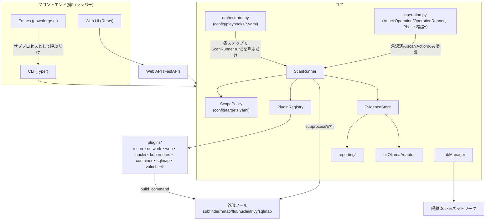
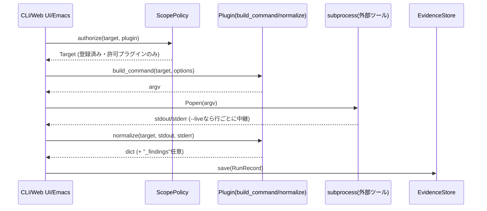
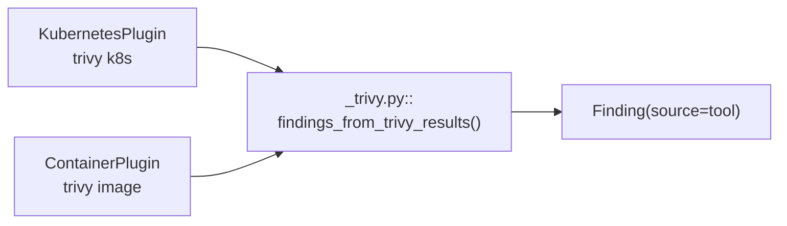
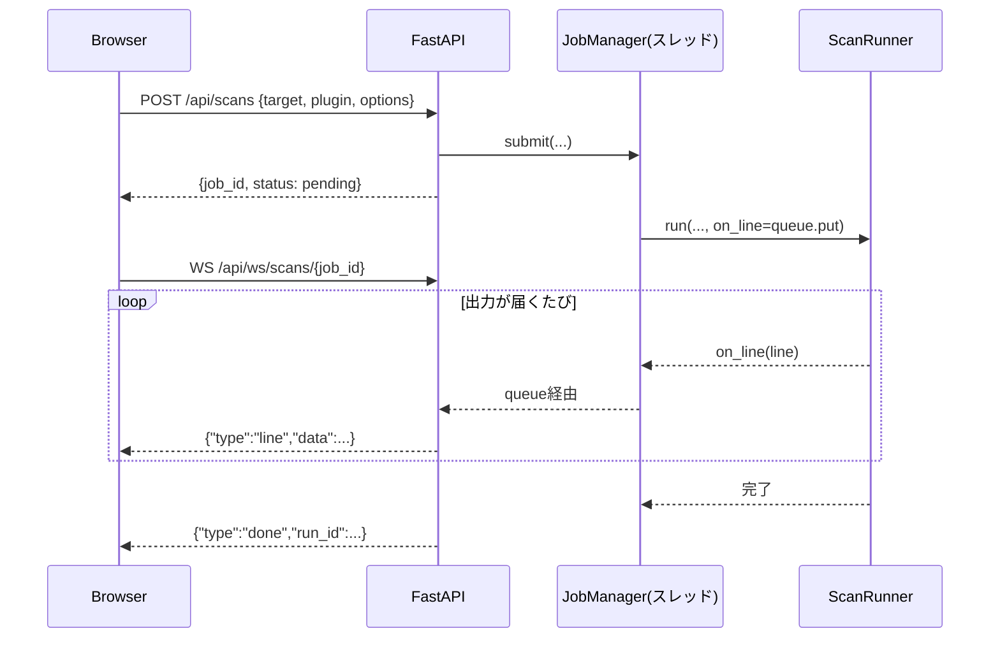
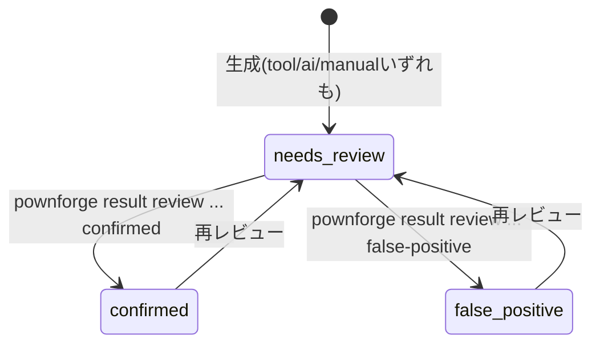

# PownForge 手引書

設計・ビルド・利用をまとめた一冊です。旧`docs/`配下の個別ファイル
(architecture.md/cli-contract.md/container.md/kubernetes.md/sqlmap.md/
lab.md/web.md/emacs.md/walkthrough-report.md/walkthrough.md/roadmap.md)は
本書に統合され、削除されています。コミット規約・エージェント向けの運用
ルールは引き続き[AGENTS.md](../AGENTS.md)を参照してください。

## 目次

1. [はじめに](#1-はじめに)
2. [全体アーキテクチャ](#2-全体アーキテクチャ)
3. [セットアップとビルド](#3-セットアップとビルド)
4. [クイックスタート](#4-クイックスタート)
5. [CLIコマンドリファレンス](#5-cliコマンドリファレンス)
6. [プラグイン](#6-プラグイン)
7. [ラボネットワーク](#7-ラボネットワーク)
8. [Playbook: 複数プラグインの連続実行](#8-playbook-複数プラグインの連続実行)
9. [Web UI / API](#9-web-ui--api)
10. [Emacs連携](#10-emacs連携)
11. [AIによる分析・ウォークスルー・提案](#11-aiによる分析ウォークスルー提案)
12. [Target modelとスコープ制御](#12-target-modelとスコープ制御)
13. [証跡とレポート](#13-証跡とレポート)
14. [`AttackOperation`モデル：攻撃経路のモデル化と承認フロー(Phase 2設計)](#14-attackoperationモデル攻撃経路のモデル化と承認フローphase-2設計)
15. [テスト](#15-テスト)
16. [付録: 実装状況サマリー](#16-付録-実装状況サマリー)

---

## 1. はじめに

PownForgeは、**明示的に許可されたラボ・検証環境**に対するセキュリティ診断を、
プラグイン方式で実行・正規化・証跡管理するためのモジュール型CLIです。
Pown.jsの「独立したモジュールをCLIから呼び出す」という考え方を参考にして
いますが、実装はPython/Typerによる独自設計です。

対象読者は、このプロジェクトを保守・拡張する開発者と、CLI/Web UI/Emacsを
実際に使って診断を行うユーザーの両方です。

中核となる約束は3つです。

- **登録済み対象以外はスキャンできない**: `config/targets.yaml`に登録された
  対象名でしか`pownforge scan`は実行できません。任意のホスト名・URLを
  直接引数に取ることはできません
- **AIは直接スキャンを実行しない**: AI(`pownforge analyze`/
  `pownforge walkthrough generate`)は、すでに保存された結果を要約・分析・
  提案するだけで、スキャン対象や実行コマンドを決定する権限を持ちません
- **実行証跡はハッシュ付きで保存される**: すべてのスキャンはコマンド・
  タイムスタンプ・stdout/stderrのSHA-256ハッシュとともに記録されます

## 2. 全体アーキテクチャ

PownForgeは、CLI・スコープ検証・プラグイン実行・証跡保存・レポート/分析を
明確に分離しています。



どのフロントエンドを使っても、認可ロジック(登録済み対象・許可プラグインの
組み合わせでしかスキャンできない)は完全に同じコードパスを通ります。
Web UIのルーターは`ScopePolicy`/`ScanRunner`/`LabManager`をそのまま呼ぶ
だけ、Emacs連携は`pownforge`実行バイナリをサブプロセスとして呼ぶだけです。

1回のスキャン実行は次の流れで進みます。



### 設計原則

- **AIに直接スキャンを任せない**: `ai/`はすでに保存された結果を要約・分析
  するだけで、スキャン対象や実行コマンドを決定する権限を持ちません
- **AI推定は確定した脆弱性として扱わない**: `pownforge analyze`がLLMの
  応答から生成する`Finding`は常に`source="ai"`を持ち、レポート上でも
  「AI推定・要確認」と明記されます。`severity`は固定のenum
  (`info/low/medium/high/critical`)で検証し、想定外の値は`info`に
  フォールバックしてタイトル・詳細は保持します(1件の逸脱で応答全体を
  捨てない)
- **AIは結果から推論し支援してよいが、実行権限は持たない**:
  `pownforge walkthrough generate`は複数runをまたぐ接続ナラティブと、
  「次に試すべきこと」の構造化提案(`Suggestion`)を生成しますが、
  どのRunRecordも書き換えません(`analyze`は対象runのfindings/analysisを
  上書き保存する副作用を持つのに対し、walkthroughは読み取り専用で新しい
  レポートを生成するだけ)。`Suggestion.plugin`はAIの自由記述で
  レジストリと突き合わせず、実行するには人間が改めて
  `pownforge scan <plugin>`を呼ぶ必要があります(詳細は
  [§11](#11-aiによる分析ウォークスルー提案))
- **スコープはコードで強制する**: `pownforge scan`は`config/targets.yaml`に
  登録された対象名でしか実行できません。`pownforge lab add`も最終的に
  同じ`ScopePolicy.add_target()`を通ります。`Target.environment`が
  `production`の対象は`notes`(認可/契約の参照)が必須で、無い場合
  `ScopePolicy.add_target()`自体が`PolicyError`を送出します(CLI/Web API/
  Web UIいずれの登録経路でも同じチェックを通る)
- **証跡に含まれるコマンドは秘匿情報らしき値をマスクする**: `ScanRunner`は
  実際の実行(`subprocess.Popen`)には`plugin.build_command()`が返した引数を
  そのまま使いますが、`Evidence.command`(証跡として保存・表示される側)には
  `core/secrets.py::mask_command()`を通した後のコピーを格納します。
  `--token`/`--password`/`--cookie`/`--header`等それらしい名前のフラグの
  値を`***`に置換するキーワードヒューリスティックで、固定のツール別
  フラグ一覧ではありません(将来認証情報を扱うプラグインを追加した時の
  ため。単一文字のフラグ、例えば`-H`はキーワード照合の対象にならないため
  対象外)
- **コマンド組み立てと実行を分離する**: プラグインは`build_command`/
  `normalize`のみを担当し、実際に外部プロセスを起動するのは`ScanRunner`
  (`LabManager`も同様の分離)に一本化しています。証跡の保存形式は
  `evidence/`が一元管理し、プラグインが独自形式で永続化することは
  ありません(中間出力を一時ファイルに書いても`normalize`内で読み込み次第
  削除します)
- **フロントエンドは薄いラッパーに留める**: ライブ進捗も、根は
  `ScanRunner.run()`の`on_line`コールバック1つ(Web UIはWebSocketへ、
  CLI/Emacsは`--live`で標準出力へ中継)を両方が共有しています

### プラグインインターフェース

`src/pownforge/plugins/base.py`の`Plugin`抽象クラスを実装します。

| メソッド/属性 | 内容 |
| --- | --- |
| `check() -> bool` | 必要な外部ツールが利用可能か |
| `build_command(target, options) -> list[str]` | 実行するコマンド(検証済みtargetのみを使用) |
| `normalize(target, raw_stdout, raw_stderr) -> dict` | 生出力をJSON化可能な形式に変換 |
| `version_command() -> list[str] \| None` | ツールのバージョン確認コマンド(省略可)。返した場合は`Evidence.tool_version`に記録される |
| `parse_version_output(stdout, stderr) -> str \| None` | バージョン文字列の抽出(既定は「stdoutの最初の行」)。ツールが警告等を先に出す場合はオーバーライド(`NucleiPlugin`はGoランタイムの警告行を読み飛ばす) |
| `expected_kind: TargetKind \| None` | このプラグインのaddressが前提とする`Target.kind`(既定`None`=制約なし)。`build_command()`冒頭で`self.require_kind(target)`を呼ぶと、一致しない場合に`PluginError`を送出する |
| `kind_hint: str \| None` | `require_kind()`のエラーメッセージへの追加ヒント |

`normalize()`が返す辞書に`"_findings"`キー(`{"title", "severity", "detail"}`
のリスト)を含めると、`ScanRunner`がそれを取り出して`Finding`
(`source="tool"`)に変換し`RunRecord.findings`へ格納します
(`NucleiPlugin`/`KubernetesPlugin`/`SqlmapPlugin`/`ContainerPlugin`が使用)。
`KubernetesPlugin`(`trivy k8s`)と`ContainerPlugin`(`trivy image`)は同じ
trivy JSON形状(`Results[].{Misconfigurations,Vulnerabilities,Secrets}`)を
扱うため、抽出ロジックは`src/pownforge/plugins/_trivy.py::
findings_from_trivy_results()`として共通化しています。



このキーを使わないプラグイン(`NetworkPlugin`/`WebPlugin`)には影響しません。
ツール側のseverity表記が`Severity` enumに合わない場合は`info`に
フォールバックし、finding自体は破棄しません
(`core/finding_utils.py::coerce_finding`、`pownforge analyze`のJSON解析と
共通のロジック)。

## 3. セットアップとビルド

Python 3.11以上が必要です(`pyproject.toml`の`requires-python`)。

```bash
make install          # python3.11 で .venv を作成してインストール
# または
pip install -e ".[dev]"
```

`pownforge`は`.venv`にインストールされ、シェルのPATHには自動で入りません。

```bash
source .venv/bin/activate
# もしくは毎回 .venv/bin/pownforge ... のように直接呼び出す
```

### Dockerランタイムイメージのビルド

Docker上で外部ツールを揃えて動かす場合、`docker/Dockerfile.runtime`
(Arch Linuxベース)をビルドします。Apple Silicon上でのビルドで実際に
遭遇した問題と対応(今後同じ構成で構築する場合の参考として記録):

| 問題 | 症状 | 原因 | 対応 |
| --- | --- | --- | --- |
| プラットフォーム不一致 | `no match for platform in manifest: not found` | `archlinux:base`にarm64向けマニフェストが無い | `docker build --platform linux/amd64`、`compose.yaml`の該当serviceに`platform: linux/amd64`を明記 |
| pacmanサンドボックス失敗 | `error restricting syscalls via seccomp: 22!` | pacmanの新しいダウンロードサンドボックスが必要とするseccomp/user-namespace系syscallをQEMUエミュレーションが未対応 | `/etc/pacman.conf`に`DisableSandbox`を追加 |
| ffuf/nuclei/subfinderが見つからない | `error: target not found: ffuf` | Arch公式リポジトリ(core/extra)に未収録 | `go`パッケージを追加し`go install github.com/ffuf/ffuf/v2@latest`等でソースからビルド |
| nucleiが"no templates provided" | テンプレート0件でスキャン失敗 | 隔離`--internal`ネットワークには実行時のインターネット接続が無く、nucleiはテンプレート同梱なし | `RUN nuclei -update-templates`を**ビルド時**(インターネット接続がある間)に実行してテンプレートを焼き込む |

ビルド後、ツールの実在を確認:

```bash
docker run --rm --platform linux/amd64 --entrypoint sh pownforge:runtime \
  -c "command -v nmap; command -v ffuf; command -v subfinder; command -v pownforge; ffuf -V; nmap --version | head -1"
```

trivy/kubectl/sqlmapはDockerランタイムイメージには含めていません
(通常、開発者のホスト上で実行することを想定。[§6](#6-プラグイン)参照)。

## 4. クイックスタート

```bash
# 作業ディレクトリと空のスコープファイルを初期化
pownforge init

# 利用可能なプラグインを確認("missing tool"ならホストにツールが無い)
pownforge plugin list

# 検証対象を登録(自分のラボ環境などに限定すること)
pownforge target add lab-web --address 127.0.0.1 --kind host --allowed-plugins network

# 登録済み対象一覧
pownforge target list

# 診断を実行
pownforge scan network --target lab-web

# 実行結果一覧・詳細
pownforge result list
pownforge result show <run-id>

# レポート生成(既定Markdown、--format htmlでスタンドアロンHTML)
pownforge report generate <run-id>

# LLMによる分析(~/.local/bin/llm 経由。ローカルOllamaでもClaude/OpenAI等の
# ホスト型モデルでも、使うモデルは `pownforge config set --model ...` で選ぶ)
pownforge analyze <run-id>
```

## 5. CLIコマンドリファレンス

| コマンド | 説明 |
| --- | --- |
| `pownforge init` | 作業ディレクトリ(`.pownforge/`)と空のスコープファイルを作成 |
| `pownforge target list` | 登録済み対象の一覧 |
| `pownforge target add <name> --address <addr> [--kind host\|url] [--type network\|web\|api\|kubernetes\|container] [--environment local-lab\|staging\|production] [--allowed-plugins a,b] [--notes <text>]` | 対象を登録。`type`は分類用の任意項目(スキャン許可判定には使わない)。`--environment production`は`--notes`(認可/契約の参照)が必須、無いと登録は拒否される |
| `pownforge target remove <name>` | 対象の登録を解除。in-place編集(address/allowed_plugins等の変更)は無く、変更したい場合は一度`remove`してから`add`し直す |
| `pownforge engagement list` | 登録済みEngagementの一覧 |
| `pownforge engagement add <name> --targets a,b[,c...] [--notes <text>]` | 既存Targetをグループ化したEngagementを登録。横展開の記録・ウォークスルーでのみ使う。詳細は[§12](#12-target-modelとスコープ制御) |
| `pownforge plugin list` | 利用可能なプラグインと外部ツールの有無 |
| `pownforge plugin info <name>` | プラグインの詳細(`expected kind`は`host\|url\|any`のうちそのプラグインが前提とするaddress形式) |
| `pownforge scan recon --target <name> [--option sources=... --option exclude_sources=...] [--live]` | reconプラグイン(subfinder、受動的サブドメイン列挙)を実行。対象へトラフィックは送らない |
| `pownforge scan network --target <name> [--option k=v ...] [--live]` | networkプラグイン(nmap)を実行 |
| `pownforge scan web --target <name> --option wordlist=<path> [--live]` | webプラグイン(ffuf)を実行 |
| `pownforge scan nuclei --target <name> [--option tags=... --option severity=... --option templates=...] [--live]` | nucleiプラグイン(テンプレートベースの脆弱性検出)を実行。検出結果はfinding(`source: "tool"`)として記録 |
| `pownforge scan kubernetes --target <name> [--option namespaces=... --option severity=...] [--live]` | kubernetesプラグイン(`trivy k8s`)を実行。対象の`address`はkubeconfigのcontext名 |
| `pownforge scan kubernetes-audit --target <name> [--option namespaces=...] [--live]` | kubernetes-auditプラグイン(kubectl+trivy k8s、RBAC/Pod Security/Network/Imageの攻撃チェーン検出)を実行 |
| `pownforge scan kube-bench --target <name> [--option image=... --option timeout=...] [--live]` | kube-benchプラグイン(CIS Kubernetes Benchmark、control-planeノード上のJobとして実行)を実行 |
| `pownforge scan sqlmap --target <name> [--option risk=... --option level=... --option dump=true ...] [--live]` | sqlmapプラグイン(SQLインジェクション検出/抽出)を実行。安全設計は[§6](#6-プラグイン)参照 |
| `pownforge scan container --target <name> [--option severity=... --option ignore-unfixed=true --option scanners=...] [--live]` | containerプラグイン(`trivy image`)を実行。対象の`address`はコンテナイメージの参照 |
| `pownforge scan vulncheck --target <name> --option script=<許可されたNSEスクリプト名> [--option port=...] [--live]` | vulncheckプラグイン(nmapの許可リスト済み`vuln safe`スクリプト1本による既知CVE検証)を実行 |
| `pownforge result list` | 実行結果の一覧 |
| `pownforge result show <run-id>` | 実行結果の詳細(JSON) |
| `pownforge result import --target <name> --command <text> --output <text> [--tool ... --tool-version ... --returncode ... --engagement <name> --via <target>]` | 人間が別ツールで実施した工程の証跡を記録(PownForgeは`--command`を実行しない)。`--engagement`/`--via`は横展開の記録用(両方同時に指定、詳細は[§12](#12-target-modelとスコープ制御))。詳細は[§13](#13-証跡とレポート) |
| `pownforge result add-finding <run-id> --title <text> [--severity ... --detail ...]` | 人間が観測したfinding(`source: "manual"`)をrunに追加。既定`needs-review` |
| `pownforge result review <run-id> <finding-id> <needs-review\|confirmed\|false-positive>` | findingの検証状態を更新 |
| `pownforge report generate <run-id> [--format markdown\|html]` | レポートを`.pownforge/reports/<run-id>.{md,html}`に生成 |
| `pownforge analyze <run-id> [--model ...] [--language ja\|en]` | LLMによる分析草案を出力。`--model`/`--language`省略時は`pownforge config`の保存値を使う |
| `pownforge walkthrough generate <run-id>... \| --target <name> \| --engagement <name> [--model ...] [--language ja\|en] [--format markdown\|html]` | 複数runをまたぐ物語調ウォークスルーを生成。読み取り専用(詳細は[§11](#11-aiによる分析ウォークスルー提案))。`--engagement`はEngagement全メンバーのrunをまとめて選択(詳細は[§12](#12-target-modelとスコープ制御)) |
| `pownforge config show` / `pownforge config set [--model <name>] [--language ja\|en]` | `analyze`/`walkthrough generate`が使う既定モデル・出力言語を表示/更新(詳細は[§11](#11-aiによる分析ウォークスルー提案)) |
| `pownforge lab add <name> --image <image> [--kind host\|url] [--port <n>] [--scheme http\|https] [--env k=v ...] [--allowed-plugins a,b] [--no-register] [--network <name>]` | 隔離ネットワーク上に攻撃対象ホストを起動 |
| `pownforge lab list [--network <name>]` | 稼働中/停止中のラボホスト一覧 |
| `pownforge lab remove <name> [--purge] [--network <name>]` | ラボホストを停止・削除 |
| `pownforge playbook list [--playbooks-dir <dir>]` | 利用可能なPlaybookの一覧 |
| `pownforge playbook show <name> [--playbooks-dir <dir>]` | Playbookのステップ内容を表示 |
| `pownforge playbook run <name> --target <target> [--playbooks-dir <dir>]` | Playbookの全ステップを対象に順次実行。1ステップ失敗しても後続は継続、`when`条件を満たさないステップはSKIPPEDとして報告(詳細は[§8](#8-playbook-複数プラグインの連続実行)) |
| `pownforge attack-session create <name> [--description <text>] [--engagement <name>]` | 空のAttackSessionを作成(何も実行しない) |
| `pownforge attack-session add-stage <name> <run-id> [--label <text>]` | 既存のrun-idをAttackSessionの次のステージとして追加 |
| `pownforge attack-session list` | AttackSessionの一覧 |
| `pownforge attack-session show <name>` | AttackSessionのステージを順に表示 |
| `pownforge attack-session report <name> [--format markdown\|html]` | AttackSessionを経路レポートとして`<workdir>/reports/`に出力(詳細は[§13](#13-証跡とレポート)) |
| `pownforge operation create <name> [--objective <text>] [--engagement <name>]` | 空のAttackOperationを作成(何も実行しない) |
| `pownforge operation add-action <name> <action-id> <action-name> --target <target> --phase <phase> [--kind scan\|manual\|pivot] [--plugin <name>]` | Actionを追加。`--kind scan`(既定)は`--plugin`必須、`manual`/`pivot`は`--plugin`を指定できない |
| `pownforge operation approve <name> <action-id> --approved-by <operator> [--note <text>]` | Actionに人間の承認を記録 |
| `pownforge operation execute <name> <action-id>` | 承認済み`scan`種別のActionのみ、既存の`ScanRunner`経由で実行(`manual`/`pivot`は常に拒否、詳細は[§14](#14-attackoperationモデル攻撃経路のモデル化と承認フローphase-2設計)) |
| `pownforge operation show <name>` | AttackOperationのnodes/edges/actions/approvalsを表示 |
| `pownforge audit list` | `ScopePolicy`が拒否したスキャン実行の試みを一覧表示 |
| `pownforge audit show <violation-id>` | 拒否された試みの詳細(JSON) |
| `pownforge evidence verify <run-id>` | 保存済みoutputからハッシュを再計算し、証跡と一致するか確認 |

### `--config`/`--workdir`の使い分け

- `--config`(既定: `config/targets.yaml`): `target list/add`、`scan *`、
  `lab add/remove`、`operation add-action/execute`(`ScopePolicy`で
  target/pluginを検証するため)だけが受け付ける
- `--workdir` / `POWNFORGE_HOME`(既定: `.pownforge/`): `init`、`scan *`、
  `result *`、`report generate`、`analyze`、`walkthrough generate`、
  `audit *`、`evidence verify`、`attack-session *`、`operation *`だけが
  受け付ける。`walkthrough generate`は`--config`を受け付けない
  (`EvidenceStore`上のrunを`target`文字列で絞り込むだけで、スコープの
  再照会が不要なため)
- `plugin list/info`と`lab list`はどちらも取らない
- `--settings`(既定: `config/settings.yaml`、`POWNFORGE_SETTINGS`で上書き可):
  `analyze`、`walkthrough generate`、`web serve`、`config show/set`が受け付ける。
  `config/targets.yaml`同様、マシンごとに使えるモデルが異なるため
  `.gitignore`済み(`config/settings.yaml.example`参照)
- `scan`は登録済みの対象名しか受け付けない。各プラグインは前提とする
  `Target.kind`を宣言しており(`network`/`vulncheck`は`any`、`web`/`nuclei`/
  `sqlmap`は`url`、`kubernetes`/`container`/`recon`は`host`)、
  一致しない対象で`scan`すると
  ツールを起動する前に明確な`PluginError`で拒否される
- 拒否された試みは`.pownforge/violations/`に記録され、コマンド自体は
  一切実行されない

### `evidence verify`の限界

保存済みoutputからstdout/stderrのSHA-256を再計算し、証跡のハッシュと
一致するか確認しますが、これは実行結果JSONファイルへの**偶発的・部分的な
変更**(誤編集やディスク破損など)を検出するためのものです。そのファイルを
編集できる権限を持つ人は証跡のハッシュ自体も書き換えられるため、
**悪意ある改ざんに対する証明にはなりません**。また、`evidence.command`
(マスク後のコピー)は`evidence verify`の対象ではありません(検証対象は
実際のツール出力のハッシュのみ)。

### `--live`

ツールのstdoutを1行ずつ`| `付きでその場に表示するだけで、保存される
証跡・findingの内容は`--live`の有無に関わらず同一です(Web UIのWebSocket
ライブ進捗と同じ`ScanRunner`の`on_line`コールバックを使っているだけ)。
Emacs連携はこの`--live`出力を非同期プロセスのバッファへライブテールする
形で利用しています。

## 6. プラグイン

### recon(`subfinder`)

公開ソース(証明書透明性ログ、DNSデータベース等)のみを問い合わせる
**受動的**なサブドメイン列挙です。対象ホストへは一切トラフィックを
送らないため、他プラグインと異なりスキャン対象自体への負荷や検知の
懸念がありません。`Target.address`はベアなドメイン名(例: `example.com`)
として扱います。`expected_kind`は`host`。

```bash
pownforge target add example-recon --address example.com --kind host \
  --allowed-plugins recon
pownforge scan recon --target example-recon --option sources=crtsh,hackertarget
```

`--option`のキー: `sources`(`subfinder -s`、使用する情報源を限定)、
`exclude_sources`(`subfinder -es`)。結果は発見したサブドメインと
その出典ソースの一覧として記録され、確認済み脆弱性ではないためfindingは
生成しません(`network`/`web`と同様)。

**実機検証**: 実際にHomebrewで`subfinder`(v2.16.0)を導入し、
`projectdiscovery.io`を対象に`crtsh`ソースで実行、`{"host", "input",
"source"}`形式のJSONLが出力されることを確認した上でパーサーを実装。

**`pownforge lab`のホストには使えません**: `recon`は`kind=host`かつ
実在の公開ドメインが前提のプラグインです。`pownforge lab add`で登録される
ラボホストのaddressはDocker DNS上のコンテナ名(例: `lab-web`)で、
`kind=url`(web/nuclei/sqlmap向け)または`kind=host`であってもcrt.sh等の
公開ソースには存在しない名前のため、`recon`を向けても意味のある結果は
得られません(`kind=url`の対象に対してはそもそも`require_kind()`で
`PluginError`となり実行前に拒否されます)。[§7](#7-ラボネットワーク)の
Juice Shop等のラボ検証では、`recon`だけは対象外と考えてください。

### network(`nmap`)

TCP/service discovery。`--option ports=80,443`のようなkey=valueオプション
のみで、名前付きプロファイル機構はありません。`expected_kind`は`None`
(制約なし)。

### web(`ffuf`)

コンテンツ・エンドポイント探索。`--option wordlist=<path>`が必須。
オートキャリブレーション(`-ac`)込み。`expected_kind`は`url`。

### nuclei

テンプレートベースの脆弱性検出。`--option tags=... --option severity=...
--option templates=...`。検出結果はそのままfinding
(`source: "tool"`、既定`needs-review`)として記録される、当初案の検証
ワークフローに最も近いプラグインです。`expected_kind`は`url`。

**実機検証**: [§7](#7-ラボネットワーク)のOWASP Juice Shopラボ対象に対し、
実際のnuclei(Dockerランタイムイメージに同梱、テンプレートはビルド時に
`nuclei -update-templates`で取得済み)で`--option
tags=exposure,misconfig`を実行。`prometheus-metrics`テンプレートが
`/metrics`エンドポイントの露出を実際に検出し、`severity: medium`の
finding(`source: "tool"`)として正しく記録されることを確認済み。

### kubernetes(`trivy k8s`)

クラスタの誤設定(Misconfigurations)・RBAC・コンテナイメージの脆弱性
(Vulnerabilities)・漏洩シークレット(Secrets)をまとめて検出します。

`network`/`web`/`nuclei`と違い、**`Target.address`はhost/URLではなく
kubeconfigのcontext名として扱います**(`kind get clusters`や`kubectl
config get-contexts`で確認できる文字列)。`Target.kind`は`host`のまま、
分類用に`Target.type`へ`kubernetes`を設定できます(表示・分類目的のみ)。
`expected_kind`は`host`。対象のクラスタへは`pownforge`を実行している
マシンの`~/.kube/config`経由で到達できる必要があり、通常は開発者のホスト上
(kubectl/trivyが使える環境)で実行することを想定しています。

```bash
pownforge target add kind-lab --address kind-pownforge-lab --kind host \
  --type kubernetes --allowed-plugins kubernetes
pownforge scan kubernetes --target kind-lab \
  --option namespaces=kube-system --option severity=MEDIUM,HIGH,CRITICAL
```

**実機検証**: `kind`でローカルクラスタを作成し、実際のtrivy(0.74.0)で
スキャンを実行した。`kube-system`namespaceだけでも258件のfinding
(critical 2 / high 134 / medium 122)が検出され、実在のCVEやKubernetesの
設定不備がそのままfindingとして記録され、CLI・Web UIの両方で確認できる
ことを確認済み。**再検証**(別セッション、`kindest/node:v1.37.0`)でも
`kube-system`namespaceに対する`--option severity=CRITICAL,HIGH`実行で
136件のfindingが正しく記録されることを確認、コード上の問題は
見つからなかった。

### kubernetes-audit(kubectl + `trivy k8s`)

`kubernetes`プラグインが`trivy k8s`の個別findingをそのまま流すのに対し、
`kubernetes-audit`は**単体では見過ごされがちな所見同士が組み合わさると
実際に悪用できてしまう経路(攻撃チェーン)**を検出する専用プラグインです。
元は別リポジトリ(KubeForge、意図的に脆弱なkindラボを提供する診断ツール)の
`scripts/`配下にPythonスクリプトとして実装されていたRBAC/Pod Security/
Network/Imageの4種の監査ロジックを、チェーン検出アルゴリズムごと本プラグイン
(`src/pownforge/plugins/kubernetes_audit.py`)へ移植したものです。
KubeForge自体は今後「再現可能な脆弱Kubernetesラボの構築」に専念し、
監査・可視化はPownForge側で行う役割分担になっています([§7](#7-ラボネットワーク)参照)。

`Target.address`は`kubernetes`プラグインと同様kubeconfigのcontext名。
`expected_kind`は`host`。1回の実行で以下をまとめて検出します。

| チェーン | 検出内容 |
| --- | --- |
| RBAC | `serviceaccounts/token`のcreate権限を持つServiceAccountが、同じnamespace内のcluster-admin付きServiceAccountへ`kubectl create token`でなりすませる経路 |
| Pod Security | privileged/特権capability + hostPathマウント、または + hostPIDによるノード乗っ取りチェーン |
| Network | NetworkPolicyのルールにfrom/toが無く実質全許可になっているケース、hostNetworkによるNetworkPolicyバイパス |
| Image | `trivy k8s --report all`が検出したCRITICAL/HIGH脆弱性を持つイメージが、同じPodのノード脱出手段(privileged/hostPath/hostNetwork等)と組み合わさっているケース |

**KubeForge本家との実装上の違い**: KubeForgeは`image_audit.py`で
Podごとの`container.image`に対し個別に`trivy image`を呼んでいましたが、
本プラグインは`build_command`が返す1コマンド(`kubectl get ... && trivy
k8s ...`)で完結させるため、`trivy k8s --report all`が返すPod単位の
Vulnerabilities集計をそのまま使います(個別`trivy image`呼び出しは
行いません)。イメージ単位ではなくPod単位の粒度になりますが、
このラボの構成(1コンテナ1Pod)では実質的に同じ結果になります。

**誤検出対策**: RBAC/Pod Security/Network/Imageのすべてで、CNI/CSIの
DaemonSet等が正当に必要とするprivileged/hostPath/hostNetworkを
system namespace(`kube-system`/`kube-public`/`kube-node-lease`/
`tigera-operator`/`calico-system`/`calico-apiserver`)ごと除外する
`EXEMPT_NAMESPACES`を全チェーン検出で共有しています(移植元のKubeForge
AGENTS.mdに記録された「新しいチェーン検出を追加するときは最初から
除外フィルタを組み込むこと」という教訓をそのまま踏襲)。

```bash
pownforge target add kubeforge-lab --address kind-kubeforge-lab \
  --kind host --type kubernetes --allowed-plugins kubernetes,kubernetes-audit,kube-bench

docker compose run --rm \
  -e KUBECONFIG=/app/config/kubeforge-lab.kubeconfig \
  pownforge scan kubernetes-audit --target kubeforge-lab \
  --option namespaces=vulnerable-lab
```

**実機検証**: KubeForgeの`vulnerable-lab`namespace(`privileged-host-breakout`
Pod: privileged+hostPath+hostPID+hostNetwork+hostIPC、`root-no-limits`
Pod、過剰権限ServiceAccount一式)に対して`docker compose run`経由
(`pownforge-lab`ネットワークに加えて`kind`ネットワークにも接続した
コンテナから)で実行。RBACトークン昇格チェーン1件、Pod Securityブレイク
アウトチェーン2件(hostPath/hostPID)、Networkの実効性のないルール1件+
hostNetworkバイパス1件、findings合計32件が正しく検出されることを確認した。
`kubectl get pod ... -o jsonpath='{.spec.hostNetwork} {.spec.hostPID}
{.spec.hostIPC}'`で実際の値が`true true true`であることを突き合わせ、
誤検出でないことも検証済み。Imageチェーンは0件だったが、対象Pod
(`alpine:3.20`)にCRITICAL/HIGH脆弱性が無かったことが原因で、ロジックの
不具合ではないことを確認した(`nginx:1.27`ベースの`root-no-limits`には
多数のCVEがあるが、ノード脱出手段を持たないためチェーンとしては
検出されない、という判定も期待通り)。

### kube-bench(CIS Kubernetes Benchmark)

Hardening施策(kind-config.yamlの`kubeadmConfigPatches`でapiserver/
controller-manager/schedulerのフラグを変更する等)の効果を、変更前後で
`pownforge scan kube-bench`を2回実行しPASS/FAIL/WARN件数を比較すること
で測定するためのプラグインです。`kube-bench`自体はcontrol-planeノード上の
Job(`src/pownforge/plugins/_kube_bench_job.yaml`、KubeForgeの
`manifests/audits/kube-bench-job.yaml`を移植)として実行され、
標準出力のサマリー行(`== Summary total ==`)とFAIL行(`[FAIL] <id>
<desc>`)を正規表現で集計します。

Jobのコンテナイメージは、PownForgeのランタイムイメージ自身
(既定: `pownforge-pownforge:latest`、`--option image=...`で上書き可)を
使います。公式のkube-bench配布物(GitHub Releases/Docker Hub)は
リリース時点のGoバージョンのまま固定されており埋め込まれたstdlib由来の
脆弱性をTrivyが検出することがあるため、`docker/Dockerfile.runtime`で
ソースからビルドしています(`ffuf`/`nuclei`/`subfinder`と同じ理由。
kube-benchはcfg/ディレクトリ(CIS Benchmarkのチェック定義)がビルド済み
バイナリに含まれないため、`go install`ではなくソースtarballを取得して
`go build`する必要がある点に注意)。実行前に対象のkindクラスタへ
`kind load docker-image pownforge-pownforge:latest --name <cluster>`
でイメージを読み込ませておくこと。

**既知の制約(Apple Silicon)**: `docker/Dockerfile.runtime`は
`archlinux:base`が公式にarm64マニフェストを提供していないため
amd64限定でビルドされています(`compose.yaml`の`platform:
linux/amd64`)。kindクラスタのノードがホストのネイティブアーキテクチャ
(Apple Siliconではarm64)で動く場合、Jobのコンテナはノードのcontainerdが
「no match for platform in manifest」でイメージを解決できず起動できません
(`kind load docker-image`自体もBuildKitのattestationマニフェスト付き
イメージで失敗することがあり、その場合は`docker save | docker exec -i
<node> ctr --namespace=k8s.io images import -`への切り替えが必要 --
`kubernetes-audit`実機検証時にも同じ回避策が必要だった)。`kubectl`/
`build_command`/`normalize`のロジック自体はJobが正しく作成・スケジュール
・wait・ログ取得まで進むことを実機で確認済みだが、このarm64制約により
Jobコンテナの起動(=実際のCIS Benchmark実行)そのものは本セッションでは
検証できていない。KubeForge本家はALARM(Arch Linux ARM)のrootfsを使う
マルチステージDockerfileでこの問題を回避しているため、Apple Siliconの
kindクラスタでkube-benchを使いたい場合は同様のarm64ネイティブビルドを
`docker/Dockerfile.runtime`に追加するか、amd64のkindクラスタ(x86_64ホスト、
またはRosetta/QEMUエミュレーション込みの明示的なamd64ノード)を使う必要が
ある。

### container(`trivy image`)

コンテナイメージの脆弱性・誤設定・漏洩シークレットを検出します。実装は
kubernetesプラグインと同じtrivy JSON形状を扱うため、抽出ロジックは
`_trivy.py`として共通化しています(前掲の図参照)。

`Target.address`はコンテナイメージの参照(例: `nginx:1.25`)として
扱います。`expected_kind`は`host`。対象イメージはDocker/containerd/podman
経由で取得されます。

```bash
pownforge target add web-app-image --address "myregistry.example.com/web-app:1.4.2" \
  --kind host --type container --allowed-plugins container
pownforge scan container --target web-app-image \
  --option severity=HIGH,CRITICAL --option ignore-unfixed=true
```

`--option`のキー: `severity`(`trivy image --severity`)、`ignore-unfixed`
(`true`で修正版が無い脆弱性を除外)、`scanners`(`vuln,misconfig,secret`)。

**実機検証**: サポート終了済みの`alpine:3.10`イメージを対象に実際のtrivyで
検証し、実在のCVE(`CVE-2021-36159`)がfinding(`severity: critical`)として
記録されることを確認済み。**再検証**(別セッション)でも同じ`alpine:3.10`
に対して同じCVEが検出されることを確認、コード上の問題は見つからなかった。

### sqlmap

URL中のパラメータに対するSQLインジェクションを検出・(オプションで)実際に
データを抽出します。`expected_kind`は`url`。

**安全設計(重要)**: sqlmapは他のプラグインと違い、SQLインジェクションを
足がかりにOSコマンド実行やファイル操作にまでエスカレートできるツールです。
これは「対象のURL・パラメータへのSQLi診断」というスコープを大きく逸脱
しうるため、以下の方針で実装しています。

- **`--risk`/`--level`には上限を設けない**。既定は`--risk 1 --level 1`
  (最も保守的)だが利用者が明示すれば緩められる。これらは「SQLi検出
  ペイロードの積極度」を変えるだけで、対象を診断すること自体は最初から
  許可されているため
- **`--dump`/`--dump-all`は許可する**。検出だけでなく実際にデータを
  抽出して見せることがsqlmapの本来の価値であり、対象は既に`ScopePolicy`
  で認可済みのため
- **OS/レジストリ/ファイル操作・インタラクティブシェル・設定ファイル
  読み込みに相当するフラグは`--risk`/`--level`の値に関わらず常に拒否する**。
  拒否リスト(大文字小文字・先頭`-`の有無を問わない):

  ```text
  os-shell, os-pwn, os-smbrelay, os-bof, priv-esc, os-cmd,
  reg-read, reg-add, reg-del, reg-key, reg-value, reg-data, reg-type,
  file-read, file-write, file-dest,
  sql-shell, shell, wizard,
  eval, tamper, answers, c, configfile
  ```

  (`c`/`configfile`は追加のsqlmap引数を設定ファイル経由で密輸できて
  しまうため、`answers`は`--batch`が選ぶ保守的な既定回答を上書きできて
  しまうため、それぞれ拒否リストに含めている)
- **`environment=production`のtargetに対する一律禁止は設けない**。
  Target登録時点で`environment=production`は`notes`必須という強制が
  既に入っており([§12](#12-target-modelとスコープ制御)参照)、これを
  sqlmap実行の認可としてそのまま流用する

```bash
pownforge target add shop-item --address "https://shop.example/item?id=1" \
  --kind url --type web --allowed-plugins sqlmap
pownforge scan sqlmap --target shop-item --live
pownforge scan sqlmap --target shop-item \
  --option risk=2 --option level=3 --option dump=true
```

`normalize()`の`output`には`dbms`(検出DBMS名)、`injection_points`
(`[{"parameter", "method", "techniques": [...]}]`)、`dumped_tables`
(`--dump`実行時、抽出データ)を含みます。

**実機検証**: 意図的に脆弱なローカルFlaskアプリ(生の文字列結合による
SQLクエリ組み立て)を用意し、実際のsqlmap(1.10.9)で検証した。
boolean-based blind/error-based/time-based blind/UNION queryの4手法が
検出され、`severity: critical`のfindingとして記録されることを確認。
`--option os-shell=true`指定時にsqlmapを実行せずエラーになることも確認済み。
**再検証**(別セッション、最小限のSQLite製Flaskアプリ)でも
boolean-based blind/error-based/UNION queryが検出され(この検証環境では
DBMSがSQLiteのためtime-based blindは対象外)、DBMS判定(`SQLite`)を含め
`output.dbms`/`output.injection_points`が正しく記録されることを確認、
コード上の問題は見つからなかった。

### vulncheck(`nmap` NSEスクリプト)

単一の登録済み対象に対して、既知CVEの実際の該当有無を検証します。
中身は`nmap --script <許可された1本> --script-args vulns.showall`で、
新規の外部ツール依存はありません(`network`プラグインと同じく`nmap`のみ)。

**安全設計**: 実行できるNSEスクリプトは、nmap自身が`vuln`かつ`safe`と
分類している(`exploit`/`intrusive`/`dos`/`brute`のいずれでもない)スクリプト
だけに**許可リスト方式で**限定しています(`plugins/vulncheck.py::
_ALLOWED_SCRIPTS`)。たとえば`http-shellshock`や`ftp-vsftpd-backdoor`は
nmap自身が`exploit`/`intrusive`に分類しており(既定でコマンド実行や
バックドアの起動を伴う)、これらは常に拒否されます。`--option script=`に
許可リスト外の名前を渡すと、ツールを起動する前に`PluginError`で拒否
されます。sqlmapの「拒否リスト方式(OS/ファイル操作系オプションを個別に
拒否)」とは逆に、こちらは「許可リスト方式(ホワイトリストに無いものは
すべて拒否)」を採っています。対応CVEの一覧・重大度対応表は
`_ALLOWED_SCRIPTS`/`_SEVERITY_BY_SCRIPT`を参照してください(Heartbleed/
POODLE/EternalBlue/ROCA等、主要な既知CVE検証スクリプトを収録)。

```bash
pownforge target add app-tls --address app.example.internal --kind host \
  --allowed-plugins vulncheck
pownforge scan vulncheck --target app-tls \
  --option script=ssl-heartbleed --option port=443
```

スクリプトが対象を"VULNERABLE"と報告した場合のみfinding(`source:
"tool"`)として記録されます。"NOT VULNERABLE"の場合はfindingを作らず、
`output.results`に結果(state/detail)だけが残ります。

**実機検証**: ローカルに自己署名TLSサーバー(`openssl s_server`)を
立て、実際のnmap(7.991)で`ssl-heartbleed`を実行。「NOT VULNERABLE」の
判定が正しく記録され、findingが作られないことを確認。また、許可リスト
外の`http-shellshock`を指定した場合にツールを起動せず拒否されることも
確認済み。

続けて、[§7](#7-ラボネットワーク)のMetasploitable2ラボ対象に対して
`http-vuln-cve2011-3192`(Apache Range headerによるDoS、Metasploitable2の
Apache 2.2.8が対象になりうる)と`smb-vuln-ms17-010`(EternalBlue、
Metasploitable2のSamba相手に実行)を実行。この検証で**実バグを発見**した:
`smb-vuln-ms17-010`はportrule(`<port>`配下)ではなくhostrule
(`<hostscript>`配下)で結果を返すnmap NSEスクリプトで、`_parse_xml()`は
`<port>`配下の`<script>`しか見ていなかったため、スクリプトは実際に
実行され結果も出力されているのに`output.results`が常に空になっていた。
`<hostscript>/<script>`も走査するよう修正し、`smb-vuln-ms17-010`の
「NOT VULNERABLE」判定が正しく`output.results`に記録されることを
再検証で確認した(この場合`port`は`null`になる。ポート番号を伴わない
ホストレベルの結果であるため)。

さらに、`_ALLOWED_SCRIPTS`収録の残り13本についても、ローカルTLS
サーバー(コンテナ化した`alpine/openssl s_server`)とMetasploitable2ラボ
対象に対して実機検証を行い、以下を確認した。

- `ssl-poodle`/`ssl-ccs-injection`/`rsa-vuln-roca`/`http-vuln-cve2015-1635`:
  いずれも正しく「NOT VULNERABLE」を`output.results`に記録
- `smb-double-pulsar-backdoor`: `smb-vuln-ms17-010`と同じhostrule系
  スクリプトで、修正後の`<hostscript>`走査で正しく記録されることを確認
- `tls-ticketbleed`: raw socket特権が必要なスクリプトで、非rootの
  ローカルnmapでは`NSE: Not running due to lack of privileges.`で
  スキップされ`output.results`が空になる(バグではなく、nmap自体が
  スクリプトを実行していないため)。`pownforge:runtime`イメージは
  コンテナ内でroot実行される(`uid=0`)ため、実際のラボ運用では問題なく
  動作することを、コンテナ化したTLSサーバーに対して確認した
- `http-vuln-cve2010-0738`(JBoss JMX)/`http-vuln-cve2014-2126`〜`2129`
  (Cisco ASA VPN系)は、対象が該当製品でない場合スクリプト自体が何も
  出力しない(`<script>`要素が生成されない)ため`output.results`は空になる。
  これは各スクリプトの想定どおりの挙動で、パース側の不具合ではないことを
  raw XMLで確認
- `http-vuln-cve2017-1001000`(WordPress REST API)は、対象がWordPressで
  ない場合にスクリプト自身がLua例外を投げて失敗することがある(nmap NSE
  側の既知の弱さ)。この場合`<script>`要素にはエラーメッセージだけが入り、
  `state`要素が無いため`_parse_script_result()`は`state="UNKNOWN"`として
  扱う。`_is_vulnerable_state("UNKNOWN")`は`False`を返すため、スクリプトが
  失敗してもfindingが誤って生成されないことを確認した

これで許可リスト15本全てについて、実際のnmapでの実行結果を確認済み。

## 7. ラボネットワーク

`pownforge lab`サブコマンドは、意図的に脆弱なコンテナイメージを
「攻撃対象ホスト」として、隔離されたDockerネットワーク上に動的に
起動・停止するための機能です。`compose.yaml`を手動編集する必要はありません。

### 安全設計

- ラボ用ネットワーク(既定名: `pownforge-lab`)は`docker network create
  --internal`で作成され、外部ネットワークへはルーティングされません
- **`--internal`ネットワーク上で作成したコンテナは、ホストへのポート
  公開(`docker run -p`)が効きません。** `--internal`はデフォルト
  ゲートウェイを持たないため、ポート公開が依存するNAT/フォワーディング
  経路自体が存在しないという、Docker自体の仕様です。`pownforge lab add`
  はこの制約をそのまま引き継ぎます(コンテナを`pownforge-lab`ネットワーク
  に直接作成するため)。sqlmapのようにDockerランタイムイメージに含まれず
  ホスト側venvから実行する必要があるツールでラボホストを検証したい場合は、
  `docker run -d -p 127.0.0.1:<host-port>:<container-port> <image>`で
  デフォルトブリッジ上に作成してから`docker network connect pownforge-lab
  <name>`で追加接続する(コンテナは複数ネットワークに同時所属できる)、
  という回避策が必要です。既存の`pownforge lab add`コマンド自体には
  ポート公開オプションはありません
- `pownforge lab add`で追加したホストは、既定で`config/targets.yaml`にも
  自動登録されます(`--no-register`で無効化可能)。スキャンは引き続き
  `ScopePolicy`による対象名の検証を経由するため、ラボホストを追加した
  だけでスキャン範囲が無条件に広がることはありません
- 実際のスキャンは、`pownforge-lab`ネットワークに接続されたコンテナ
  (`docker compose run pownforge ...`)から実行してください。ホスト
  マシンから直接実行すると、Dockerの組み込みDNSが効かず対象に到達
  できません
- **DNS到達不可の状態でも、`nmap`のような外部ツールは「0件検出」を
  正常終了として扱うため、`scan`コマンドは`completed (exit=0)`と成功
  したように見えるメッセージを返すことがあります。**`pownforge scan`は
  ツールがstderrに何か出力していた場合に注意喚起の一行(`note: the tool
  wrote to stderr ...`)を表示しますが、findingが0件・hostsが空だった
  ときは必ず`pownforge result show <run-id>`で`output.raw_stderr`を
  確認してください
- `pownforge analyze`/`pownforge walkthrough generate`(LLM連携)は
  **`docker compose run pownforge ...`経由では動きません**。理由は2つ:
  (1) `docker/Dockerfile.runtime`には`llm` CLIが同梱されていない、
  (2) `pownforge-lab`ネットワークは`--internal`のため、ローカルOllama等
  LLMバックエンドへの到達経路も無い。これらのコマンドはホスト側の
  `.venv/bin/pownforge`から実行してください(スキャン自体はコンテナ経由、
  分析はホスト経由、という使い分けになります)

### 使い方

```bash
# --kind host: nmap(network)プラグイン向け。address はコンテナ名そのもの
pownforge lab add lab-net --image <your-vulnerable-image> --allowed-plugins network

# --kind url --port <port>: web/apiプラグイン向け。address は http(s)://<name>:<port>
pownforge lab add lab-web --image bkimminich/juice-shop --kind url --port 3000 --allowed-plugins web,network

pownforge lab list

docker compose run --rm pownforge scan network --target lab-net
docker compose run --rm pownforge scan web --target lab-web \
  --option wordlist=/app/config/wordlists/common.txt

pownforge lab remove lab-web --purge
```

`config/wordlists/common.txt`は動作確認用の最小限のワードリストです。
実運用ではSecLists等、より網羅的なワードリストに差し替えてください。
ラボイメージ自体はこのリポジトリに含まれません。自分が使用権限を持つ、
意図的に脆弱なイメージを指定してください。

### 推奨する練習用の脆弱イメージ

`The Hacker Playbook 2`のPregame章で紹介されているMetasploitable2/
OWASPBWAは、公式にはVirtualBox/VMware用のVMイメージ(`.ova`/`.zip`)として
配布されており、Dockerイメージではありません
(Metasploitable2: `http://sourceforge.net/projects/metasploitable/files/Metasploitable2`、
OWASPBWA: `http://sourceforge.net/projects/owaspbwa/files/`)。
`pownforge lab`はDockerイメージのみを扱うため、これらの公式配布物を
直接使うことはできません。代わりに以下を推奨します。

| 用途 | イメージ | 登録例 |
| --- | --- | --- |
| サービス層の脆弱性練習(Metasploitable2相当) | `tleemcjr/metasploitable2`(コミュニティ製、Metasploitable2のファイルシステムをコンテナ化したもの) | `pownforge lab add metasploitable2 --image tleemcjr/metasploitable2 --kind host --allowed-plugins network,vulncheck` |
| Webアプリの脆弱性練習(OWASPBWA相当) | `bkimminich/juice-shop`(OWASP公式プロジェクト、現役でメンテナンスされている) | `pownforge lab add lab-web --image bkimminich/juice-shop --kind url --port 3000 --allowed-plugins web,network` |

OWASPBWA自体は2015年以降更新が止まっている複数の脆弱Webアプリの詰め合わせ
VMです。同等の練習効果を得るには、個々にDockerイメージが提供され現役で
メンテナンスされているOWASP公式プロジェクト(Juice Shop、WebGoat等)を
個別に起動する方が実用的です。

**`LabManager`の既知の落とし穴(コミュニティ製イメージ)**: 一部の
イメージ(`tleemcjr/metasploitable2`等)は、デフォルトの`CMD`が
`services.sh && bash`のように「バックグラウンドでサービスを起動した後、
対話シェルを起動して居座る」形になっています。`docker run -d`単体だと
標準入力が繋がらず、末尾の`bash`が即座にEOFを受けて終了し、コンテナ全体が
`Exited (0)`になってしまいます。`LabManager.add()`は`-i`
(標準入力を開いたままにする)を常に付与することでこれを回避しています。

### 実機検証記録(Metasploitable2)

`pownforge lab add metasploitable2 --image tleemcjr/metasploitable2 --kind
host --allowed-plugins network,vulncheck`で起動・登録し、`docker compose
run pownforge scan network --target metasploitable2`と同等の経路(隔離
ネットワークに接続したコンテナからの実行)で実際にnmapスキャンを実施。
Docker DNS経由で`metasploitable2.pownforge-lab`(172.19.0.2)へ到達し、
OpenSSH 4.7p1/Apache httpd 2.2.8/Samba 3.X-4.X/MySQL 5.0.51a/PostgreSQL
8.3.0という、実際のMetasploitable2の既知の脆弱なサービス構成を正しく
検出できることを確認した。検証に使ったコンテナ・ネットワークは検証後に
削除している。

### 実機検証記録(OWASP Juice Shop)

`pownforge lab add lab-web --image bkimminich/juice-shop --kind url --port
3000`でJuice Shopをラボネットワークに追加し、`pownforge-lab`ネットワークが
無ければ自動作成されることを確認。`scan web`(ffuf)で`/encryptionkeys`
`/ftp`(いずれもJuice Shop特有の既知チャレンジエンドポイント)
`/metrics`等を実際に検出、`WebPlugin.normalize()`がffufの`-o <一時ファイル>
-of json`出力を`hits: [{path, url, status, length, words}]`の構造化データ
に変換できることを実データで確認した。検証に使ったコンテナ・スコープ登録は
検証後に削除している。

**この検証で発見・修正したバグ**: `scan network`(nmap)を`--kind url`の
対象(`lab-web`のaddressは`http://lab-web:3000`)に対して実行すると、
`NetworkPlugin.build_command()`がURL文字列をそのままnmapの引数に渡して
おり、nmapが`"Unable to split netmask from target expression"`で失敗して
いた。`expected_kind = None`のコメントには元々「host/IPまたはURLのhostの
どちらでも動く」と書かれていたが、実装はURLからhostを抽出していなかった
(そもそもこの経路のテストが無かった)。`urllib.parse.urlparse`でURLの
hostnameを抽出するよう`plugins/network.py::_scan_host()`として修正し、
再度実機で`scan network --target lab-web --option ports=3000`を実行して
Juice Shopの待受ポート(3000/tcp open)を正しく検出できることを確認した。

### KubeForge(kind クラスタ)への接続

[KubeForge](https://github.com/ac1965/KubeForge)(別リポジトリ、意図的に
脆弱なkindクラスタを提供するKubernetesセキュリティ診断ラボ)を`kubernetes`プラグイン
(`trivy k8s`、§6「プラグイン」参照)の対象として、
`pownforge-lab`ネットワーク上の`pownforge`サービスコンテナ
(`docker compose run pownforge ...`)から直接スキャンする手順。

`kubernetes`プラグインは`trivy k8s <context>`をそのまま呼び出すだけで、
接続先はambientなkubeconfig(`KUBECONFIG`環境変数)が持つcontextの
`server`フィールドに委ねられている。kindが生成する既定のkubeconfig
(`~/.kube/config`にマージされるもの)は`server: https://127.0.0.1:<port>`
というホスト向けのアドレスになっており、`pownforge-lab`(`--internal`、
ホストへのルートなし)からは到達できない。そこで`kind get kubeconfig
--internal`が生成する、kindのDockerネットワーク上のコンテナ名
(例: `kubeforge-lab-control-plane:6443`)をserverとする**内部向け
kubeconfig**を使う。

**前提条件**: `docker/Dockerfile.runtime`にtrivyを追加済み(元々は
nuclei/ffuf/subfinderのみでtrivyは同梱されていなかった)。`go install`系の
レイヤーはQEMUエミュレーション下では非常に時間がかかるため、trivyの
`pacman`インストールはそれらの**後**に置き、変更してもgoツール群の
ビルドキャッシュを壊さないようにしている(順序を変えるとキャッシュが
効かず、フルリビルドで数十分単位の手戻りになることを実機で確認した)。

```yaml
# compose.yaml: pownforgeサービスをkindクラスタのDockerネットワークにも接続
services:
  pownforge:
    networks:
      - pownforge-lab
      - kind

networks:
  pownforge-lab:
    external: true
    name: pownforge-lab
  kind:
    # kind create cluster が(既定名で)作成するネットワーク。--internalでは
    # ないため、このネットワーク経由では外部到達も可能になる点に注意
    external: true
    name: kind
```

```bash
# KubeForge側でクラスタを作成(既に稼働中なら不要)
cd ../KubeForge && make cluster-up && make lab-deploy

# 内部向けkubeconfigをPownForgeのconfig/へ配置(config/*.kubeconfigは
# 認証情報を含むためgit管理外、.gitignore済み)
kind get kubeconfig --internal --name kubeforge-lab \
  > ../PownForge/config/kubeforge-lab.kubeconfig

cd ../PownForge
pownforge target add kubeforge-lab --address kind-kubeforge-lab \
  --kind host --type kubernetes --allowed-plugins kubernetes

docker compose run --rm \
  -e KUBECONFIG=/app/config/kubeforge-lab.kubeconfig \
  pownforge scan kubernetes --target kubeforge-lab \
  --option namespaces=vulnerable-lab --option severity=CRITICAL,HIGH,MEDIUM
```

**実機検証記録**: `make cluster-up`でKubeForgeのkindクラスタ
(`kubeforge-lab`、Calico込み3ノード)を起動し`make lab-deploy`で
`manifests/vulnerable-lab/`をデプロイ。上記手順で`pownforge-lab`と
`kind`の両ネットワークに接続した`pownforge`コンテナから
`kubeforge-lab-control-plane`への名前解決・到達を確認した上で
`scan kubernetes`を実行、`trivy k8s`が`vulnerable-lab`namespace内の
`privileged-host-breakout`(hostNetwork/hostPID/hostIPC/SYS_ADMIN付与等)
と`root-no-limits`(root実行、CVEを含む脆弱なベースイメージ)を実際に
検出し、430件のfinding(`source: "tool"`)として永続化されることを
確認した。検証に使ったkindクラスタは削除せず稼働したままにしている
(継続してラボとして使う想定のため)。

## 8. Playbook: 複数プラグインの連続実行

`pownforge scan <plugin>`は常に1プラグイン・1runです。実際のエンゲージ
メントでは「network→web→nuclei」のように複数プラグインを順番に対象へ
実行することが多く、毎回コマンドを手で打ち直すのは煩雑です。`Playbook`
は、この「対象に対してどのプラグインをどの順で実行するか」を人間が
事前に書いた、バージョン管理可能なYAMLファイルとして宣言し、
`pownforge playbook run`でまとめて実行する機能です。

### 設計上の一線: 実行時の分岐・AI判断は入れない

Playbookは意図的に**線形かつ静的**です。「前のステップの結果を見て
次に何を実行するか動的に決める」という分岐ロジックは、実行時にAI
(または複雑な条件式エンジン)が「次に何をスキャンするか」を決める
ことになり、既存の「AIは直接スキャンを実行しない」という原則
([[feedback-ai-advisory-boundary]]、[§11](#11-aiによる分析ウォークスルー提案)参照)
と衝突します。Playbookが決めるのはファイルを書いた**人間**であり、
`pownforge playbook run`を実行するのも人間です。各ステップは内部的には
既存の`ScanRunner.run()`(=通常の`pownforge scan <plugin>`と全く同じ
`ScopePolicy`認可・証跡保存パイプライン)を順番に呼んでいるだけで、
Playbookという単位そのものは何の実行権限も追加しません
(各プラグインは引き続きTargetの`allowed_plugins`で許可されている必要が
あります)。

```yaml
# config/playbooks/web-baseline.yaml
name: web-baseline
description: "network(nmap) -> web(ffuf) -> nuclei against a url-kind target"
steps:
  - plugin: network
    options:
      ports: "80,443"
  - plugin: web
    options:
      wordlist: config/wordlists/common.txt
  - plugin: nuclei
    options:
      tags: exposure,misconfig,tech
```

```bash
pownforge playbook list
pownforge playbook show web-baseline
pownforge playbook run web-baseline --target lab-web
```

### 失敗したステップで止めない

あるステップが失敗(スコープ拒否・ツール未インストール・プラグイン
エラー)しても、Playbook全体は止まりません。後続のステップは失敗した
ステップの出力に依存しない独立したスキャンであることがほとんどのため、
継続した方がより多くの情報を得られると判断しています。失敗は
`FAILED -- <reason>`として明示的に表示され、黙って握りつぶされることは
ありません(§7で追加した「stderrヒント」と同じ設計方針)。最後に
`playbook '<name>' finished: N/M steps succeeded`という要約と、成功した
run idをまとめた`pownforge walkthrough generate <id> <id> ...`コマンド例が
表示されます。

### Playbookファイルの置き場所

既定では`config/playbooks/*.yaml`(`--playbooks-dir`または
`POWNFORGE_PLAYBOOKS`環境変数で変更可)を読みます。`config/targets.yaml`
とは異なり秘密情報を含まないため`.gitignore`されておらず、チームで
共有・レビューできます。

**実機検証**: OWASP Juice Shopラボ対象に対し、同梱の`web-baseline`
Playbook(network→web→nuclei)を実際に`pownforge playbook run`で実行し、
3ステップ全てが成功、各runが実データ(サービス検出・ffufヒット12件・
nuclei finding 1件)を持つことを確認した。

### v2: 条件分岐(`when`)

ステップに`when`を指定すると、**直前より前のステップが出した
finding(`severity`)を条件に**、そのステップを実行するかスキップするかを
決められます。

```yaml
# config/playbooks/web-adaptive.yaml
name: web-adaptive
description: "nuclei -> sqlmap, but only if nuclei found a high/critical finding"
steps:
  - plugin: nuclei
    options:
      tags: exposure,misconfig,sqli
  - plugin: sqlmap
    when:
      after_step: 1        # 1-indexed。このステップより前の番号でなければならない
      min_severity: high    # step1のfindingにhigh以上が1件でもあれば実行
    options:
      risk: "1"
      level: "1"
```

**条件判定は`findings`(`severity`)だけを見ます**。プラグインごとに形が
違う生出力(`hosts[]`/`matches[]`/`injection_points[]`等)は一切参照しま
せん。理由は2つです。

- 全プラグイン共通の型(`Finding.severity`)なので、プラグインが増えても
  条件の書き方が変わらない
- **判定はYAMLに書かれた閾値との比較だけで完結し、LLM/AIは一切関与し
  ません**。「次に何をスキャンするか」を実行時にAIが決めることは無く、
  Playbookを書いた人間が事前に決めた条件をそのまま評価するだけです
  (既存の「AIは直接スキャンを実行しない」原則を維持)

条件を満たさなかったステップは`SKIPPED`として明示的に報告され(黙って
消えない)、Playbook全体は止まりません。判定対象のステップ自体が失敗して
いた場合(`record`が無い)も「条件を満たさない」= スキップ扱いになります
(失敗したステップは何の情報も示さないため)。`after_step`が自分自身や
未来のステップを指している場合、`pownforge playbook run`は実行前に
`PlaybookError`で拒否します。

**実機検証**: Juice Shopラボに対し`web-adaptive`(nucleiがmedium止まりの
finding)を実行し、`step 2: SKIPPED`が正しく報告されることを確認。
続けて閾値を`medium`に下げた変種を実行し、今度は条件が満たされて
sqlmapステップが実際に起動されることを確認した(この環境ではsqlmap自体が
Dockerランタイムに含まれないため`FAILED`で終わるが、それはステップが
実行を試みた証拠であり、条件判定自体は正しく機能している)。

### Web UI / Emacsからの実行

`pownforge playbook list/show/run`と同じ操作は、Web UI(Playbooksページ)
・Emacs(`pownforge-playbook-list`/`pownforge-playbook-show`/
`pownforge-playbook-run`)からも行えます。どちらも内部的には
[§9](#9-web-ui--api)のWeb API・CLIサブプロセス経由で同じ
`core/orchestrator.py::run_playbook()`を呼ぶだけで、認可ロジックは
CLI/Web UI/Emacsのどこから実行しても完全に同じです。

- **Web UI**: Playbooksページで対象を選んで「実行」すると、
  `POST /api/playbooks/{name}/run`でジョブを投入し、
  `WS /api/ws/playbooks/{job_id}`でステップ単位の進捗(開始/完了/
  スキップ/失敗)をライブ表示します。個々のツールの生の行出力までは
  ストリーミングしません(`scan`のライブ出力とは異なる粒度)
- **Emacs**: `M-x pownforge-playbook-list`でタブ区切り一覧を表示
  (`RET`でステップ表示、`r`で実行)。`M-x pownforge-playbook-run`は
  `pownforge-scan`と同じ「サブプロセスの出力をバッファに逐次tailする」
  方式で、`C-c C-c`で完了済みステップのいずれかのrun結果を開けます

**実機検証**: 実際にJuice Shop(ホストから到達可能なポート公開構成)を
対象に、Web UIのPlaybooksページから`web-baseline`をブラウザ経由で実行し、
WebSocketのライブ進捗(`network`成功→`web`/`nuclei`失敗、いずれも実際の
ツール未インストールという正直な理由)がリアルタイムに表示され、生成
されたrunをRun detail画面で確認できることを確認した。Emacs側も同じ対象に
対し`pownforge-playbook-run`をバッチモードで実行し、同じ結果(1/3ステップ
成功)がライブバッファに反映され、`pownforge-parse-playbook-run-ids`で
run idを正しく抽出できることを確認した。

この検証中に、`pownforge-scan`/`pownforge-playbook-run`双方の
プロセスセンチネルに実バグを発見した: `process-status`はシンボル
(`exit`等)を返すのに`string-trim`(文字列限定)にそのまま渡していたため、
run idを解決できなかった場合に`wrong-type-argument`エラーで例外を投げて
いた(`pownforge-scan`側は元から潜在していたが、run idが常に解決できる
ケースしかテストされておらず露見していなかった)。`process-status`の
戻り値をそのまま`format`に渡すよう修正し、回帰テストを追加した。

## 9. Web UI / API

`pownforge web serve`で、CLIと同じコア(`ScopePolicy`/`ScanRunner`/
`LabManager`/`EvidenceStore`)をそのまま使うFastAPIバックエンドを起動
できます。スキャンのライブ進捗はWebSocketでストリーミングされます。


### セットアップ

開発時(2ターミナル):

```bash
# ターミナル1: バックエンド
pip install -e ".[web]"
pownforge web serve

# ターミナル2: フロントエンド(初回のみ make web-install)
cd webui && npm run dev
```

`npm run dev`(Vite、既定`http://localhost:5173`)が`/api/*`
(WebSocket含む)を`http://127.0.0.1:8420`へプロキシするので、ブラウザからは
`http://localhost:5173`を開くだけで動きます。CORS設定は不要です。

ビルド済みSPAをFastAPIから配信する場合:

```bash
make web-build      # webui/dist を生成
pownforge web serve  # 同一オリジンでAPIとSPAの両方を配信
```

- 既定は`http://127.0.0.1:8420`。`--host`/`--port`/`--config`/`--workdir`で
  変更可能
- **セキュリティ**: 既定で`127.0.0.1`のみにバインドします。認証機構は
  ありません(ローカル単一ユーザー前提)。`--host 0.0.0.0`等で他
  インターフェースにバインドすると、target登録・lab起動・スキャン実行の
  書き込み系APIがそのまま露出します。信頼できないネットワークでは
  使わないでください
- Swagger UI: `http://127.0.0.1:8420/docs`
- **開発サーバーの既知の注意点**: `npm run dev`(Vite/esbuild)の開発
  サーバーには、ブラウザで開いている別のWebサイトからのリクエストを
  受け付けてしまう既知の問題(GHSA-67mh-4wv8-2f99)があります。信頼できる
  ネットワーク・自分だけが使うマシンで動かしてください。ビルド済みSPAを
  FastAPI経由で配信する運用ではこの開発サーバー自体を使わないため
  影響しません

### 画面


Dashboard/Targets/Lab/Runs/Run detail/Audit/New Scan/Scan live/
Playbooks/Playbook live/Attack Session/Walkthrough/Settingsの各画面から、
target追加・削除、labホスト起動・削除、新規スキャン実行(ライブ進捗)、
Playbook実行(ステップ単位のライブ進捗、
[§8](#8-playbook-複数プラグインの連続実行)参照)、Attack Sessionの作成・
stage追加・レポート表示([§13](#13-証跡とレポート)の
`AttackSession`節参照)、Analyze実行、finding検証、evidence検証、
複数runをまたぐウォークスルー生成、AI既定モデル・出力言語の設定
(Settings)までひととおり操作できます。`AttackOperation`はWeb UIからは
未対応です([§14](#14-attackoperationモデル攻撃経路のモデル化と承認フローphase-2設計)参照)。


Run detail画面では、findingがseverityバッジ(赤=critical/橙=high/黄=
medium/青=low/灰=info)付きで、検証状態(確認済み/要確認/誤検知として却下)
別に一覧表示されます。

### APIエンドポイント

すべてのハンドラは`ScopePolicy`/`ScanRunner`/`LabManager`をそのまま呼ぶ
だけの薄いラッパーです。CLIを経由してもWeb APIを経由しても、認可ロジック
は同じです。

| メソッド/パス | 説明 |
| --- | --- |
| `GET /api/targets` | 登録済み対象の一覧 |
| `POST /api/targets` | 対象を登録(`ScopePolicy.add_target`) |
| `DELETE /api/targets/{name}` | 対象を削除 |
| `GET /api/plugins` | プラグイン一覧と外部ツールの有無 |
| `GET /api/lab` | 稼働中/停止中のラボホスト一覧 |
| `POST /api/lab` | ラボホストを起動(既定でスコープにも自動登録) |
| `DELETE /api/lab/{name}?purge=true` | ラボホストを削除 |
| `POST /api/scans` | スキャンをジョブとして投入。`{"job_id": ..., "status": "pending"}`を返す |
| `GET /api/scans/{job_id}` | ジョブの状態をポーリング(`pending/running/done/error`) |
| `WS /api/ws/scans/{job_id}` | スキャンのライブ出力を行単位でストリーミング |
| `GET /api/playbooks` | 利用可能なPlaybookの一覧(`config/playbooks/*.yaml`) |
| `GET /api/playbooks/{name}` | Playbookのステップ内容 |
| `POST /api/playbooks/{name}/run` | Playbookをジョブとして投入。`{"job_id": ..., "status": "pending"}`を返す |
| `WS /api/ws/playbooks/{job_id}` | Playbookの各ステップの開始/完了/スキップ/失敗をストリーミング(詳細は[§8](#8-playbook-複数プラグインの連続実行)) |
| `GET /api/attack-sessions` | AttackSessionの一覧 |
| `GET /api/attack-sessions/{name}` | AttackSessionのステージ一覧(JSON) |
| `POST /api/attack-sessions` | 空のAttackSessionを作成(何も実行しない) |
| `POST /api/attack-sessions/{name}/stages` | 既存run-idを次のステージとして追加(run-id未検出時は404) |
| `GET /api/attack-sessions/{name}/report[?format=markdown\|html]` | 経路レポート文字列を返す(詳細は[§13](#13-証跡とレポート)の`AttackSession`節) |
| `GET /api/runs` | 実行結果の一覧 |
| `GET /api/runs/{run_id}` | 実行結果の詳細(JSON) |
| `GET /api/runs/{run_id}/report[?format=markdown\|html]` | レポート文字列を返す |
| `POST /api/runs/{run_id}/analyze[?model=...&language=ja\|en]` | LLMで分析・分類し、結果を永続化。省略時は`config/settings.yaml`の値を使う |
| `PATCH /api/runs/{run_id}/findings/{finding_id}` | findingの検証状態を更新 |
| `GET /api/runs/{run_id}/verify` | 証跡のハッシュと一致するか確認 |
| `GET /api/audit` | `ScopePolicy`が拒否したスキャン実行の試みを一覧表示 |
| `GET /api/audit/{violation_id}` | 拒否された試みの詳細(JSON) |
| `POST /api/walkthroughs` | 複数runをまたぐウォークスルーを生成。詳細は[§11](#11-aiによる分析ウォークスルー提案) |
| `GET`/`PUT /api/settings` | AI既定モデル・出力言語(`config/settings.yaml`)を取得/更新。詳細は[§11](#11-aiによる分析ウォークスルー提案) |

### WebSocketメッセージ形式

`/api/ws/scans/{job_id}`(単一プラグインのスキャン、行単位):

```json
{"type": "line", "data": "Nmap scan report for ..."}
{"type": "done", "run_id": "abcd1234", "returncode": 0}
{"type": "error", "message": "'nmap' is required for the 'network' plugin but was not found on PATH..."}
```

`/api/ws/playbooks/{job_id}`(Playbook、ステップ単位。個々のツールの
行出力はストリーミングしない):

```json
{"type": "step_start", "index": 1, "total": 3, "plugin": "network"}
{"type": "step_done", "index": 1, "plugin": "network", "run_id": "abcd1234", "returncode": 0}
{"type": "step_skipped", "index": 2, "plugin": "sqlmap"}
{"type": "step_failed", "index": 3, "plugin": "nuclei", "error": "'nuclei' is required for the 'nuclei' plugin but was not found on PATH..."}
{"type": "done", "run_ids": ["abcd1234"]}
```



`done`または`error`が届いたら接続は終了します。1ジョブにつき1接続のみを
想定した設計です(キューは単一購読者向けで、途中から再接続しても、それまで
に流れた行は再取得できません)。

### 使用例

```bash
curl -X POST http://127.0.0.1:8420/api/targets \
  -H 'Content-Type: application/json' \
  -d '{"name":"lab-net","kind":"host","address":"127.0.0.1","allowed_plugins":["network"]}'

curl -X POST http://127.0.0.1:8420/api/scans \
  -H 'Content-Type: application/json' \
  -d '{"target":"lab-net","plugin":"network","options":{"ports":"3000"}}'
# => {"job_id": "...", "status": "pending"}
```

### テスト

```bash
pip install -e ".[dev,web]"
pytest
```

`tests/web/`配下のテストは冒頭で`pytest.importorskip("fastapi")`して
いるため、`[web]`をインストールしていない環境でも`pytest`全体は失敗せず、
該当テストはskipされます。

## 10. Emacs連携

`emacs/pownforge.el`は`pownforge`実行バイナリをそのまま呼び出す薄い
Emacs Lispラッパーです。スコープ検証・プラグイン実行・証跡保存はCLI/Web UI
と完全に共通で、`pownforge.el`側では一切再実装していません。

### セットアップ

```elisp
(add-to-list 'load-path "/path/to/PownForge/emacs")
(require 'pownforge)

;; 任意。設定しない場合はpownforge自身の既定値
;; (config/targets.yaml, .pownforge/) が使われる。
(setq pownforge-executable "/path/to/PownForge/.venv/bin/pownforge")
(setq pownforge-config-file "/path/to/PownForge/config/targets.yaml")
(setq pownforge-workdir "/path/to/PownForge/.pownforge")
```

`use-package`を使う場合:

```elisp
(use-package pownforge
  :load-path "/path/to/PownForge/emacs"
  :commands (pownforge-target-list pownforge-scan pownforge-result-list
             pownforge-audit-list pownforge-findings-to-org))
```

### コマンド一覧

| コマンド | 内容 |
| --- | --- |
| `pownforge-target-list` | 登録済み対象を`tabulated-list-mode`で表示。行上で`s`を押すと`pownforge-scan`へ |
| `pownforge-plugin-list` | 利用可能プラグインと外部ツールの有無を表示 |
| `pownforge-scan` | 対象・プラグインを`completing-read`で選択、`pownforge scan ... --live`を非同期実行してツール出力をバッファへライブ表示。完了後`C-c C-c`で結果を開く |
| `pownforge-playbook-list` | 利用可能なPlaybookを`tabulated-list-mode`で表示。`RET`でステップ表示、`r`で`pownforge-playbook-run`へ |
| `pownforge-playbook-show` | Playbookのステップ内容を表示 |
| `pownforge-playbook-run` | Playbook・対象を`completing-read`で選択、`pownforge playbook run ...`を非同期実行してステップ進捗をバッファへライブ表示。完了後`C-c C-c`でいずれかのステップの結果を開く |
| `pownforge-attack-session-list` | AttackSessionを`tabulated-list-mode`で表示。`RET`でstage表示、`c`で`pownforge-attack-session-create`、`a`で`pownforge-attack-session-add-stage`へ |
| `pownforge-attack-session-show` | AttackSessionのstageを順に表示(フェーズ・ラベル付き) |
| `pownforge-attack-session-create` | 空のAttackSessionを作成(何も実行しない) |
| `pownforge-attack-session-add-stage` | 既存run-idを次のstageとして追加(run-idは`completing-read`で`result list`から選択) |
| `pownforge-attack-session-report` | 経路レポートを生成しファイルを開く |
| `pownforge-result-list` | 過去の実行一覧。`RET`で詳細、`o`でその実行のfindingsをOrgとして挿入 |
| `pownforge-result-show` | 実行の詳細を表示。findingsはseverity降順。行上で`r`を押すと`pownforge result review`でステータス変更 |
| `pownforge-report-generate` | レポートを生成しファイルを開く |
| `pownforge-walkthrough-generate` | 複数runをまたぐウォークスルーを生成。読み取り専用。生成後ファイルを開く |
| `pownforge-audit-list` | `ScopePolicy`が拒否した実行試行の一覧 |
| `pownforge-findings-to-org` | 実行のfindingsをOrgアウトラインとして挿入 |
| `pownforge-review-finding-in-org-at-point` | Org見出しから直接findingをレビュー(`pownforge result review`実行 + TODO状態を追従) |

### Org-mode連携

`pownforge-findings-to-org`は、findingごとに次のような見出しを挿入します。

```org
** TODO [#A] Exposed admin panel  :medium:tool:
:PROPERTIES:
:POWNFORGE_RUN_ID: run001
:POWNFORGE_FINDING_ID: f1
:END:
found at /admin
```

- severity → Org priority: `critical`/`high` → `#A`、`medium` → `#B`、
  `low`/`info` → `#C`
- finding.status → TODOキーワード: `needs-review` → `TODO`、
  `confirmed` → `DONE`、`false-positive` → `CANCELLED`

`CANCELLED`をTODOキーワードとして認識させるため、`org-todo-keywords`に
含めることを推奨します。

```elisp
(setq org-todo-keywords '((sequence "TODO" "|" "DONE" "CANCELLED")))
```

挿入した見出し上で`pownforge-review-finding-in-org-at-point`を実行すると、
新しいステータスを`completing-read`で選び、実際に`pownforge result review
<run-id> <finding-id> <status>`を実行したうえで見出しのTODOキーワードを
更新します。Org側での「レビュー」は表示上のラベル変更ではなく、常にCLI
経由でスコープ強制済みの実データを書き換えます。

### テスト

```bash
make emacs-test
```

`emacs/tests/pownforge-test.el`(ERT)は`emacs/tests/fixtures/
fake-pownforge`というスタブシェルスクリプトを使い、実際のPython環境や
スキャン対象なしにパース処理・非同期プロセス(ライブスキャン)・Org連携を
検証します。

**実機検証**: 実際の`pownforge`バイナリ・`nmap`を使い、`pownforge-scan`で
localhostへのライブスキャンがバッファへ逐次表示されること、
`pownforge-result-show`/`pownforge-findings-to-org`が実際のJSON出力を
正しく描画することを確認済み。`pownforge-walkthrough-generate`も、実際の
2件のrunに対しrun idを対話的に選んで生成→ファイルオープンまで(ローカル
Ollama経由で)確認済み。

## 11. AIによる分析・ウォークスルー・提案

PownForgeには、AIがすでに保存された結果を扱う機能が2種類あります。

| 機能 | スコープ | 副作用 | 出力 |
| --- | --- | --- | --- |
| `pownforge analyze <run-id>` | 単一run | 対象runの`findings`/`analysis`を上書き保存する | 要約 + 構造化`Finding`(`source="ai"`) |
| `pownforge walkthrough generate` | 複数run(明示run-id列 または `--target`で時系列全件) | **読み取り専用**。どのRunRecordも書き換えない | 接続ナラティブ + `Suggestion`一覧 |


### `pownforge analyze`

`Finding`は常に`source="ai"`を持ち、レポート上でも「AI推定・要確認」と
明記されます。`severity`は固定enumで検証し、想定外の値は`info`に
フォールバックします。

対象runの`plugin`が`web`/`nuclei`/`sqlmap`(Webアプリを相手にするプラグイン)
のときだけ、プロンプトにOWASP Top 10ライクなチェックリスト(Broken Access
Control/Injection/Security Misconfiguration等10項目、`core/analysis.py::
_OWASP_CHECKLIST`)を追加で渡します。あくまで「raw出力を評価する際に
考慮すべき観点のカテゴリ一覧」を渡すだけで、evidenceの基準自体は変えません
(raw出力に実際に現れていないものをfindingとして報告してはいけない、という
指示は従来どおり)。`network`/`kubernetes`/`container`/`recon`のような
Webアプリを対象にしないプラグインには付与されません
(`The Hacker Playbook 2`の"The Throw"章――手動Web診断で見るべき観点の
リスト――に着想を得ています)。

**実機検証**: ローカルOllama(`qwen3:14b`)に対し、`/api/debug`が
スタックトレース付きの500エラーを返しNode/Express旧バージョンを露出する
合成ffuf出力を渡したところ、実際に「セキュリティミス構成」「古くなった
コンポーネント」というOWASPカテゴリに沿った分類でfindingが生成されることを
確認済み。

### `pownforge walkthrough generate`(複数runの物語調ウォークスルー)

「まず`network`でポート発見→`web`でエンドポイント発見→`nuclei`で脆弱性
確認」のような一連の流れを、AIに接続ナラティブとして書かせる機能です。
`pownforge analyze`と同じ`OllamaAdapter`を使いますが、**どのrunの
findings/analysisも一切書き換えません**(読み取り専用)。

**安全上の設計**:

- プロンプトには各runの`target`/`plugin`/`created_at`/`findings`
  (title/severity/status/source)だけを渡し、生の`raw_stdout`は渡しません
  (プロンプト長を抑える、tool出力経由のプロンプトインジェクションを
  避ける)
- プロンプトは「`status`が`confirmed`のfinding以外は確定した脆弱性として
  断定しない」「`needs-review`のfindingは未検証と明記する」よう明示的に
  指示します
- 生成されたナラティブは常に「AI生成・要確認」という注記付きで表示され、
  各runの詳細セクション(検証状態を含む)とセットで提示されます

**AIの提案(Suggestion)**: ナラティブに加えて、「次に試すべきこと」を
AIが構造化された提案として出します。`core/models.py::Suggestion`
(`title`/`plugin`/`rationale`のみ)は`Finding`とは完全に別のモデルで、
`status`を持たず、**どのRunRecordにも永続化されません**(walkthrough自体が
生成する度に使い捨てで作る一時的な出力)。「AIに直接スキャンを任せない」
という原則は変わらず、提案の`plugin`はAIの自由記述(レジストリとの
突き合わせはしない)で、実際にそのプラグインを実行するかどうかは常に
人間が改めて`pownforge scan <plugin>`を呼ぶ必要があります。提案は
レポート上・Web UI上どちらも「これらはAIによる提案です。実行するかどうか
は人間が判断してください。」という注記付きで表示されます。

LLMへのプロンプトは`{"narrative": "...", "suggestions": [{"title": "...",
"plugin": "...", "rationale": "..."}]}`という単一のJSONオブジェクトを
要求します(`pownforge analyze`と同じ「JSON1個を要求し、パース失敗時は
全文をnarrativeとして扱いsuggestionsは空にする」フォールバック方式)。

```bash
# 明示的にrun idを指定順で含める
pownforge walkthrough generate <run-id-1> <run-id-2> --format html

# targetの全runを時系列(古い順)で含める
pownforge walkthrough generate --target <name> --model qwen3:14b
```

`<run-id...>`と`--target`はどちらか一方だけを指定します。出力先は
`.pownforge/reports/walkthrough-<最初のrun-id>.{md,html}`。

Web APIは`POST /api/walkthroughs`(`{"run_ids": [...]}`または
`{"target": "..."}`のどちらか一方 + 任意`model`/`format`)。応答は
`{"markdown": ..., "suggestions": [...]}`または`{"html": ...,
"suggestions": [...]}`。両方/どちらも無い場合400、LLM呼び出し失敗時は502。

Web UIの`Walkthrough`ページ(`/walkthrough/new`)では、runの一覧から
チェックボックスで含めるrunを選ぶか(1件もチェックしなければ)targetの
ドロップダウンから選び、model/formatを指定して生成します。「AIの提案」は
独立したセクションとして一覧表示され、HTML形式はiframeでプレビューでき、
ダウンロードボタンでファイルとして保存できます。Emacsからは
`pownforge-walkthrough-generate`([§10](#10-emacs連携)参照)で同じことが
できます。

### モデル選択・出力言語(`pownforge config` / Web UIの`Settings`)

`analyze`/`walkthrough generate`はどちらも`ai/ollama.py::OllamaAdapter`
経由で`llm`(https://llm.datasette.io/)CLIを呼び出すだけの薄いラッパーで、
名前に反してOllama専用ではありません。`llm`にプラグインを追加すれば
ローカルOllama以外のモデルも同じ経路(`--model`/`-m`フラグ)で使えます:

```bash
# Claude(Anthropic API、Claude Consoleの従量課金)を使う場合
llm install llm-anthropic
llm keys set anthropic   # APIキー入力はターミナルで直接行う(ツール側では代行しない)
pownforge analyze <run-id> --model claude-haiku-4.5

# OpenAIを使う場合
llm keys set openai
pownforge analyze <run-id> --model gpt-4o-mini
```

毎回`--model`/`--language`を指定しなくて済むよう、既定値は
`config/settings.yaml`(`config/targets.yaml`と同様、マシンごとに使える
モデルが違うため`.gitignore`済み。`config/settings.yaml.example`参照)に
保存できます:

```bash
pownforge config show
pownforge config set --model qwen3:14b --language ja
pownforge config set --model claude-haiku-4.5 --language en
pownforge config set --model ""   # 未設定に戻す(`llm` CLI自身の既定モデルを使う)
```

`--model`/`--language`をコマンドラインで明示した場合はそちらが優先され、
省略時のみ`config/settings.yaml`の値にフォールバックします
(`src/pownforge/core/settings.py::AppSettings`)。`language`はプロンプトに
「要約・ナラティブ・提案文は日本語(または英語)で書け」という指示文
(`language_instruction()`)を追加するだけで、プラグイン名やCVE番号等の
技術識別子はそのまま出力するよう明示しています。

Web UIでは`/settings`ページで同じ2項目(model/language)を編集でき、
`GET`/`PUT /api/settings`(`config/settings.yaml`を読み書き)経由で
即座に反映されます。`Walkthrough`ページのmodel/language欄を空のままにすると
この既定値が使われ、明示指定すればそちらが優先されます(CLIと同じ優先順位)。

**実機検証記録**: 実際に`nmap`で2回スキャンした`network`プラグインのrunを
2件用意し、ローカルOllama(`qwen3:14b`、`llm-ollama`プラグイン経由)で
実際にナラティブを生成した。生成前後で元のrun JSONファイルのMD5ハッシュが
完全に一致することを確認し、非破壊であることを実地検証済み。CLI・Web API
(実際に`pownforge web serve`を起動)・Web UI(ブラウザで実際にrunを選択して
生成)・Emacs(実バイナリ経由でrun id 2件を対話的に選択)の4経路すべてで
実際に動作することを確認した。

AIの提案についても、実際に`network`(findingsなし)→`web`(ffufが`/admin`を
発見、`medium`/`needs-review`のfinding)という2runを用意しローカルOllama
で生成したところ、そのfindingを踏まえた具体的な提案(要約: 「/admin
エンドポイントへの認証が無いことを手動で確認すべき」)がJSONとして正しく
パースされ、CLI生成のHTML・Web UIの専用セクション双方に表示されることを
確認した。

## 12. Target modelとスコープ制御

```python
class Target(BaseModel):
    name: str
    kind: TargetKind              # host | url（プラグインが使うaddress形式）
    address: str
    allowed_plugins: list[str]
    notes: str | None
    type: TargetType | None       # network | web | api | kubernetes | container（分類用、任意）
    environment: TargetEnvironment  # local-lab(既定) | staging | production
```

`type`は`kind`(address形式)とは独立した、レポート/一覧表示用の分類軸です。
どのプラグインを実行できるかは引き続き`allowed_plugins`だけが決めます
(`type`はスキャン実行を許可/拒否する判定には使いません)。`environment`は
「どれだけ本番/権威的な対象か」を表し、`production`だけは以下のコード上の
強制が入ります。

- `Target.environment`が`production`の対象は`notes`(認可/契約の参照)が
  必須で、無い場合`ScopePolicy.add_target()`自体が`PolicyError`を送出
  します(CLI/Web API/Web UIいずれの登録経路でも同じチェックを通る)

`kubernetes`タイプの対象は`address`にkubeconfigのcontext名を、`container`
タイプの対象は`address`にコンテナイメージの参照を格納します
([§6](#6-プラグイン)参照)。

### Engagementと横展開の記録

`ScopePolicy`は本来「1対象=1認可」のモデルです。横展開(対象Aで得た
アクセスを使って対象Bへ移動する)は、この単位を超えた「2対象間の関係」を
扱うため、`Engagement`という別の認可単位を追加しています。

```python
class Engagement(BaseModel):
    name: str
    targets: list[str]   # 既存のTarget名の集合(すべて事前登録済みである必要がある)
    notes: str | None
```

```bash
pownforge target add jump-host --address 10.0.0.1 --kind host --allowed-plugins network,manual
pownforge target add internal-db --address 10.0.0.2 --kind host --allowed-plugins manual
pownforge engagement add pentest-2026 --targets jump-host,internal-db --notes "契約書#2026-014"

# jump-hostへの通常スキャンはこれまでどおり
pownforge scan network --target jump-host

# jump-hostから得た資格情報でinternal-dbへ横展開した、という記録
pownforge result import --target internal-db --engagement pentest-2026 --via jump-host \
  --command "psexec.py admin@10.0.0.2" --output "$(cat session.log)" --tool psexec.py

# engagementの全対象を時系列でまとめたウォークスルー
pownforge walkthrough generate --engagement pentest-2026 --model qwen3:14b
```

**Engagementが与える権限はこれだけ**: `pownforge result import --engagement
... --via ...`([§11](#11-aiによる分析ウォークスルー提案)参照)が、
`--target`と`--via`が両方とも同じEngagementのメンバーであることを検証
できるようになる、それだけです。`--via`に指定した対象がEngagementの
メンバーでない場合、`ScopePolicy.authorize_pivot()`が拒否し
`.pownforge/violations/`に記録されます。`pownforge walkthrough generate
--engagement <name>`もEngagementのメンバー全員のrunを時系列でまとめて
選択できるようにするだけです。

**これまでの安全設計から変わらない点**:

- `ScanRunner`(実際にサブプロセスを起動する経路)は一切変更していません。
  Engagementはブックキーピング層でしかなく、それ単体では何の実行権限も
  与えません
- Engagementのメンバーであることは、個々の対象の`allowed_plugins`を
  バイパスしません。`internal-db`をスキャンするには、`internal-db`自体に
  必要なプラグインが許可されている必要があります
- **PownForgeが対象Aを踏み台にして対象Bへ実際にネットワーク到達する
  (プロキシ/ピボット)機能はここには含まれません**。あくまで、人間が別
  ツールで実施した横展開の結果を、正しい認可関係の下で記録するだけです
- `environment=production`の対象がEngagementに含まれる場合、
  Engagement自体にも`notes`が必須です(Target単体の既存ルールと同じ
  強制を、Engagement登録時にも適用)

`RunRecord`には`via_target`(踏み台にした対象名)と`engagement`
(所属Engagement名)が追加されており、いずれも横展開の記録以外では
`null`のままです。レポート/ウォークスルーは`via_target`が設定されている
runに「Reached via: ...」という行を追加で表示します。

**実機検証**: `jump-host`(127.0.0.1)へ実際のnmapスキャンを実行し、
Engagement外の対象への`result import --via`が拒否されること、Engagement
メンバー間の横展開記録が成功すること、`pownforge walkthrough generate
--engagement ...`(ローカルOllama, qwen3:14b)が実際に「ジャンプホストを
スキャン→内部DBへ横展開→SYSTEM権限取得(未確認)」という経緯どおりの
ナラティブを生成し、レポートに「Reached via: jump-host」が表示される
ことを確認済み。

## 13. 証跡とレポート

`EvidenceStore`が実行証跡(コマンド・タイムスタンプ・SHA-256ハッシュ)を
1実行1JSONファイル(`.pownforge/runs/{run_id}.json`)として保存します。
プラグインが独自形式で永続化することはありません。

Findingは`needs-review`(既定)/`confirmed`/`false-positive`のいずれかの
状態を持ちます。



`pownforge result review <run-id> <finding-id> <status>` / Web UI(Run
detail画面の確認ボタン) / `PATCH /api/runs/{id}/findings/{id}`のいずれからも
状態遷移できます。レポートも検証状態別(確認済み/要確認/誤検知として却下)に
見出しを分けて出力します。

レポートはMarkdown(既定)またはHTML(`--format html`、Web UIと同じ
severity配色のスタンドアロンページ)で生成できます。詳細は
[§5](#5-cliコマンドリファレンス)を参照してください。

### 手動で実施した工程の証跡取り込み(`result import`)

実際のペネトレーションテストでは、PownForgeのプラグインでは扱わない工程
(Metasploit等の別ツールで行う既知CVEの実悪用や、その先の作業)が発生
します。`pownforge result import`は、そうした**人間が別ツールで実際に
行った操作**を、通常のスキャンと同じ`ScopePolicy`認可・`EvidenceStore`・
ハッシュ検証のパイプラインに乗せて記録するためのコマンドです。

```bash
pownforge result import --target lab-web \
  --command "msfconsole -x 'use exploit/multi/http/apache_mod_cgi_bash_env_exec; run'" \
  --output "$(cat session.log)" \
  --tool msfconsole --tool-version "Metasploit Framework 6.4"

pownforge result add-finding <run-id> --title "Shellshock RCEでシェル取得" \
  --severity critical --detail "CVE-2014-6271"
```

**PownForge自身は`--command`を一切実行しません**。あくまで「何を実行し、
何が出力されたか」を記録するだけで、`evidence verify`による事後のハッシュ
検証も他のプラグインと同じように機能します。`--command`は
`core/secrets.py::mask_command()`でクレデンシャルらしきフラグの値を
マスクした上で保存されます。

対象が`manual`を明示的に受け付けるには、`allowed_plugins`に`manual`を
含めるか、`allowed_plugins`を空(=すべて許可)にしておく必要があります
(他のプラグインと同じ認可ルール)。拒否された場合は他のプラグインと同様
`.pownforge/violations/`に記録されます。

`Finding.source`には元々`"manual"`(人間が記録)という値が用意されていま
したが、それを実際に作るCLIコマンドがありませんでした。
`pownforge result add-finding`はその欠けていた経路を埋めるもので、
既存の`review`と同様に、既定の状態は`needs-review`です(記録した本人でも、
明示的な`pownforge result review ... confirmed`を経ないと確認済みには
なりません)。

`pownforge walkthrough generate --target <name>`は`plugin`名を区別しない
ため、`manual`のrunも他のプラグインのrunと時系列でまとめてナラティブに
含まれます。「スキャンで見つけて→手動で実悪用した」という一連の流れを、
ウォークスルーが語れるようになります。

**実機検証**: 実際に`pownforge scan network`(nmap)を実行したrunと、
Shellshock(CVE-2014-6271)をmsfconsoleで実悪用したという想定の`result
import`によるrunを同一targetに対して作成し、`pownforge walkthrough
generate --target ... --model qwen3:14b`(ローカルOllama)で実際に
ナラティブを生成。「ネットワークスキャンでは見つからなかったため手動
テストに移行し、Shellshockの可能性が判明したが未確認」という、実際の
経緯どおりの物語が生成されることを確認済み。

#### キルチェーン上の位置づけ(`--phase`)

`pownforge result import`には`--phase`オプションがあり、その工程が
攻撃チェーン上どこに位置するか(`discovery`/`vuln-confirm`/`exploit`/
`initial-access`/`privilege-escalation`/`lateral-movement`/
`persistence`/`impact`、`core/models.py::KillChainPhase`)を記録できます。

```bash
pownforge result import --target lab-web \
  --command "msfconsole -x 'use exploit/...; run'" \
  --output "Meterpreter session 1 opened" \
  --tool msfconsole --phase initial-access
```

**これは純粋にレポート・ウォークスルー向けの分類タグです**。`--phase`を
指定してもPownForgeの実行内容は一切変わりません(そもそも`result
import`自体が何も実行しない、という制約はこれまでどおり)。PownForge
自身が実行するプラグイン(`network`/`web`/`nuclei`/`kubernetes`/
`container`/`sqlmap`/`vulncheck`/`recon`)は、discovery/vuln-confirm
相当の非破壊的な検証にとどまり続けます。`exploit`以降のフェーズ
(実悪用・初期アクセス・権限昇格・横展開・永続化・実害)は、これまで
どおり人間が別ツールで実施し、`result import`で**記録するだけ**です。
`--phase`を付けることで、`pownforge walkthrough generate`のナラティブや
レポートが「今どのフェーズの記録か」を明示的に示せるようになり、単発の
検証記録の集まりから、一連の攻撃チェーンとして読めるようになります。

**実機検証**: `--phase initial-access`/`--phase privilege-escalation`を
付けた`result import`を2件作成し、`pownforge walkthrough generate`
(ローカルOllama, qwen3:14b)を実行。生成されたナラティブが実際に
「初期アクセスおよび特権昇格フェーズの手動テスト」と各フェーズに言及し、
レポート側にも`Kill chain phase: initial-access`/
`Kill chain phase: privilege-escalation`が正しく表示されることを確認済み。

#### `AttackSession`: 複数runを名前付きの経路としてまとめる

`pownforge walkthrough generate <run-id>...`は、その場限りで複数runを
まとめてAIナラティブを生成するコマンドです。`AttackSession`は、これを
**名前付きで永続化**したものです。「discoveryのrun→手動exploitのrun→
手動privescのrun」という経路を、人間が選んだ順番・人間が書いたラベル
付きで保存し、何度でも参照・レポート化できます。

```bash
pownforge attack-session create op-2026-lab --description "Lab engagement walkthrough"

pownforge attack-session add-stage op-2026-lab <run-id-1> --label "Discovered SSH/HTTP"
pownforge attack-session add-stage op-2026-lab <run-id-2> --label "Initial foothold via Shellshock"
pownforge attack-session add-stage op-2026-lab <run-id-3> --label "Escalated to root"

pownforge attack-session show op-2026-lab
pownforge attack-session report op-2026-lab --format html
```

**これも`Engagement`/`result import`と同じ「記録・追跡専用」の枠組みです**。
`attack-session add-stage`は指定した`run-id`が`EvidenceStore`に既に
存在することを確認するだけで、新しいrunを作ったり何かを実行したりは
一切しません(`core/attack_session.py::AttackSessionStore`は
`EvidenceStore`/`AuditStore`と同じ「1レコード1JSONファイル」構成)。
`AttackSession`のstageは、既存のPlaybook(実行前に書く計画)とは対照的に、
**実行後に人間が選んで物語として組み立てる**ものです。

`--target`/`--run-ids`する既存の`walkthrough generate`と何が違うかと
言うと、`walkthrough`はAIが接続ナラティブを生成する使い捨ての出力です。
`AttackSession`は、`config/targets.yaml`のtarget登録や`Engagement`のように
**保存された名前付きオブジェクト**で、ラベル付きの経路として何度でも
`show`/`report`できます。両者は併用できます(`AttackSession`の
stage一覧から`run-id`を集めて`walkthrough generate`に渡す、という使い方も
可能)。

**実機検証**: 実際の`network`スキャン→`result import --phase
initial-access`→`result import --phase privilege-escalation`という
3つのrunを作成し、`attack-session create`→`add-stage`を3回実行して
経路を組み立てた。`attack-session show`で経路とフェーズ・ラベルが
正しく一覧表示され、`attack-session report --format html/markdown`
双方でstageごとの詳細(コマンド・フェーズ・findings)が正しく出力
されることを確認した。存在しないrun-idを指定した場合に拒否されること、
同名セッションの重複作成が拒否されることも確認済み。

#### Kubernetesダッシュボード(攻撃チェーン + kube-benchの可視化)

`attack-session report --format html`は、stageに`kubernetes-audit`
プラグインのrunが含まれる場合、そのまま自動でKPIカード・攻撃チェーン
カード・トポロジー図(`reporting/kubernetes_dashboard.py`)を追加描画
します。`kube-bench`プラグインのrunも同じsessionに含まれていれば、
CIS BenchmarkのPASS/FAIL/WARNバーとFAIL一覧も合わせて1枚に集約されます。
どちらのプラグインのrunも無いsessionでは、この節自体が出力されず
既存のレポート表示は変わりません(新しいCLIコマンドを追加するのではなく、
既存の`AttackSession`report機構をKubernetes向けに拡張したもの)。

```bash
pownforge scan kubernetes-audit --target kubeforge-lab --option namespaces=vulnerable-lab
pownforge scan kube-bench --target kubeforge-lab

pownforge attack-session create k8s-hardening-check
pownforge attack-session add-stage k8s-hardening-check <kubernetes-audit run-id>
pownforge attack-session add-stage k8s-hardening-check <kube-bench run-id>
pownforge attack-session report k8s-hardening-check --format html
```

トポロジー図は`kubernetes-audit`のoutputに既に含まれる`resources.pods`
(kubectl get podsで取得済みの`(namespace, name) -> nodeName`)をそのまま
使って組み立てるため、可視化のために追加のkubectl呼び出しは発生しません
(KubeForge本家の`generate_dashboard.py`は専用のkubectl呼び出しを別途
行っていましたが、本実装では監査実行時に取得済みのデータを再利用します)。

**実機検証**: KubeForgeの`vulnerable-lab`に対する実際の`kubernetes-audit`
run(前掲、findings 32件)をstageに追加し`attack-session report --format
html`を実行、生成されたHTMLをブラウザで実際に開いて確認した。KPIカード
(RBAC 1 / Pod Security 2 / Network 2 / Image 0 chain)、トポロジー図
(`vulnerable-lab`namespaceから侵害ノード`kubeforge-lab-worker`への
breakout/hostNetwork矢印2本)、RBAC/Pod Security/Network/Imageの各
チェーンカードが文字化けや`<br>`の二重エスケープ無く正しく描画される
ことを確認した(移植元のKubeForge AGENTS.mdに記録されていた
「HTML生成は実際にブラウザで開いて確認しないと分からない」という
教訓を踏襲した検証)。`kube-bench`との組み合わせ表示は、ユニットテスト
(`tests/test_kubernetes_dashboard.py`)でCISベンチマークのサマリー行を
模したデータを使って検証済みだが、実クラスタでの`kube-bench`自体の
実機検証はApple Siliconのアーキテクチャ制約([§6](#6-プラグイン)
kube-bench節参照)により未実施。

#### Web UI / Emacsからの利用

`pownforge attack-session create/add-stage/list/show/report`と同じ操作は、
Web UI(Attack Sessionページ)・Emacs(`pownforge-attack-session-list`/
`-show`/`-create`/`-add-stage`/`-report`)からも行えます。Playbookと同様、
どちらも内部的には[§9](#9-web-ui--api)のWeb API・CLIサブプロセス経由で
同じ`core/attack_session.py`を呼ぶだけで、「既存run-idの存在確認のみ・
実行は一切しない」という制約はどの経路から使っても変わりません。

- **Web UI**: Attack Sessionページで新規作成フォームからセッションを
  作成すると一覧に反映され、一覧から「表示」を選ぶと詳細(stage一覧・
  stage追加フォーム・Markdown/HTMLレポート表示)が開きます。
  stage追加フォームのrun選択肢は`GET /api/runs`から取得した実在のrunのみで、
  Webからも存在しないrun-idを指定することはできません
  (`POST /api/attack-sessions/{name}/stages`は`run_id`未検出時に404)
- **Emacs**: `M-x pownforge-attack-session-list`でタブ区切り一覧を表示
  (`RET`でstage表示、`c`で新規作成、`a`でstage追加)。
  `M-x pownforge-attack-session-report`はレポートを生成しファイルを開きます
  (`pownforge-report-generate`/`pownforge-walkthrough-generate`と同じ
  「`wrote <path>`行をパースして`find-file`」パターン)

**実機検証**: Web UI(`pownforge web serve`を起動しビルド済みSPA経由)で
実際の`network`スキャンのrun(`lab-web`対象)を使い、セッション作成→
stage追加→Markdown/HTMLレポート表示までブラウザから一気通貫で実行し、
レポートに実際のfindings・コマンドが反映されることを確認した。Emacs側も
実CLI(スタブではなく`.venv/bin/pownforge`)に対して同じ手順を
`pownforge-attack-session-add-stage`/`-report`から実行し、
`attack-session-<name>.md`が正しい内容で書き出されることを確認した。
検証用に作成したセッション・レポートファイルはいずれも確認後に削除済み
(`config/targets.yaml`の実対象登録には触れていない)。

各レポート(単一run向けの`report generate`、複数runを横断する
`walkthrough generate`のいずれも)冒頭には**エグゼクティブサマリー**節が
あり、`reporting/summary.py::summarize()`が既存のFindingを集計して
「総件数・確認済みのseverity内訳・要確認件数・誤検知件数・総合評価
(確認済みのうち最高severity)」を提示します。新しい判定や推測は一切
行わず、既に保存済みのFinding/statusを集計するだけです
(`The Hacker Playbook 2`の"Post-Game Analysis"章 — 報告書は詳細な指摘一覧の
前に全体像を示すべき、という考え方に着想を得ています)。

## 14. `AttackOperation`モデル：攻撃経路のモデル化と承認フロー(Phase 2設計)

`AttackOperation`は、既存の`ScanRunner → Plugin → EvidenceStore`の上位に
追加された、攻撃経路そのものを第一級オブジェクトとして扱うモデルです
(`core/operation.py`)。[§13.4のAttackSession](#13-証跡とレポート)が
「実行済みのrunを事後的に束ねる」記録専用の枠組みであるのに対し、
`AttackOperation`は「これから何を・どういう順番で・誰の承認を得て
実行するか」を事前に計画する枠組みです。両者は独立しており、既存の
`AttackSession`はそのまま「既存Runの物語化」の後方互換経路として
残っています。

### モデル構成

| クラス | 役割 |
| --- | --- |
| `AttackOperation` | `name`/`objective`/`engagement`と、`nodes`/`edges`/`actions`/`approvals`のリストを保持するトップレベルオブジェクト |
| `AttackNode` | 到達済み・既知のtargetをグラフのノードとして表す(`id`/`target`/`label`/`state`) |
| `AttackEdge` | ノード間の到達関係(`source`/`destination`/`relationship`/`capabilities`) |
| `Action` | 実行候補(`id`/`phase`/`kind`/`target`/`plugin`/`status`)。`kind`は`scan`/`manual`/`pivot`の3種 |
| `Approval` | `Action`に対する人間の承認記録(`approved_by`/`approved_at`/`note`) |

`AttackOperationStore`(`core/attack_session.py`と同じ「1レコード1JSON
ファイル」構成、保存先は`<workdir>/operations/<name>.json`)がこれらを
永続化します。

### CLI

```bash
pownforge operation create op1 --objective "lab engagement"
pownforge operation add-action op1 a1 "network scan" \
  --target lab-web --phase discovery --plugin network
pownforge operation approve op1 a1 --approved-by operator
pownforge operation execute op1 a1
pownforge operation show op1
```

**実行できるのは承認済み(`approve`済み)の`scan`種別のActionのみです。**
`OperationRunner.execute()`は次の順に検証します。

1. Actionの`status`が`approved`でなければ`OperationError`(未承認では実行不可)
2. `kind`が`scan`以外(`manual`/`pivot`)であれば`OperationError`
   (「モデル化・承認はできるが、このリファクタリングでは実行プロバイダを
   有効化しない」という設計方針をコードでも強制している)
3. 検証を通った`scan`種別のActionのみ、既存の`ScanRunner`(`ScopePolicy`
   による認可を経由)に委譲して実行し、結果の`run_id`をActionに記録して
   `status`を`completed`にする

`manual`/`pivot`のActionは`add-action --kind manual`(または`pivot`)で
モデル化・`approve`まではできますが、`execute`は常に拒否されます。AIが
`AttackOperation`やActionを直接操作する経路は追加していません(すべて
人間がCLI/将来のフロントエンドから操作する想定)。

### 既知の未実装項目

`core/operation.py`の`add_node`/`add_edge`(`AttackNode`/`AttackEdge`に
よるグラフ構築)は実装済みですが、**CLIサブコマンドとしては未公開**
です(`pownforge operation`には`create`/`add-action`/`approve`/`execute`/
`show`のみがあり、`add-node`/`add-edge`に相当するコマンドはありません)。
現時点では`operation show`の`nodes=0 edges=0`が常に表示され、グラフ機能は
Pythonから直接`core.operation`を呼ぶテスト(`tests/test_attack_operation.py`)
経由でのみ検証されています。Web UI/Emacsからの操作も未対応です
(`AttackSession`と異なり、CLIのみ)。

**実機検証**: `operation create` → `operation add-action`(`network`
プラグイン) → `operation approve` → `operation execute` → `operation show`
を実際に実行し、`execute`が既存の`ScanRunner`経由で実nmapスキャンを
最後まで走らせ、`run_id`が正しくActionに記録されることを確認した。
未承認Actionへの`execute`が拒否されること、`manual`種別のActionは
`add-action --kind manual`で登録・承認まではできるが`execute`は常に
拒否されることも確認済み。

## 15. テスト

```bash
make install
make test           # .venv/bin/pytest
make emacs-test      # Emacs ERT(スタブCLI経由)
make web-build       # フロントエンドの型チェック+ビルド(cd webui && npm run build)

# 上記3つ(pytest/webuiビルド/Emacs ERT)をまとめて実行。
# npm(webui/node_modules、事前に `make web-install`)とEmacsが
# 両方インストールされている場合のローカル開発向け。CI/貢献者環境では
# Node/Emacsが無いこともあるため、`test`自体はpytestだけに留めている
make test-all
```

このプロジェクトの一貫した方針は、**実機で検証してから完了とする**こと
です。新しいプラグインを追加する際は、実際に対象ツールをインストールし、
意図的に脆弱なローカル環境(自作のFlaskアプリ、`kind`クラスタ、Dockerで
起動した既知の脆弱なイメージ等)に対して実際にスキャンを実行し、生成された
findingsが正しく記録・表示されることを確認してから完了としています
(各プラグインの「実機検証記録」を参照)。

## 16. 付録: 実装状況サマリー

設計当初に提示された「Phase 2〜10」のロードマップ(10フェーズ・M1〜M7
マイルストーン)と、実際にこのリポジトリで実装した内容の対比サマリーです。

| マイルストーン | 当初の到達点 | 状況 |
| --- | --- | --- |
| **M1** | CLI + Target + Plugin Registry | ✅ 完了 |
| **M2** | Network Plugin + Result Store | ✅ 完了 |
| **M3** | Evidence + Markdown Report | 🟡 部分完了(保存構造・検証コマンドが当初案と異なる) |
| **M4** | Web/API Plugin | 🟡 部分完了(`web`/`nuclei`/`sqlmap`実装済み、API専用プラグインは未着手) |
| **M5** | Ollama Analysis | ✅ 完了 |
| **M6** | Kubernetes Lab | 🟡 部分完了(誤設定/RBAC/イメージ脆弱性検出に加え、攻撃チェーン検出(`kubernetes-audit`)・kube-bench連携・ダッシュボード可視化を実装。`pownforge lab`からのkindクラスタ起動は未着手) |
| **M7** | Emacs Integration + SDK | 🟡 部分完了(Emacs連携は実装済み、SDKは`Plugin` ABCのみ) |

**当初計画に無かった追加実装**: Web UI(FastAPIバックエンド + React SPA、
ライブ進捗WebSocket)、`pownforge lab`による攻撃対象コンテナの動的管理、
Emacs連携、複数runをまたぐ物語調ウォークスルー機能とAIの提案(Suggestion)、
recon(`subfinder`)による受動的サブドメイン列挙(`The Hacker Playbook 2`の
"Before the Snap"章に着想を得た偵察フェーズの補強)、レポートのエグゼクティブ
サマリー節(同書"Post-Game Analysis"章に着想を得た報告書の全体像提示)、
Webアプリ系プラグインの`pownforge analyze`へのOWASP Top 10チェックリスト
(同書"The Throw"章に着想を得た手動診断観点の補強)、`pownforge result
import`/`add-finding`による人間が別ツールで実施した工程(既知CVEの実悪用等)
の証跡取り込み(同書"The Drive"章の「検出だけでなく実際に悪用する」という
考え方を、PownForge自身が実行するのではなく記録・ウォークスルーに接続する
形で取り込んだもの)、vulncheckプラグインによる単一対象への既知CVE検証
(同章の考え方を、nmapの`vuln`+`safe`スクリプトに限定した許可リスト方式で
PownForge自身が安全に実行できる範囲に絞って取り込んだもの)、
`Engagement`モデルによる横展開の記録(同書"The Lateral Pass"章の考え方を、
PownForgeが実際にホスト間を移動するのではなく、既に個別に認可された
複数対象間の関係を正しく認可した上で記録・ウォークスルー化する形で
取り込んだもの)、`Playbook`による複数プラグインの線形連続実行(実行時の
分岐・AI判断は含めず、人間が事前に書いた静的なステップ列を
`ScanRunner`経由で順に流すだけ)、`result import`への`KillChainPhase`
タグ付け(discovery〜impactの全フェーズをレポート・ウォークスルー上で
分類できるようにしたもの。PownForge自身が実行するのは引き続き
discovery/vuln-confirm相当のみで、exploit以降は今までどおり記録専用)、
`AttackSession`による複数run経路の名前付き永続化(`walkthrough
generate`をその場限りの出力から、ラベル付きで保存・再参照できる経路に
発展させたもの。`add-stage`は既存run-idの存在確認のみで、実行・生成は
一切しない)、`AttackOperation`による攻撃経路の事前モデル化と人間承認
フロー(既存の`ScanRunner`の上位に、Action(実行候補)とApproval(人間の
承認)を第一級オブジェクトとして追加したもの。承認済み`scan`種別の
Actionのみ既存の`ScanRunner`経由で実行でき、`manual`/`pivot`はモデル化・
承認はできても実行プロバイダを有効化していない。詳細は
[§14](#14-attackoperationモデル攻撃経路のモデル化と承認フローphase-2設計)を参照)。

**既知の未実装項目**:

- API専用プラグイン(curl/httpx)、sqlmap以外のPhase 5候補
- PDFレポート出力
- Plugin SDKの正式なパッケージ化(`PluginMetadata`の完全な形、`options`/
  `normalize()`戻り値の型スキーマ)
- `identity`系プラグイン(認証情報を扱うため、`core/secrets.py::
  mask_command()`のマスキング対象になる想定)
- `pownforge lab`からのkindクラスタ起動(現状はKubeForgeリポジトリ側で
  `make cluster-up`する運用。kube-bench連携自体は`kube-bench`プラグイン
  として実装済み([§6](#6-プラグイン))だが、Apple Siliconではアーキテクチャ
  制約により実機未検証)
- Target modelの「除外対象」「対象ごとの同時実行数制限」(具体的な利用者が
  無いまま拡張するのは時期尚早、という判断を維持)
- `AttackOperation`の`add-node`/`add-edge`(グラフ構築)のCLI公開、
  `manual`/`pivot`種別Actionの実行プロバイダ、Web UI/Emacsからの
  `AttackOperation`操作([§14](#14-attackoperationモデル攻撃経路のモデル化と承認フローphase-2設計)参照)
