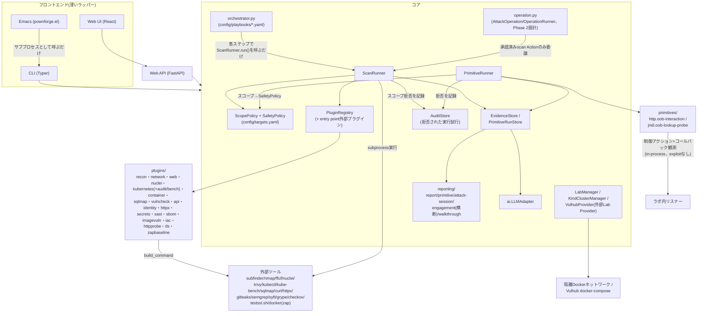
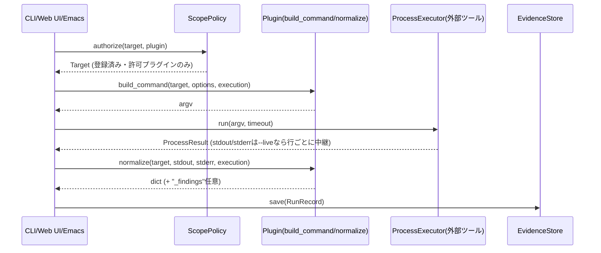
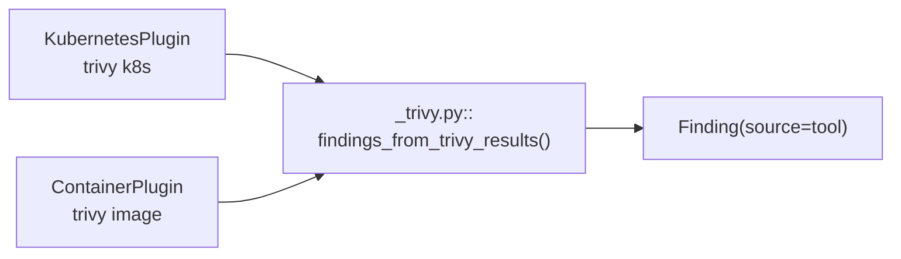
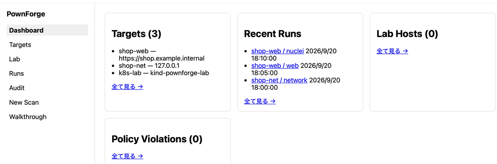
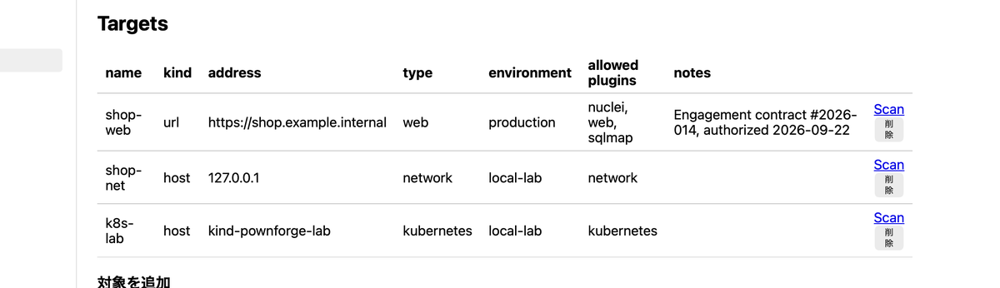
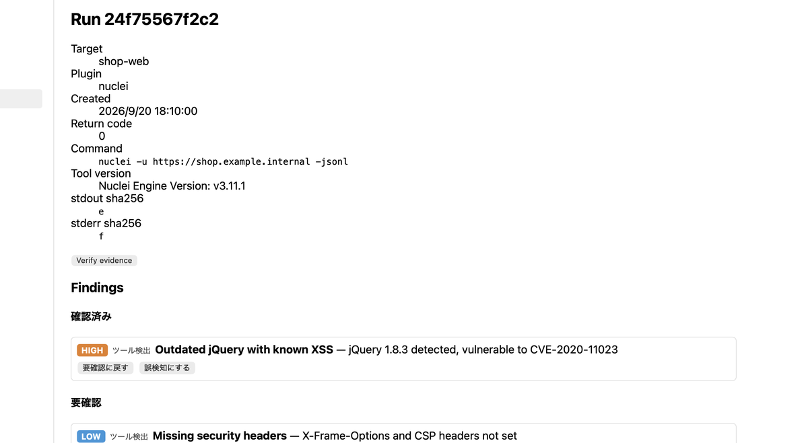
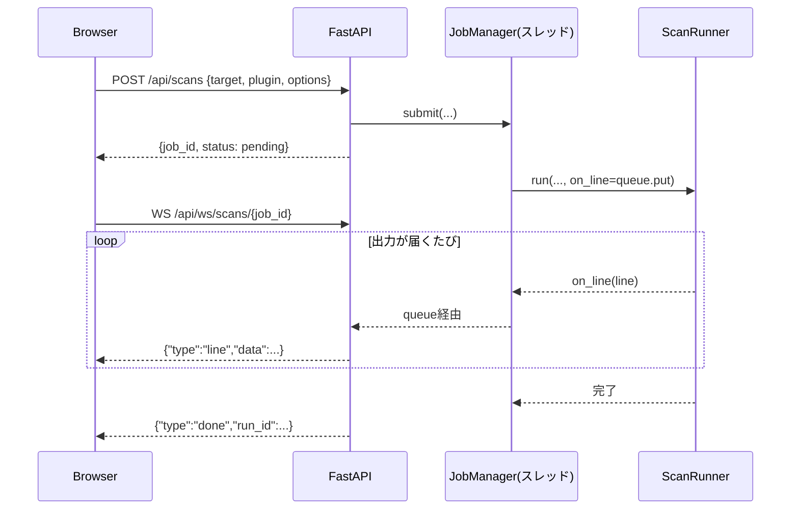
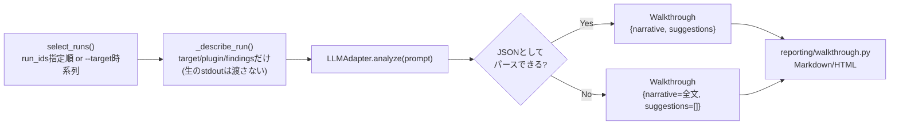
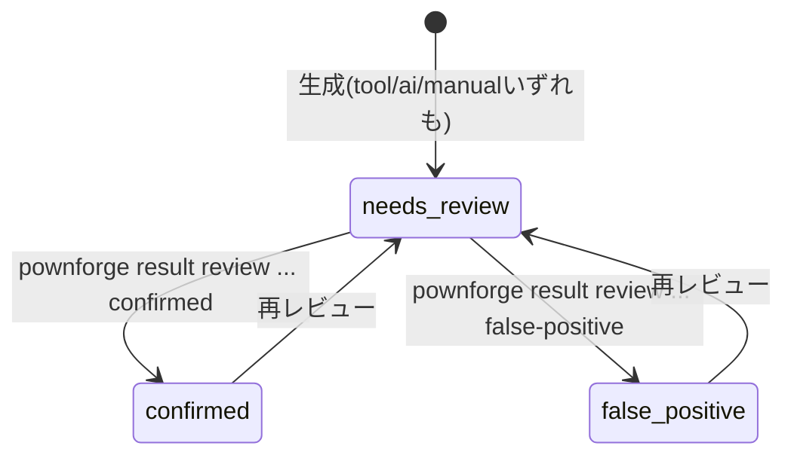

# PownForge 手引書

設計・ビルド・利用をまとめた一冊です。旧`docs/`配下の個別ファイル
(architecture.md/cli-contract.md/container.md/kubernetes.md/sqlmap.md/
lab.md/web.md/emacs.md/walkthrough-report.md/walkthrough.md/roadmap.md)は
本書に統合され、削除されています。コミット規約・エージェント向けの運用
ルールは引き続き[AGENTS.md](../AGENTS.md)を参照してください。

## 目次

1. [はじめに](#1-はじめに)
2. [全体アーキテクチャ](#2-全体アーキテクチャ)
3. [セットアップとビルド](#3-セットアップとビルド)
4. [クイックスタート](#4-クイックスタート)
5. [CLIコマンドリファレンス](#5-cliコマンドリファレンス)
6. [プラグイン](#6-プラグイン)
7. [ラボネットワーク](#7-ラボネットワーク)
8. [Playbook: 複数プラグインの連続実行](#8-playbook-複数プラグインの連続実行)
9. [Web UI / API](#9-web-ui--api)
10. [Emacs連携](#10-emacs連携)
11. [AIによる分析・ウォークスルー・提案](#11-aiによる分析ウォークスルー提案)
12. [Target modelとスコープ制御](#12-target-modelとスコープ制御)
13. [証跡とレポート](#13-証跡とレポート)
14. [`AttackOperation`モデル：攻撃経路のモデル化と承認フロー(Phase 2設計)](#14-attackoperationモデル攻撃経路のモデル化と承認フローphase-2設計)
15. [検証プリミティブ・フレームワーク(Phase 2設計・骨格)](#15-検証プリミティブフレームワークphase-2設計骨格)
16. [テスト](#16-テスト)
17. [付録: 実装状況サマリー](#17-付録-実装状況サマリー)
18. [RiskForgeとの関係(姉妹プロジェクト)](#18-riskforgeとの関係姉妹プロジェクト)

---

## 1. はじめに

PownForgeは、**明示的に許可されたラボ・検証環境**に対するセキュリティ診断を、
プラグイン方式で実行・正規化・証跡管理するためのモジュール型CLIです。
Pown.jsの「独立したモジュールをCLIから呼び出す」という考え方を参考にして
いますが、実装はPython/Typerによる独自設計です。

対象読者は、このプロジェクトを保守・拡張する開発者と、CLI/Web UI/Emacsを
実際に使って診断を行うユーザーの両方です。

中核となる約束は3つです。

- **登録済み対象以外はスキャンできない**: `config/targets.yaml`に登録された
  対象名でしか`pownforge scan`は実行できません。任意のホスト名・URLを
  直接引数に取ることはできません
- **AIは直接スキャンを実行しない**: AI(`pownforge analyze`/
  `pownforge walkthrough generate`)は、すでに保存された結果を要約・分析・
  提案するだけで、スキャン対象や実行コマンドを決定する権限を持ちません
- **実行証跡はハッシュ付きで保存される**: すべてのスキャンはコマンド・
  タイムスタンプ・stdout/stderrのSHA-256ハッシュとともに記録されます

## 2. 全体アーキテクチャ

PownForgeは、CLI・スコープ検証・プラグイン実行・証跡保存・レポート/分析を
明確に分離しています。



どのフロントエンドを使っても、認可ロジック(登録済み対象・許可プラグインの
組み合わせでしかスキャンできない)は完全に同じコードパスを通ります。
Web UIのルーターは`ScopePolicy`/`ScanRunner`/`PrimitiveRunner`/`LabManager`/
`VulhubProvider`をそのまま呼ぶだけ、Emacs連携は`pownforge`実行バイナリを
サブプロセスとして呼ぶだけです。

`ScanRunner`(プラグイン)に加え、`PrimitiveRunner`(検証プリミティブ、§15)も
同じ`ScopePolicy`を先頭で通し、さらに`SafetyPolicy`の行動エンベロープ
(detection/validation/execution、外部接続・永続化・cleanup要否)で到達段階を
制限します。プラグイン実行・プリミティブ実行のいずれも、スコープ/安全境界で
拒否された試行は`AuditStore`に記録されます。PownForge自身はexploitを実行せず、
プリミティブの最上位も「制御されたコールバック観測」まで
([§15](#15-検証プリミティブフレームワークphase-2設計骨格))。

1回のスキャン実行は次の流れで進みます。



`execution`は`PluginExecution`(`plugins/base.py`)のインスタンスで、
`ScanRunner`が1回の実行ごとに新しい一時ディレクトリを割り当てて生成し、
`build_command`/`normalize`の両方に同じインスタンスを渡します(P0
リファクタリング: §4.1)。

### 設計原則

- **AIに直接スキャンを任せない**: `ai/`はすでに保存された結果を要約・分析
  するだけで、スキャン対象や実行コマンドを決定する権限を持ちません
- **AI推定は確定した脆弱性として扱わない**: `pownforge analyze`がLLMの
  応答から生成する`Finding`は常に`source="ai"`を持ち、レポート上でも
  「AI推定・要確認」と明記されます。`severity`は固定のenum
  (`info/low/medium/high/critical`)で検証し、想定外の値は`info`に
  フォールバックしてタイトル・詳細は保持します(1件の逸脱で応答全体を
  捨てない)
- **AIは結果から推論し支援してよいが、実行権限は持たない**:
  `pownforge walkthrough generate`は複数runをまたぐ接続ナラティブと、
  「次に試すべきこと」の構造化提案(`Suggestion`)を生成しますが、
  どのRunRecordも書き換えません(`analyze`は対象runのfindings/analysisを
  上書き保存する副作用を持つのに対し、walkthroughは読み取り専用で新しい
  レポートを生成するだけ)。`Suggestion.plugin`はAIの自由記述で
  レジストリと突き合わせず、実行するには人間が改めて
  `pownforge scan <plugin>`を呼ぶ必要があります(詳細は
  [§11](#11-aiによる分析ウォークスルー提案))
- **スコープはコードで強制する**: `pownforge scan`は`config/targets.yaml`に
  登録された対象名でしか実行できません。`pownforge lab add`も最終的に
  同じ`ScopePolicy.add_target()`を通ります。`Target.environment`が
  `production`の対象は`notes`(認可/契約の参照)が必須で、無い場合
  `ScopePolicy.add_target()`自体が`PolicyError`を送出します(CLI/Web API/
  Web UIいずれの登録経路でも同じチェックを通る)
- **証跡に含まれるコマンドは秘匿情報らしき値をマスクする**: `ScanRunner`は
  実際の実行(`subprocess.Popen`)には`plugin.build_command()`が返した引数を
  そのまま使いますが、`Evidence.command`(証跡として保存・表示される側)には
  `core/secrets.py::mask_command()`を通した後のコピーを格納します。
  `--token`/`--password`/`--cookie`/`--header`等それらしい名前のフラグの
  値を`***`に置換するキーワードヒューリスティックで、固定のツール別
  フラグ一覧ではありません(将来認証情報を扱うプラグインを追加した時の
  ため。単一文字のフラグ、例えば`-H`はキーワード照合の対象にならないため
  対象外)
- **コマンド組み立てと実行を分離する**: プラグインは`build_command`/
  `normalize`のみを担当し、実際に外部プロセスを起動するのは
  `core/process.py`の`ProcessExecutor`(`ScanRunner`がこれを呼ぶ。
  `LabManager`も同様の分離)に一本化しています。証跡の保存形式は
  `evidence/`が一元管理し、プラグインが独自形式で永続化することは
  ありません
- **Pluginインスタンスに実行ごとの状態を持たせない**: `PluginRegistry`は
  プラグイン名ごとに単一のインスタンスを保持し、複数の実行(Web UIの
  並行リクエスト等)で共有されます。`build_command`/`normalize`が中間
  出力(nmapの`-oX`等)を書く一時パスは、`self`に保存するのではなく
  引数で渡される`PluginExecution`(`execution.path("name")`)から得ます。
  `ScanRunner`は実行ごとに新しい一時ディレクトリで`PluginExecution`を
  生成し、実行が終わるとディレクトリごと削除するため、同じPlugin
  インスタンスへの同時実行が互いの一時ファイルを混同することはありません
  (P0リファクタリング §4.1)
- **フロントエンドは薄いラッパーに留める**: ライブ進捗も、根は
  `ScanRunner.run()`の`on_line`コールバック1つ(Web UIはWebSocketへ、
  CLI/Emacsは`--live`で標準出力へ中継)を両方が共有しています

### プラグインインターフェース

`src/pownforge/plugins/base.py`の`Plugin`抽象クラスを実装します。

| メソッド/属性 | 内容 |
| --- | --- |
| `check() -> bool` | 必要な外部ツールが利用可能か |
| `build_command(target, options, execution) -> list[str]` | 実行するコマンド(検証済みtargetのみを使用)。一時ファイルが要る場合は`execution.path("name")`を使う(`self`に保存しない) |
| `normalize(target, raw_stdout, raw_stderr, execution) -> dict` | 生出力をJSON化可能な形式に変換。`build_command`と同じ`execution`が渡されるので`execution.path("name")`で同じパスを再取得できる |
| `version_command() -> list[str] \| None` | ツールのバージョン確認コマンド(省略可)。返した場合は`Evidence.tool_version`に記録される |
| `parse_version_output(stdout, stderr) -> str \| None` | バージョン文字列の抽出(既定は「stdoutの最初の行」)。ツールが警告等を先に出す場合はオーバーライド(`NucleiPlugin`はGoランタイムの警告行を読み飛ばす) |
| `expected_kind: TargetKind \| None` | このプラグインのaddressが前提とする`Target.kind`(既定`None`=制約なし)。`build_command()`冒頭で`self.require_kind(target)`を呼ぶと、一致しない場合に`PluginError`を送出する |
| `kind_hint: str \| None` | `require_kind()`のエラーメッセージへの追加ヒント |

`normalize()`が返す辞書に`"_findings"`キー(`{"title", "severity", "detail"}`
のリスト)を含めると、`ScanRunner`がそれを取り出して`Finding`
(`source="tool"`)に変換し`RunRecord.findings`へ格納します
(`NucleiPlugin`/`KubernetesPlugin`/`SqlmapPlugin`/`ContainerPlugin`が使用)。
`KubernetesPlugin`(`trivy k8s`)と`ContainerPlugin`(`trivy image`)は同じ
trivy JSON形状(`Results[].{Misconfigurations,Vulnerabilities,Secrets}`)を
扱うため、抽出ロジックは`src/pownforge/plugins/_trivy.py::
findings_from_trivy_results()`として共通化しています。



このキーを使わないプラグイン(`NetworkPlugin`/`WebPlugin`)には影響しません。
ツール側のseverity表記が`Severity` enumに合わない場合は`info`に
フォールバックし、finding自体は破棄しません
(`core/finding_utils.py::coerce_finding`、`pownforge analyze`のJSON解析と
共通のロジック)。

## 3. セットアップとビルド

Python 3.11以上が必要です(`pyproject.toml`の`requires-python`)。

```bash
make install          # python3.11 で .venv を作成してインストール
# または
pip install -e ".[dev]"
```

`pownforge`は`.venv`にインストールされ、シェルのPATHには自動で入りません。

```bash
source .venv/bin/activate
# もしくは毎回 .venv/bin/pownforge ... のように直接呼び出す
```

### Dockerランタイムイメージのビルド

Docker上で外部ツールを揃えて動かす場合、`docker/Dockerfile.runtime`
(Debian bookworm-slimベース)をビルドします。

```bash
docker compose build
```

**2026-09-23、`archlinux:base`から`debian:bookworm-slim`に移行しました**
(移行前のArch Linuxベース時代に実際に遭遇した問題と対応は次の表に
残しています。参考情報)。理由はarm64ネイティブビルドです。
`archlinux:base`は公式にarm64マニフェストを提供しておらず、Apple
Silicon上では常にQEMUエミュレーション(`platform: linux/amd64`)を
強いられていました。これは単に遅いだけでなく、**kind(arm64ネイティブ)
上でkube-benchプラグインのin-cluster Jobがamd64専用イメージを
解決できず起動できない**という実害につながっていました
([pownforge-vulnerable-lab](https://github.com/ac1965/pownforge-vulnerable-lab)
でのT07実機検証で確認、§6「kube-bench」参照)。`debian:bookworm-slim`は
公式にマルチアーキ(amd64/arm64)対応のため、`compose.yaml`から
`platform: linux/amd64`指定を外し、Apple Silicon上でもネイティブに
ビルド・実行できるようにしました。Go/trivy/kubectlは配布元の公式
マルチアーキバイナリ(`dpkg --print-architecture`でアーキを判定)を
使っています。

(参考: Arch Linuxベース時代に遭遇した問題と対応)

| 問題 | 症状 | 原因 | 対応 |
| --- | --- | --- | --- |
| プラットフォーム不一致 | `no match for platform in manifest: not found` | `archlinux:base`にarm64向けマニフェストが無い | `docker build --platform linux/amd64`、`compose.yaml`の該当serviceに`platform: linux/amd64`を明記 |
| pacmanサンドボックス失敗 | `error restricting syscalls via seccomp: 22!` | pacmanの新しいダウンロードサンドボックスが必要とするseccomp/user-namespace系syscallをQEMUエミュレーションが未対応 | `/etc/pacman.conf`に`DisableSandbox`を追加 |
| ffuf/nuclei/subfinderが見つからない | `error: target not found: ffuf` | Arch公式リポジトリ(core/extra)に未収録 | `go`パッケージを追加し`go install github.com/ffuf/ffuf/v2@latest`等でソースからビルド |
| nucleiが"no templates provided" | テンプレート0件でスキャン失敗 | 隔離`--internal`ネットワークには実行時のインターネット接続が無く、nucleiはテンプレート同梱なし | `RUN nuclei -update-templates`を**ビルド時**(インターネット接続がある間)に実行してテンプレートを焼き込む(Debian移行後も同じ対応を継続) |

ビルド後、ツールの実在を確認:

```bash
docker run --rm --entrypoint sh pownforge-pownforge:latest \
  -c "command -v nmap; command -v ffuf; command -v subfinder; command -v trivy; command -v kubectl; command -v kube-bench; command -v pownforge"
```

sqlmapのみDockerランタイムイメージには含めていません(ホスト側の
`.venv/bin/pownforge`から実行することを想定。[§6](#6-プラグイン)、
[§7](#7-ラボネットワーク)参照)。

## 4. クイックスタート

```bash
# 作業ディレクトリと空のスコープファイルを初期化
pownforge init

# 利用可能なプラグインを確認("missing tool"ならホストにツールが無い)
pownforge plugin list

# 検証対象を登録(自分のラボ環境などに限定すること)
pownforge target add lab-web --address 127.0.0.1 --kind host --allowed-plugins network

# 登録済み対象一覧
pownforge target list

# 診断を実行
pownforge scan network --target lab-web

# 実行結果一覧・詳細
pownforge result list
pownforge result show <run-id>

# レポート生成(既定Markdown、--format htmlでスタンドアロンHTML)
pownforge report generate <run-id>

# LLMによる分析(~/.local/bin/llm 経由。ローカルOllamaでもClaude/OpenAI等の
# ホスト型モデルでも、使うモデルは `pownforge config set --model ...` で選ぶ)
pownforge analyze <run-id>
```

## 5. CLIコマンドリファレンス

| コマンド | 説明 |
| --- | --- |
| `pownforge init` | 作業ディレクトリ(`.pownforge/`)と空のスコープファイルを作成 |
| `pownforge target list` | 登録済み対象の一覧 |
| `pownforge target add <name> --address <addr> [--kind host\|url\|path] [--type network\|web\|api\|kubernetes\|container\|source-code] [--environment local-lab\|staging\|production] [--allowed-plugins a,b] [--notes <text>] [--max-concurrent <n>]` | 対象を登録。`type`は分類用の任意項目(スキャン許可判定には使わない)。`--kind path`(`secrets`/`sast`/`iac`向け)は`--address`をシンボリックリンク解決済みの絶対パスへ自動変換して保存する([§6のsecrets](#6-プラグイン)参照)。`--environment production`は`--notes`(認可/契約の参照)が必須、無いと登録は拒否される。`--max-concurrent`省略時は無制限(詳細は[§12](#12-target-modelとスコープ制御)) |
| `pownforge target remove <name>` | 対象の登録を解除。in-place編集(address/allowed_plugins等の変更)は無く、変更したい場合は一度`remove`してから`add`し直す |
| `pownforge target exclude <name> [--reason <text>]` | 対象を削除せず一時的にスキャン対象外にする(全プラグインを拒否、詳細は[§12](#12-target-modelとスコープ制御)) |
| `pownforge target include <name>` | 対象の除外を解除 |
| `pownforge engagement list` | 登録済みEngagementの一覧 |
| `pownforge engagement add <name> --targets a,b[,c...] [--notes <text>]` | 既存Targetをグループ化したEngagementを登録。横展開の記録・ウォークスルーでのみ使う。詳細は[§12](#12-target-modelとスコープ制御) |
| `pownforge plugin list` | 利用可能なプラグインと外部ツールの有無 |
| `pownforge plugin info <name>` | プラグインの詳細(`expected kind`は`host\|url\|any`のうちそのプラグインが前提とするaddress形式)。受け付ける`--option`(必須/既定値/候補)と提供元(`builtin`または外部パッケージ名)も表示 |
| `pownforge scan run <plugin> --target <name> [--option k=v ...] [--live]` | 任意の登録済みプラグイン(外部プラグインを含む)を名前で実行。個別の`scan <plugin>`コマンドと同じ`ScanRunner`経路 |
| `pownforge scan recon --target <name> [--option sources=... --option exclude_sources=...] [--live]` | reconプラグイン(subfinder、受動的サブドメイン列挙)を実行。対象へトラフィックは送らない |
| `pownforge scan network --target <name> [--option k=v ...] [--live]` | networkプラグイン(nmap)を実行 |
| `pownforge scan web --target <name> --option wordlist=<path> [--live]` | webプラグイン(ffuf)を実行 |
| `pownforge scan api --target <name> [--option path=/... --option method=GET\|HEAD\|OPTIONS --option timeout=<秒>] [--live]` | apiプラグイン(curlで1リクエスト、ヘッダの受動チェック)を実行。`kind=url`の対象のみ。詳細は[§6](#6-プラグイン) |
| `pownforge scan httpx --target <name> [--option paths=/,/admin,... --option paths_file=<file> --option timeout=<秒>] [--live]` | httpxプラグイン(projectdiscovery httpxで登録対象配下の複数パスを一括プローブ)を実行。`kind=url`の対象のみ。詳細は[§6](#6-プラグイン) |
| `pownforge scan identity --target <name> [--option document=openid-configuration\|oauth-authorization-server --option timeout=<秒>] [--live]` | identityプラグイン(IdPの公開discovery文書を1回取得して記録)を実行。`kind=url`(addressはissuerのURL)。詳細は[§6](#6-プラグイン) |
| `pownforge scan nuclei --target <name> [--option tags=... --option severity=... --option templates=...] [--live]` | nucleiプラグイン(テンプレートベースの脆弱性検出)を実行。検出結果はfinding(`source: "tool"`)として記録 |
| `pownforge scan kubernetes --target <name> [--option namespaces=... --option severity=...] [--live]` | kubernetesプラグイン(`trivy k8s`)を実行。対象の`address`はkubeconfigのcontext名 |
| `pownforge scan kubernetes-audit --target <name> [--option namespaces=...] [--live]` | kubernetes-auditプラグイン(kubectl+trivy k8s、RBAC/Pod Security/Network/Imageの攻撃チェーン検出)を実行 |
| `pownforge scan kube-bench --target <name> [--option image=... --option timeout=...] [--live]` | kube-benchプラグイン(CIS Kubernetes Benchmark、control-planeノード上のJobとして実行)を実行 |
| `pownforge scan sqlmap --target <name> [--option risk=... --option level=... --option dump=true ...] [--live]` | sqlmapプラグイン(SQLインジェクション検出/抽出)を実行。安全設計は[§6](#6-プラグイン)参照 |
| `pownforge scan container --target <name> [--option severity=... --option ignore-unfixed=true --option scanners=...] [--live]` | containerプラグイン(`trivy image`)を実行。対象の`address`はコンテナイメージの参照 |
| `pownforge scan vulncheck --target <name> --option script=<許可されたNSEスクリプト名> [--option port=...] [--live]` | vulncheckプラグイン(nmapの許可リスト済み`vuln safe`スクリプト1本による既知CVE検証)を実行 |
| `pownforge result list` | 実行結果の一覧 |
| `pownforge result show <run-id>` | 実行結果の詳細(JSON) |
| `pownforge result import --target <name> --command <text> --output <text> [--tool ... --engagement <name> --via <target> --phase <p> --artifact <file> --cve <id>]` | 人間が別ツールで実施した工程の証跡を記録(PownForgeは`--command`を実行しない)。`--engagement`/`--via`は横展開の記録用、`--phase`でKillChainフェーズ、`--artifact`(繰り返し可)で成果物をハッシュ添付、`--cve`(繰り返し可)でCVEタグ。詳細は[§13](#13-証跡とレポート) |
| `pownforge result add-finding <run-id> --title <text> [--severity ... --detail ...]` | 人間が観測したfinding(`source: "manual"`)をrunに追加。既定`needs-review` |
| `pownforge result review <run-id> <finding-id> <needs-review\|confirmed\|false-positive>` | findingの検証状態を更新 |
| `pownforge result tag <run-id> --cve <id> [--cve ...] [--remove]` | 既存run(scan/manual)にCVEタグを追加/削除。`report engagement`のCVE露出マトリクスの相関キー |
| `pownforge report generate <run-id> [--format markdown\|html\|pdf]` | レポートを`.pownforge/reports/<run-id>.{md,html,pdf}`に生成。`pdf`は`pip install -e '.[pdf]'`(reportlab、Noto Sans JP埋め込みでCJK文字化けなし)が必要 |
| `pownforge report engagement [--target <name> \| --engagement <name>] [--format markdown\|html\|pdf]` | スキャン/手動run(`RunRecord`)と検証プリミティブrun(`PrimitiveRunRecord`)を横断した1つのエンゲージメント・レポートを生成(詳細は[§13](#13-証跡とレポート))。スコープ省略時は全run。`--engagement`は`--config`が必要 |
| `pownforge analyze <run-id> [--model ...] [--language ja\|en]` | LLMによる分析草案を出力。`--model`/`--language`省略時は`pownforge config`の保存値を使う |
| `pownforge walkthrough generate <run-id>... \| --target <name> \| --engagement <name> [--model ...] [--language ja\|en] [--format markdown\|html]` | 複数runをまたぐ物語調ウォークスルーを生成。読み取り専用(詳細は[§11](#11-aiによる分析ウォークスルー提案))。`--engagement`はEngagement全メンバーのrunをまとめて選択(詳細は[§12](#12-target-modelとスコープ制御))。PDF出力は未対応(単一runの`report generate`/AttackSessionの`attack-session report`のみ) |
| `pownforge config show` / `pownforge config set [--model <name>] [--language ja\|en]` | `analyze`/`walkthrough generate`が使う既定モデル・出力言語を表示/更新(詳細は[§11](#11-aiによる分析ウォークスルー提案)) |
| `pownforge lab add <name> --image <image> [--kind host\|url] [--port <n>] [--scheme http\|https] [--env k=v ...] [--allowed-plugins a,b] [--no-register] [--network <name>]` | 隔離ネットワーク上に攻撃対象ホストを起動 |
| `pownforge lab list [--network <name>]` | 稼働中/停止中のラボホスト一覧 |
| `pownforge lab kind create <name> [--kind-config <yaml>] [--kubeconfig-dir config] [--allowed-plugins ...] [--no-register]` | kindクラスタを作成し、kindのDockerネットワーク内向けkubeconfig(`kind get kubeconfig --internal`)を`<kubeconfig-dir>/<name>.kubeconfig`(0600)に書き出し、`address: kind-<name>`・`type: kubernetes`のTargetとして`ScopePolicy`経由で登録(詳細は[§7](#kubeforgekind-クラスタへの接続)) |
| `pownforge lab kind delete <name> [--purge]` | kindクラスタとkubeconfigを削除。`--purge`で登録済みTargetも削除 |
| `pownforge lab kind list` | ホスト上のkindクラスタとcontext名の一覧 |
| `pownforge lab provider list [--vulhub-dir <dir>]` | Vulhubチェックアウト配下のシナリオ(CVE環境)を一覧(詳細は[§7](#vulhubを外部lab-providerとして扱う)) |
| `pownforge lab provider start <scenario> [--vulhub-dir <dir>] [--register]` | シナリオを起動(`docker compose up -d`)。`--register`で最初の公開ポートを`http://127.0.0.1:<port>`のurl対象として`ScopePolicy`経由で登録。意図的に脆弱な環境のため隔離ホストでのみ実行 |
| `pownforge lab provider status <scenario>` | シナリオの稼働状態と公開ポート |
| `pownforge lab provider stop <scenario>` | シナリオのコンテナを停止(`docker compose stop`) |
| `pownforge lab provider reset <scenario>` | シナリオを作り直す(`docker compose down` + `up -d`) |
| `pownforge lab provider cleanup <scenario> [--purge]` | シナリオをボリュームごと破棄(`docker compose down -v`)。`--purge`で自動登録した対象も削除 |
| `pownforge lab remove <name> [--purge] [--network <name>]` | ラボホストを停止・削除 |
| `pownforge playbook list [--playbooks-dir <dir>]` | 利用可能なPlaybookの一覧 |
| `pownforge playbook show <name> [--playbooks-dir <dir>]` | Playbookのステップ内容を表示 |
| `pownforge playbook run <name> --target <target> [--playbooks-dir <dir>]` | Playbookの全ステップを対象に順次実行。1ステップ失敗しても後続は継続、`when`条件を満たさないステップはSKIPPEDとして報告(詳細は[§8](#8-playbook-複数プラグインの連続実行)) |
| `pownforge attack-session create <name> [--description <text>] [--engagement <name>]` | 空のAttackSessionを作成(何も実行しない) |
| `pownforge attack-session add-stage <name> <run-id> [--label <text>]` | 既存のrun-idをAttackSessionの次のステージとして追加 |
| `pownforge attack-session list` | AttackSessionの一覧 |
| `pownforge attack-session show <name>` | AttackSessionのステージを順に表示 |
| `pownforge attack-session report <name> [--format markdown\|html\|pdf]` | AttackSessionを経路レポートとして`<workdir>/reports/`に出力(詳細は[§13](#13-証跡とレポート))。`pdf`はKubernetes攻撃チェーンのHTML専用ダッシュボードを含まない(reportlab生成のため) |
| `pownforge operation create <name> [--objective <text>] [--engagement <name>]` | 空のAttackOperationを作成(何も実行しない) |
| `pownforge operation list` | AttackOperationの一覧 |
| `pownforge operation add-node <name> <node-id> --target <target> [--label <text>]` | 登録済みtargetをグラフのnodeとして追加(記述のみ、認可を拡張しない) |
| `pownforge operation add-edge <name> --source <target> --destination <target> [--capabilities <csv>]` | 既に追加済みのnode(target名)どうしをedgeで接続(記述のみ、実行・pivot権限を与えない) |
| `pownforge operation add-action <name> <action-id> <action-name> --target <target> --phase <phase> [--kind scan\|manual\|pivot] [--plugin <name>]` | Actionを追加。`--kind scan`(既定)は`--plugin`必須、`manual`/`pivot`は`--plugin`を指定できない |
| `pownforge operation approve <name> <action-id> --approved-by <operator> [--note <text>]` | Actionに人間の承認を記録 |
| `pownforge operation execute <name> <action-id> [--command <text>] [--output <text>] [--tool <name>] [--tool-version <text>] [--returncode <n>]` | 承認済みActionを実行。`scan`は既存`ScanRunner`経由、`manual`/`pivot`は`--output`必須の記録専用(PownForge自身は何も実行しない。詳細は[§14](#14-attackoperationモデル攻撃経路のモデル化と承認フローphase-2設計)) |
| `pownforge operation show <name>` | AttackOperationのnodes/edges/actions/approvalsを表示 |
| `pownforge primitive list` | 利用可能な検証プリミティブと受け付ける`--option`を一覧表示(詳細は[§15](#15-検証プリミティブフレームワークphase-2設計骨格)) |
| `pownforge primitive run <id> --target <name> [--level detection\|validation\|execution] [--option k=v ...] [--cve <id>]` | 検証プリミティブを対象に実行し`PrimitiveRunRecord`を保存。スコープ+SafetyPolicyを先に強制(拒否は`AuditStore`に記録)。`--cve`でCVEタグ付与。exploitは実行しない |
| `pownforge primitive runs` | 保存済みのプリミティブ実行を一覧表示 |
| `pownforge primitive show <run-id>` | 保存済みプリミティブ実行(前提条件・Evidence4層・cleanup結果)をJSONで表示 |
| `pownforge primitive report <run-id> [--format markdown\|html\|pdf]` | プリミティブ実行を`<workdir>/reports/`にレポート出力。PDFは`[pdf]` extra必要(§13と同じNoto Sans JP埋め込み) |
| `pownforge audit list` | `ScopePolicy`が拒否したスキャン実行の試みを一覧表示 |
| `pownforge audit show <violation-id>` | 拒否された試みの詳細(JSON) |
| `pownforge evidence verify <run-id>` | 保存済みoutputからハッシュを再計算し、証跡と一致するか確認 |

### `--config`/`--workdir`の使い分け

- `--config`(既定: `config/targets.yaml`): `target list/add`、`scan *`、
  `lab add/remove`、`operation add-action/execute`(`ScopePolicy`で
  target/pluginを検証するため)だけが受け付ける
- `--workdir` / `POWNFORGE_HOME`(既定: `.pownforge/`): `init`、`scan *`、
  `result *`、`report generate`、`analyze`、`walkthrough generate`、
  `audit *`、`evidence verify`、`attack-session *`、`operation *`、
  `primitive run/runs/show/report`だけが受け付ける。`walkthrough generate`は
  `--config`を受け付けない
  (`EvidenceStore`上のrunを`target`文字列で絞り込むだけで、スコープの
  再照会が不要なため)
- `plugin list/info`と`lab list`はどちらも取らない
- `--settings`(既定: `config/settings.yaml`、`POWNFORGE_SETTINGS`で上書き可):
  `analyze`、`walkthrough generate`、`web serve`、`config show/set`が受け付ける。
  `config/targets.yaml`同様、マシンごとに使えるモデルが異なるため
  `.gitignore`済み(`config/settings.yaml.example`参照)
- `scan`は登録済みの対象名しか受け付けない。各プラグインは前提とする
  `Target.kind`を宣言しており(`network`/`vulncheck`は`any`、`web`/`nuclei`/
  `sqlmap`は`url`、`kubernetes`/`container`/`recon`は`host`)、
  一致しない対象で`scan`すると
  ツールを起動する前に明確な`PluginError`で拒否される
- 拒否された試みは`.pownforge/violations/`に記録され、コマンド自体は
  一切実行されない

### `evidence verify`の限界

保存済みoutputからstdout/stderrのSHA-256を再計算し、証跡のハッシュと
一致するか確認しますが、これは実行結果JSONファイルへの**偶発的・部分的な
変更**(誤編集やディスク破損など)を検出するためのものです。そのファイルを
編集できる権限を持つ人は証跡のハッシュ自体も書き換えられるため、
**悪意ある改ざんに対する証明にはなりません**。また、`evidence.command`
(マスク後のコピー)は`evidence verify`の対象ではありません(検証対象は
実際のツール出力のハッシュのみ)。

### `--live`

ツールのstdoutを1行ずつ`| `付きでその場に表示するだけで、保存される
証跡・findingの内容は`--live`の有無に関わらず同一です(Web UIのWebSocket
ライブ進捗と同じ`ScanRunner`の`on_line`コールバックを使っているだけ)。
Emacs連携はこの`--live`出力を非同期プロセスのバッファへライブテールする
形で利用しています。

## 6. プラグイン

### recon(`subfinder`)

公開ソース(証明書透明性ログ、DNSデータベース等)のみを問い合わせる
**受動的**なサブドメイン列挙です。対象ホストへは一切トラフィックを
送らないため、他プラグインと異なりスキャン対象自体への負荷や検知の
懸念がありません。`Target.address`はベアなドメイン名(例: `example.com`)
として扱います。`expected_kind`は`host`。

```bash
pownforge target add example-recon --address example.com --kind host \
  --allowed-plugins recon
pownforge scan recon --target example-recon --option sources=crtsh,hackertarget
```

`--option`のキー: `sources`(`subfinder -s`、使用する情報源を限定)、
`exclude_sources`(`subfinder -es`)。結果は発見したサブドメインと
その出典ソースの一覧として記録され、確認済み脆弱性ではないためfindingは
生成しません(`network`/`web`と同様)。

**実機検証**: 実際にHomebrewで`subfinder`(v2.16.0)を導入し、
`projectdiscovery.io`を対象に`crtsh`ソースで実行、`{"host", "input",
"source"}`形式のJSONLが出力されることを確認した上でパーサーを実装。

**`pownforge lab`のホストには使えません**: `recon`は`kind=host`かつ
実在の公開ドメインが前提のプラグインです。`pownforge lab add`で登録される
ラボホストのaddressはDocker DNS上のコンテナ名(例: `lab-web`)で、
`kind=url`(web/nuclei/sqlmap向け)または`kind=host`であってもcrt.sh等の
公開ソースには存在しない名前のため、`recon`を向けても意味のある結果は
得られません(`kind=url`の対象に対してはそもそも`require_kind()`で
`PluginError`となり実行前に拒否されます)。[§7](#7-ラボネットワーク)の
Juice Shop等のラボ検証では、`recon`だけは対象外と考えてください。

### network(`nmap`)

TCP/service discovery。`--option ports=80,443`のようなkey=valueオプション
のみで、名前付きプロファイル機構はありません。`expected_kind`は`None`
(制約なし)。

### web(`ffuf`)

コンテンツ・エンドポイント探索。`--option wordlist=<path>`が必須。
オートキャリブレーション(`-ac`)込み。`expected_kind`は`url`。

### nuclei

テンプレートベースの脆弱性検出。`--option tags=... --option severity=...
--option templates=...`。検出結果はそのままfinding
(`source: "tool"`、既定`needs-review`)として記録される、当初案の検証
ワークフローに最も近いプラグインです。`expected_kind`は`url`。

**実機検証**: [§7](#7-ラボネットワーク)のOWASP Juice Shopラボ対象に対し、
実際のnuclei(Dockerランタイムイメージに同梱、テンプレートはビルド時に
`nuclei -update-templates`で取得済み)で`--option
tags=exposure,misconfig`を実行。`prometheus-metrics`テンプレートが
`/metrics`エンドポイントの露出を実際に検出し、`severity: medium`の
finding(`source: "tool"`)として正しく記録されることを確認済み。

### kubernetes(`trivy k8s`)

クラスタの誤設定(Misconfigurations)・RBAC・コンテナイメージの脆弱性
(Vulnerabilities)・漏洩シークレット(Secrets)をまとめて検出します。

`network`/`web`/`nuclei`と違い、**`Target.address`はhost/URLではなく
kubeconfigのcontext名として扱います**(`kind get clusters`や`kubectl
config get-contexts`で確認できる文字列)。`Target.kind`は`host`のまま、
分類用に`Target.type`へ`kubernetes`を設定できます(表示・分類目的のみ)。
`expected_kind`は`host`。対象のクラスタへは`pownforge`を実行している
マシンの`~/.kube/config`経由で到達できる必要があり、通常は開発者のホスト上
(kubectl/trivyが使える環境)で実行することを想定しています。

```bash
pownforge target add kind-lab --address kind-pownforge-lab --kind host \
  --type kubernetes --allowed-plugins kubernetes
pownforge scan kubernetes --target kind-lab \
  --option namespaces=kube-system --option severity=MEDIUM,HIGH,CRITICAL
```

**実機検証**: `kind`でローカルクラスタを作成し、実際のtrivy(0.74.0)で
スキャンを実行した。`kube-system`namespaceだけでも258件のfinding
(critical 2 / high 134 / medium 122)が検出され、実在のCVEやKubernetesの
設定不備がそのままfindingとして記録され、CLI・Web UIの両方で確認できる
ことを確認済み。**再検証**(別セッション、`kindest/node:v1.37.0`)でも
`kube-system`namespaceに対する`--option severity=CRITICAL,HIGH`実行で
136件のfindingが正しく記録されることを確認、コード上の問題は
見つからなかった。

### kubernetes-audit(kubectl + `trivy k8s`)

`kubernetes`プラグインが`trivy k8s`の個別findingをそのまま流すのに対し、
`kubernetes-audit`は**単体では見過ごされがちな所見同士が組み合わさると
実際に悪用できてしまう経路(攻撃チェーン)**を検出する専用プラグインです。
元は別リポジトリ(KubeForge、意図的に脆弱なkindラボを提供する診断ツール)の
`scripts/`配下にPythonスクリプトとして実装されていたRBAC/Pod Security/
Network/Imageの4種の監査ロジックを、チェーン検出アルゴリズムごと本プラグイン
(`src/pownforge/plugins/kubernetes_audit.py`)へ移植したものです。
KubeForge自体は今後「再現可能な脆弱Kubernetesラボの構築」に専念し、
監査・可視化はPownForge側で行う役割分担になっています([§7](#7-ラボネットワーク)参照)。

`Target.address`は`kubernetes`プラグインと同様kubeconfigのcontext名。
`expected_kind`は`host`。1回の実行で以下をまとめて検出します。

| チェーン | 検出内容 |
| --- | --- |
| RBAC | `serviceaccounts/token`のcreate権限を持つServiceAccountが、同じnamespace内のcluster-admin付きServiceAccountへ`kubectl create token`でなりすませる経路 |
| Pod Security | privileged/特権capability + hostPathマウント、または + hostPIDによるノード乗っ取りチェーン |
| Network | NetworkPolicyのルールにfrom/toが無く実質全許可になっているケース、hostNetworkによるNetworkPolicyバイパス |
| Image | `trivy k8s --report all`が検出したCRITICAL/HIGH脆弱性を持つイメージが、同じPodのノード脱出手段(privileged/hostPath/hostNetwork等)と組み合わさっているケース |

**KubeForge本家との実装上の違い**: KubeForgeは`image_audit.py`で
Podごとの`container.image`に対し個別に`trivy image`を呼んでいましたが、
本プラグインは`build_command`が返す1コマンド(`kubectl get ... && trivy
k8s ...`)で完結させるため、`trivy k8s --report all`が返すPod単位の
Vulnerabilities集計をそのまま使います(個別`trivy image`呼び出しは
行いません)。イメージ単位ではなくPod単位の粒度になりますが、
このラボの構成(1コンテナ1Pod)では実質的に同じ結果になります。

**誤検出対策**: RBAC/Pod Security/Network/Imageのすべてで、CNI/CSIの
DaemonSet等が正当に必要とするprivileged/hostPath/hostNetworkを
system namespace(`kube-system`/`kube-public`/`kube-node-lease`/
`tigera-operator`/`calico-system`/`calico-apiserver`)ごと除外する
`EXEMPT_NAMESPACES`を全チェーン検出で共有しています(移植元のKubeForge
AGENTS.mdに記録された「新しいチェーン検出を追加するときは最初から
除外フィルタを組み込むこと」という教訓をそのまま踏襲)。

```bash
pownforge target add kubeforge-lab --address kind-kubeforge-lab \
  --kind host --type kubernetes --allowed-plugins kubernetes,kubernetes-audit,kube-bench

docker compose run --rm \
  -e KUBECONFIG=/app/config/kubeforge-lab.kubeconfig \
  pownforge scan kubernetes-audit --target kubeforge-lab \
  --option namespaces=vulnerable-lab
```

**実機検証**: KubeForgeの`vulnerable-lab`namespace(`privileged-host-breakout`
Pod: privileged+hostPath+hostPID+hostNetwork+hostIPC、`root-no-limits`
Pod、過剰権限ServiceAccount一式)に対して`docker compose run`経由
(`pownforge-lab`ネットワークに加えて`kind`ネットワークにも接続した
コンテナから)で実行。RBACトークン昇格チェーン1件、Pod Securityブレイク
アウトチェーン2件(hostPath/hostPID)、Networkの実効性のないルール1件+
hostNetworkバイパス1件、findings合計32件が正しく検出されることを確認した。
`kubectl get pod ... -o jsonpath='{.spec.hostNetwork} {.spec.hostPID}
{.spec.hostIPC}'`で実際の値が`true true true`であることを突き合わせ、
誤検出でないことも検証済み。Imageチェーンは0件だったが、対象Pod
(`alpine:3.20`)にCRITICAL/HIGH脆弱性が無かったことが原因で、ロジックの
不具合ではないことを確認した(`nginx:1.27`ベースの`root-no-limits`には
多数のCVEがあるが、ノード脱出手段を持たないためチェーンとしては
検出されない、という判定も期待通り)。

### kube-bench(CIS Kubernetes Benchmark)

Hardening施策(kind-config.yamlの`kubeadmConfigPatches`でapiserver/
controller-manager/schedulerのフラグを変更する等)の効果を、変更前後で
`pownforge scan kube-bench`を2回実行しPASS/FAIL/WARN件数を比較すること
で測定するためのプラグインです。`kube-bench`自体はcontrol-planeノード上の
Job(`src/pownforge/plugins/_kube_bench_job.yaml`、KubeForgeの
`manifests/audits/kube-bench-job.yaml`を移植)として実行され、
標準出力のサマリー行(`== Summary total ==`)とFAIL行(`[FAIL] <id>
<desc>`)を正規表現で集計します。

Jobのコンテナイメージは、PownForgeのランタイムイメージ自身
(既定: `pownforge-pownforge:latest`、`--option image=...`で上書き可)を
使います。公式のkube-bench配布物(GitHub Releases/Docker Hub)は
リリース時点のGoバージョンのまま固定されており埋め込まれたstdlib由来の
脆弱性をTrivyが検出することがあるため、`docker/Dockerfile.runtime`で
ソースからビルドしています(`ffuf`/`nuclei`/`subfinder`と同じ理由。
kube-benchはcfg/ディレクトリ(CIS Benchmarkのチェック定義)がビルド済み
バイナリに含まれないため、`go install`ではなくソースtarballを取得して
`go build`する必要がある点に注意)。実行前に対象のkindクラスタへ
`kind load docker-image pownforge-pownforge:latest --name <cluster>`
でイメージを読み込ませておくこと。

**解消済みの制約(Apple Silicon)**: 以前は`docker/Dockerfile.runtime`が
`archlinux:base`(公式にarm64マニフェスト無し)をamd64限定でビルドして
いたため、arm64ネイティブなkindノードのcontainerdが「no match for
platform in manifest」でJobのイメージを解決できず、Apple Siliconでは
kube-bench自体(=実際のCIS Benchmark実行)を検証できていなかった。
`docker save | ctr images import`への切り替えも試したが、これはイメージの
インデックス(マニフェストリスト)は取り込めてもamd64のレイヤー本体は
同じ理由で解決できず、回避策にならないことを実機で確認した。

2026-09-23、`docker/Dockerfile.runtime`を`debian:bookworm-slim`
(公式マルチアーキ)に移行し(前掲「Dockerランタイムイメージのビルド」参照)、
`compose.yaml`の`platform: linux/amd64`指定を外した。これによりarm64
ネイティブビルドが可能になり、
[pownforge-vulnerable-lab](https://github.com/ac1965/pownforge-vulnerable-lab)
のkindクラスタ(Apple Silicon上でarm64ネイティブに動作)に対して
`kube-bench`を実行し、46件のfinding(CIS Benchmarkの`[FAIL]`項目、
etcdデータディレクトリ権限、apiserverの`--authorization-mode`等)を
正しく検出できることを確認した。

### container(`trivy image`)

コンテナイメージの脆弱性・誤設定・漏洩シークレットを検出します。実装は
kubernetesプラグインと同じtrivy JSON形状を扱うため、抽出ロジックは
`_trivy.py`として共通化しています(前掲の図参照)。

`Target.address`はコンテナイメージの参照(例: `nginx:1.25`)として
扱います。`expected_kind`は`host`。対象イメージはDocker/containerd/podman
経由で取得されます。

```bash
pownforge target add web-app-image --address "myregistry.example.com/web-app:1.4.2" \
  --kind host --type container --allowed-plugins container
pownforge scan container --target web-app-image \
  --option severity=HIGH,CRITICAL --option ignore-unfixed=true
```

`--option`のキー: `severity`(`trivy image --severity`)、`ignore-unfixed`
(`true`で修正版が無い脆弱性を除外)、`scanners`(`vuln,misconfig,secret`)。

**Dockerランタイムイメージの既知の制約**: `pownforge-lab`ネットワークは
`--internal`のため、`docker compose run pownforge`経由でパブリック
レジストリのイメージ参照を直接スキャンすることはできない(レジストリ
への到達経路が無い)。実機検証はホスト側`.venv`経由(通常の
インターネット到達性を持つ)で行っている(同じ制約が`sbom`/`imagevuln`
にも適用される、[§6のsbom](#6-プラグイン)参照)。

**実機検証**: サポート終了済みの`alpine:3.10`イメージを対象に実際のtrivyで
検証し、実在のCVE(`CVE-2021-36159`)がfinding(`severity: critical`)として
記録されることを確認済み。**再検証**(別セッション)でも同じ`alpine:3.10`
に対して同じCVEが検出されることを確認、コード上の問題は見つからなかった。

### sqlmap

URL中のパラメータに対するSQLインジェクションを検出・(オプションで)実際に
データを抽出します。`expected_kind`は`url`。

**安全設計(重要)**: sqlmapは他のプラグインと違い、SQLインジェクションを
足がかりにOSコマンド実行やファイル操作にまでエスカレートできるツールです。
これは「対象のURL・パラメータへのSQLi診断」というスコープを大きく逸脱
しうるため、以下の方針で実装しています。

- **`--risk`/`--level`には上限を設けない**。既定は`--risk 1 --level 1`
  (最も保守的)だが利用者が明示すれば緩められる。これらは「SQLi検出
  ペイロードの積極度」を変えるだけで、対象を診断すること自体は最初から
  許可されているため
- **`--dump`/`--dump-all`は許可する**。検出だけでなく実際にデータを
  抽出して見せることがsqlmapの本来の価値であり、対象は既に`ScopePolicy`
  で認可済みのため
- **OS/レジストリ/ファイル操作・インタラクティブシェル・設定ファイル
  読み込みに相当するフラグは`--risk`/`--level`の値に関わらず常に拒否する**。
  拒否リスト(大文字小文字・先頭`-`の有無を問わない):

  ```text
  os-shell, os-pwn, os-smbrelay, os-bof, priv-esc, os-cmd,
  reg-read, reg-add, reg-del, reg-key, reg-value, reg-data, reg-type,
  file-read, file-write, file-dest,
  sql-shell, shell, wizard,
  eval, tamper, answers, c, configfile
  ```

  (`c`/`configfile`は追加のsqlmap引数を設定ファイル経由で密輸できて
  しまうため、`answers`は`--batch`が選ぶ保守的な既定回答を上書きできて
  しまうため、それぞれ拒否リストに含めている)
- **`environment=production`のtargetに対する一律禁止は設けない**。
  Target登録時点で`environment=production`は`notes`必須という強制が
  既に入っており([§12](#12-target-modelとスコープ制御)参照)、これを
  sqlmap実行の認可としてそのまま流用する

```bash
pownforge target add shop-item --address "https://shop.example/item?id=1" \
  --kind url --type web --allowed-plugins sqlmap
pownforge scan sqlmap --target shop-item --live
pownforge scan sqlmap --target shop-item \
  --option risk=2 --option level=3 --option dump=true
```

`normalize()`の`output`には`dbms`(検出DBMS名)、`injection_points`
(`[{"parameter", "method", "techniques": [...]}]`)、`dumped_tables`
(`--dump`実行時、抽出データ)を含みます。

**実機検証**: 意図的に脆弱なローカルFlaskアプリ(生の文字列結合による
SQLクエリ組み立て)を用意し、実際のsqlmap(1.10.9)で検証した。
boolean-based blind/error-based/time-based blind/UNION queryの4手法が
検出され、`severity: critical`のfindingとして記録されることを確認。
`--option os-shell=true`指定時にsqlmapを実行せずエラーになることも確認済み。
**再検証**(別セッション、最小限のSQLite製Flaskアプリ)でも
boolean-based blind/error-based/UNION queryが検出され、DBMS判定
(`SQLite`)を含め`output.dbms`/`output.injection_points`が正しく
記録されることを確認、コード上の問題は見つからなかった。この時点では
「DBMSがSQLiteのためtime-based blindは対象外」と判断していたが誤りで、
**再々検証**([pownforge-vulnerable-lab](https://github.com/ac1965/pownforge-vulnerable-lab)
の`flask-sqli`、§7参照)でtime-based blindも`RANDOMBLOB`を使った
heavy query技法で検出されることを確認した(`MySQL`の`SLEEP()`の
ような専用関数が無くても、負荷の大きいクエリで応答を遅延させる手法は
SQLiteでも機能する)。4手法すべてが検出されることを前提にしてよい。

### api(`curl`)

APIエンドポイントへ**1リクエストだけ**送り、ステータス・レスポンス
ヘッダ・本文(2万文字で切り詰め)を証跡として記録するプラグインです。
`expected_kind`は`url`。`ffuf`(`web`)のような総当たりはせず、指定した
1パスだけを観測します。

```bash
pownforge target add lab-api --address http://lab-api:3000 --kind url \
  --allowed-plugins api
pownforge scan api --target lab-api --option path=/rest/products --option method=GET
```

`--option`のキー: `path`(既定`/`、対象addressの後ろに連結)、`method`
(既定`GET`)、`timeout`(秒、既定30)。

**安全設計**:

- `method`は`GET`/`HEAD`/`OPTIONS`のみ。`POST`/`PUT`/`PATCH`/`DELETE`等、
  対象の状態を変えうるメソッドは`build_command()`の時点で拒否する
- `path`は単一の`/`で始まる必要があり(`//host`や`@host`は拒否)、
  さらに連結後のURLのscheme/host/portが登録済みaddressと一致することを
  検証してから実行する(登録済み対象以外へ要求が飛ばないようにするため)
- リダイレクトは追わない(`-L`なし)。`--proto =http,https`で他プロトコル
  も使わない

**finding**(`source: "tool"`、すべて`needs-review`で生成): レスポンス
ヘッダだけから判定する受動的な観測に限る。`X-Content-Type-Options`欠落
(low)、`Content-Security-Policy`欠落(info)、https時の
`Strict-Transport-Security`欠落(low)、`Server`/`X-Powered-By`での
バージョン表記(info)、`Access-Control-Allow-Origin: *`(low)。応答が
得られなかった場合はfindingを生成しない。

**実機検証**: 2026-09-23、`127.0.0.1`上のローカルHTTPサーバーを対象に
`scan api`を実行し、ステータス200・ヘッダ・本文とfinding 3件
(`X-Content-Type-Options`欠落、CSP欠落、`Server`のバージョン表記)が
記録されること、`method=DELETE`と`path=@evil.example/`が実行前に拒否
されることを確認した。

### httpx(projectdiscovery `httpx`)

登録済みの**1つのURL対象の配下(同一origin)**を、複数パス一括で
プローブして各URLのHTTPメタデータ(ステータス・タイトル・webserver・
検出tech・content-length/type・リダイレクトlocation)を記録する
**探索/フィンガープリント**プラグインです。`expected_kind`は`url`。
`web`(ffuf、パスの総当たり探索)とは別物で、httpxは既知のURL集合を
*性質づける*用途。findingは生成しません(`recon`/`web`/`network`と同じ
探索フェーズ)。

```bash
pownforge target add lab-web --address http://lab-web:8080 --kind url \
  --allowed-plugins httpx
pownforge scan httpx --target lab-web --option paths=/,/admin,/api/health
```

`--option`のキー: `paths`(カンマ区切りの絶対パス、既定`/`)、`paths_file`
(1行1パスのファイル、`paths`に追加)、`timeout`(秒、既定10)。

**安全設計**: プローブするURLは常に`<登録addressのbase> + <絶対パス>`として
組み立て、各パスは先頭スラッシュ1個の絶対パスに限定し(`//host`や`@host`は
拒否)、組み立て後のURLが登録addressと同一origin(scheme/host/port一致)で
あることを再検証してから実行する。よって1回のrunが登録済み対象の外へ
出ることはない(AGENTS.md「登録外の対象を叩かない」)。リダイレクトは
追わない(`-follow-redirects`なし。locationは記録するだけ)。

**ツール名の衝突に注意**: projectdiscovery httpxはバイナリ名が`httpx`で、
Pythonの`httpx`ライブラリが入れるCLIシムと名前が衝突する。このプラグインは
**projectdiscoveryのバイナリ**を前提とするため、`/usr/local/bin/httpx`に
最後に上書きインストールされた方が実際に使われる。

**実機検証で発見したバグ**: Dockerランタイムイメージで、`go install`
(projectdiscoveryのバイナリ)の**後に**`pip install '.[pdf]' ...`
(pownforge自身の依存`httpx>=0.27`ライブラリを含む)を実行していたため、
pipが入れるPython版のCLIシムが同じパスを上書きし、`httpx`/`httpprobe`
両プラグインがコンテナ内で**常にPython版のシムを実行**していた
(`httpx -version`等のフラグを全て拒否するため、実行すれば即座に失敗する
はずが、`httpprobe`の実機検証で偶然この状態のまま試すまで気づかれなかった)。
`docker/Dockerfile.runtime`でprojectdiscovery httpxの`go install`を
`pip install`の**後**に移動し、常に最後にインストールされる方
(projectdiscoveryのバイナリ)が勝つように修正した。ホスト`.venv`側は
この収集順序と無関係(`go install`/Homebrew等、別のディレクトリに
インストールされるため影響を受けない)。

### identity(`curl`、OIDC/OAuth discovery文書)

IdP(OpenID Provider / OAuth認可サーバー)が**認証なしで公開している
設定メタデータを1回だけ取得**して記録するプラグインです。`expected_kind`
は`url`で、addressにはissuerのURL(例: `http://lab-idp:8080/realms/lab`)
を登録します。

```bash
pownforge target add lab-idp --address http://lab-idp:8080/realms/lab --kind url \
  --allowed-plugins identity
pownforge scan identity --target lab-idp
pownforge scan identity --target lab-idp --option document=oauth-authorization-server
```

`--option`のキー: `document`(`openid-configuration`(既定、OpenID Connect
Discovery 1.0の`/.well-known/openid-configuration`)または
`oauth-authorization-server`(RFC 8414の`/.well-known/oauth-authorization-server`)
の2択、任意パスは不可)、`timeout`(秒、既定30)。

**扱わないもの**: 認証情報(パスワード・トークン・クライアント
シークレット)は一切受け取らず送らない。discovery文書に列挙された
エンドポイント(token/userinfo/jwks等)にもアクセスしない。そのため当初
想定していた`core/secrets.py::mask_command()`の対象になる値も無い。
URLの組み立ては`api`プラグインと同じく登録済みaddressとのscheme/host/port
一致を検証し、リダイレクトは追わない。

**記録内容**: ステータス、Content-Type、文書中の主要フィールド(issuer、
各endpoint、`jwks_uri`、`scopes_supported`、`grant_types_supported`、
`response_types_supported`、`code_challenge_methods_supported`、
`token_endpoint_auth_methods_supported`、`id_token_signing_alg_values_supported`等)。
生のレスポンス全体も`raw_stdout`として証跡に残る。

**finding**(`source: "tool"`、`needs-review`。文書の記載内容だけから判定
する受動的な観測): `id_token_signing_alg_values_supported`に`none`(medium)、
implicitフロー(`grant_types_supported`の`implicit`または`response_types`
に`token`)の提供(info)、`password`グラント(low)、
`code_challenge_methods_supported`にS256が無い(low)、issuerが登録済み
addressと異なる(info)、localhost以外の`http://`エンドポイント(low)。
200以外やJSONでない応答ではfindingを生成しない。

**実機検証**: 2026-09-23、`127.0.0.1`上のローカルHTTPサーバーに静的な
discovery文書を置いて`scan identity`を実行し、文書へのリクエスト1回のみで
メタデータが記録され、finding 3件(alg `none`、implicit、PKCE S256なし)が
生成されることを確認した。`allowed_plugins: [identity]`の対象に`scan api`
を実行するとScopePolicyが拒否することも確認した。

### vulncheck(`nmap` NSEスクリプト)

単一の登録済み対象に対して、既知CVEの実際の該当有無を検証します。
中身は`nmap --script <許可された1本> --script-args vulns.showall`で、
新規の外部ツール依存はありません(`network`プラグインと同じく`nmap`のみ)。

**安全設計**: 実行できるNSEスクリプトは、nmap自身が`vuln`かつ`safe`と
分類している(`exploit`/`intrusive`/`dos`/`brute`のいずれでもない)スクリプト
だけに**許可リスト方式で**限定しています(`plugins/vulncheck.py::
_ALLOWED_SCRIPTS`)。たとえば`http-shellshock`や`ftp-vsftpd-backdoor`は
nmap自身が`exploit`/`intrusive`に分類しており(既定でコマンド実行や
バックドアの起動を伴う)、これらは常に拒否されます。`--option script=`に
許可リスト外の名前を渡すと、ツールを起動する前に`PluginError`で拒否
されます。sqlmapの「拒否リスト方式(OS/ファイル操作系オプションを個別に
拒否)」とは逆に、こちらは「許可リスト方式(ホワイトリストに無いものは
すべて拒否)」を採っています。対応CVEの一覧・重大度対応表は
`_ALLOWED_SCRIPTS`/`_SEVERITY_BY_SCRIPT`を参照してください(Heartbleed/
POODLE/EternalBlue/ROCA等、主要な既知CVE検証スクリプトを収録)。

```bash
pownforge target add app-tls --address app.example.internal --kind host \
  --allowed-plugins vulncheck
pownforge scan vulncheck --target app-tls \
  --option script=ssl-heartbleed --option port=443
```

スクリプトが対象を"VULNERABLE"と報告した場合のみfinding(`source:
"tool"`)として記録されます。"NOT VULNERABLE"の場合はfindingを作らず、
`output.results`に結果(state/detail)だけが残ります。

**実機検証**: ローカルに自己署名TLSサーバー(`openssl s_server`)を
立て、実際のnmap(7.991)で`ssl-heartbleed`を実行。「NOT VULNERABLE」の
判定が正しく記録され、findingが作られないことを確認。また、許可リスト
外の`http-shellshock`を指定した場合にツールを起動せず拒否されることも
確認済み。

続けて、[§7](#7-ラボネットワーク)のMetasploitable2ラボ対象に対して
`http-vuln-cve2011-3192`(Apache Range headerによるDoS、Metasploitable2の
Apache 2.2.8が対象になりうる)と`smb-vuln-ms17-010`(EternalBlue、
Metasploitable2のSamba相手に実行)を実行。この検証で**実バグを発見**した:
`smb-vuln-ms17-010`はportrule(`<port>`配下)ではなくhostrule
(`<hostscript>`配下)で結果を返すnmap NSEスクリプトで、`_parse_xml()`は
`<port>`配下の`<script>`しか見ていなかったため、スクリプトは実際に
実行され結果も出力されているのに`output.results`が常に空になっていた。
`<hostscript>/<script>`も走査するよう修正し、`smb-vuln-ms17-010`の
「NOT VULNERABLE」判定が正しく`output.results`に記録されることを
再検証で確認した(この場合`port`は`null`になる。ポート番号を伴わない
ホストレベルの結果であるため)。

さらに、`_ALLOWED_SCRIPTS`収録の残り13本についても、ローカルTLS
サーバー(コンテナ化した`alpine/openssl s_server`)とMetasploitable2ラボ
対象に対して実機検証を行い、以下を確認した。

- `ssl-poodle`/`ssl-ccs-injection`/`rsa-vuln-roca`/`http-vuln-cve2015-1635`:
  いずれも正しく「NOT VULNERABLE」を`output.results`に記録
- `smb-double-pulsar-backdoor`: `smb-vuln-ms17-010`と同じhostrule系
  スクリプトで、修正後の`<hostscript>`走査で正しく記録されることを確認
- `tls-ticketbleed`: raw socket特権が必要なスクリプトで、非rootの
  ローカルnmapでは`NSE: Not running due to lack of privileges.`で
  スキップされ`output.results`が空になる(バグではなく、nmap自体が
  スクリプトを実行していないため)。`pownforge:runtime`イメージは
  コンテナ内でroot実行される(`uid=0`)ため、実際のラボ運用では問題なく
  動作することを、コンテナ化したTLSサーバーに対して確認した
- `http-vuln-cve2010-0738`(JBoss JMX)/`http-vuln-cve2014-2126`〜`2129`
  (Cisco ASA VPN系)は、対象が該当製品でない場合スクリプト自体が何も
  出力しない(`<script>`要素が生成されない)ため`output.results`は空になる。
  これは各スクリプトの想定どおりの挙動で、パース側の不具合ではないことを
  raw XMLで確認
- `http-vuln-cve2017-1001000`(WordPress REST API)は、対象がWordPressで
  ない場合にスクリプト自身がLua例外を投げて失敗することがある(nmap NSE
  側の既知の弱さ)。この場合`<script>`要素にはエラーメッセージだけが入り、
  `state`要素が無いため`_parse_script_result()`は`state="UNKNOWN"`として
  扱う。`_is_vulnerable_state("UNKNOWN")`は`False`を返すため、スクリプトが
  失敗してもfindingが誤って生成されないことを確認した

これで許可リスト15本全てについて、実際のnmapでの実行結果を確認済み。

### 外部プラグイン(Plugin SDK)

リポジトリ外のPythonパッケージとしてプラグインを配布できます。公開APIは
`pownforge.sdk`(`Plugin`、`PluginError`、`PluginOption`、`PluginMetadata`、
`FindingDict`、`Target`、`TargetKind`、`Severity`、`ENTRY_POINT_GROUP`)
で、それ以外の`pownforge.*`は予告なく変わりうる内部実装です。

**登録方法**: パッケージの`pyproject.toml`でentry pointグループ
`pownforge.plugins`に`Plugin`サブクラスを公開します。`default_registry()`
が組み込みプラグインの後に読み込みます。

```toml
[project.entry-points."pownforge.plugins"]
http-title = "pownforge_plugin_example:HttpTitlePlugin"
```

```bash
pip install -e examples/pownforge-plugin-example
pownforge plugin list            # 外部プラグインは末尾に[配布パッケージ名]付きで表示
pownforge plugin info http-title
pownforge scan run http-title --target <登録済みのurl対象>
```

完全な例は`examples/pownforge-plugin-example/`(テスト付き)。

**安全上の前提**:

- 外部プラグインも組み込みと同じく`build_command()`でargvを返すだけで、
  実行は`ScanRunner`が`ScopePolicy`の認可後に行う。`allowed_plugins`、
  除外対象、同時実行数制限、拒否時の`AuditStore`記録はすべてそのまま適用
  される
- 組み込みプラグインや先に読み込まれたプラグインと**同じ名前の外部
  プラグインは登録しない**(組み込みの置き換えはできない)。読み込みに
  失敗したもの・`Plugin`サブクラスでないものも登録せず、`plugin list`
  が警告として表示する(CLI全体は止めない)
- ただしプラグインはPythonコードなので、パッケージをインストールする
  こと自体がそのコードを信頼することを意味する。`subprocess`を直接呼ばず
  `build_command()`でargvを返すという規約(AGENTS.md)は外部プラグインでも
  守る前提で、PownForge側では強制できない。信頼できる配布元のものだけを
  入れること

**オプションスキーマ**: `options_schema`に`PluginOption`(`name`、
`description`、`required`、`default`、`choices`)を宣言すると、
`ScanRunner`が`build_command()`の前に`validate_options()`で検証する
(未知のキー、必須キーの欠落、`choices`外の値(大文字小文字は無視)を
実行前に拒否)。組み込み12プラグインはすべて宣言済み。`sqlmap`のように
未宣言のキーをツールへ素通しするプラグインは`accepts_extra_options = True`
で宣言済みキーだけを検証する(sqlmapの危険オプション拒否リストは別途
`build_command()`で従来どおり適用)。`options_schema = None`(既定)の
プラグインは検証しない。同梱Playbookの全ステップがスキーマ検証を通る
ことはテストで確認している。

**`normalize()`の戻り値**: 自由形式の`dict`(JSONシリアライズ可能)で、
慣例として`target`/`tool`/`raw_stdout`/`raw_stderr`を含める。
`_findings`キーは`FindingDict`(`title`必須、`severity`は
`info|low|medium|high|critical`、`detail`)のリストで、`ScanRunner`が
`Finding`(`source: "tool"`、`needs-review`)に変換する。

**テスト**: `pownforge.sdk.testing`の`assert_plugin_contract(plugin)`
(名前・バージョン・`version_command`・オプションスキーマの整合性等)と
`assert_findings_shape(result)`をプラグイン側のテストから呼べる。

**実機検証**: 2026-09-23、サンプルを`.venv`に`pip install -e`し、
`plugin list`/`plugin info`に`[pownforge-plugin-example]`付きで現れること、
`127.0.0.1`上のローカルHTTPサーバーに`scan run http-title`を実行して
`<title>`が証跡に記録されること、未知のオプションが実行前に拒否される
こと、`allowed_plugins`外のプラグインが拒否され監査ログに記録される
ことを確認した。Web UIのNew Scan画面で選択したプラグインのオプション
一覧が表示されることもブラウザで確認した。

### secrets(`gitleaks`)

リポジトリ内のAPIキー・パスワード・トークンの混入を検出します。
`Target.kind`は新設の`path`(ローカルディレクトリ)専用で、
`Target.address`は`target add --kind path`実行時に自動でシンボリックリンク
解決済みの絶対パスへ変換されます(`core.models.resolve_path_target_address()`)。

```bash
pownforge target add my-repo --address ./src --kind path \
  --allowed-plugins secrets,sast
pownforge scan run secrets --target my-repo
```

**シークレットの値は一切保存・記録しない**: gitleaksの`--redact`
(既定100%)を常に指定し、JSONレポート自体の`Secret`/`Match`フィールドも
`REDACTED`に置換されることを実機で確認済み。加えてPownForge側の
`normalize()`は、redact済みであっても`Secret`/`Match`キーそのものを
出力に含めない(防御的多重化)。記録するのは`RuleID`/`Description`/
`File`/`StartLine`/`EndLine`/`Commit`/`Fingerprint`(ハッシュ)のみ。

`--option`のキー: `history`(既定`false`。`true`でgitの過去コミットも
走査、既定はgitleaksの`--no-git`相当で作業ツリーのみ)。

重大度は固定で`high`(gitleaksは検出ごとの重大度を返さないため、
「ハードコードされたシークレットが見つかった」という事実に対する
固定の写像)。重複排除キーは`Fingerprint`(gitleaks自身が計算する
`file:rule:line`形式のハッシュ)。

**パス検証**: `target add`時に絶対パス化・シンボリックリンク解決済みの
値を`Target.address`へ保存する。`build_command()`実行時に
`plugins/_source_path.py::resolve_registered_directory()`が再度解決し、
登録時と異なる実パスに変わっていた場合(登録後にディレクトリが
別の場所へのシンボリックリンクへ差し替えられた等)は拒否する。

**実機検証**: 2026-09-24、Homebrewで`gitleaks`(v8.30.1)を導入し、
ダミーのStripe形式トークン(`sk_live_...`、実在の認証情報ではない)を
含むフィクスチャに対して実行、findingとして検出されること、
証跡・レポート・findingのいずれにも値そのものが含まれないこと
(`grep`で確認)、登録ディレクトリの外を指すシンボリックリンクへの
差し替えが拒否されることを確認した。`docker compose build`した
実行時イメージ(gitleaksをリリースバイナリで同梱)でも同じ結果を確認。

### sast(`semgrep`)

静的解析による既知の脆弱なコードパターン検出です。`secrets`と同じく
`kind=path`専用。

```bash
pownforge scan run sast --target my-repo
```

**`--config auto`は使わない**: Semgrep Registryからルールを取得し、
プロジェクトURLでログインする可能性があるため。既定では
`plugins/_sast_rules/python.yaml`に同梱した固定のローカルルールセット
(Python向け、SQL文字列連結・シェルインジェクション・`eval`/`exec`・
TLS検証無効化の4パターン。網羅的なセットではなく最小限の出発点)を使う。
`--option rules=<ローカルパス>`で差し替え可能だが、`auto`/`p/`/`r/`
プレフィックスやURLは実行前に拒否する(レジストリ参照・外部取得の
再導入を防ぐため)。`--metrics=off`を常に指定し、`--no-autofix`で
ファイル書き換えを禁止する(書き換え系オプションはそもそも
`options_schema`未宣言のため、指定しても実行前に拒否される)。

重大度写像: semgrepの`ERROR`→`high`、`WARNING`→`medium`、`INFO`→`info`。
未知の値は`info`にフォールバックする。重複排除キーは
`(check_id, path, line)`。

**既知の問題と対策**: semgrepは`--version`だけでも既定でバージョン
確認のため外部通信を試みる。`pownforge-lab`ネットワークは`--internal`
(意図的に外部到達不可)のため、これが失敗ではなくOSレベルの接続
タイムアウトまで**ハングする**ことを実機で確認した(`semgrep --version`
だけで30秒超)。`docker/Dockerfile.runtime`で`SEMGREP_ENABLE_VERSION_CHECK=0`
を設定して無効化し、同条件で2秒程度に短縮されることを確認済み。
ホスト実行(Dockerを使わない場合)でsemgrepを使う際は、同じ環境変数を
呼び出し元のシェルで設定することを推奨する。

**実機検証**: 2026-09-24、Homebrewで`semgrep`(v1.176.0)を導入し、
SQL文字列連結を含むダミーのフィクスチャファイルに対して実行、
同梱ルールセットで検出されること、`--option rules=auto`等の
レジストリ参照が実行前に拒否されることを確認した。
`docker compose build`した実行時イメージ(semgrepをpipで同梱)でも
同じ検出結果を確認し、上記のバージョン確認ハングとその対策も
実行時イメージ内で再現・検証した。

### sbom(`syft`)

コンテナイメージの構成要素(パッケージ名・バージョン・種別)をSBOM
(Software Bill of Materials)として取得し、CycloneDX JSON形式で証跡化
します。`container`(trivy image)と同じ`kind=host`・イメージ参照を
`address`とする規約です。

```bash
pownforge scan run sbom --target alpine-image
```

`--option`のキー: `scope`(`squashed`(既定)/`all-layers`/`deep-squashed`、
`syft --scope`)。SBOM自体は脆弱性ではないため`_findings`は生成せず、
パッケージ件数・種別ごとの内訳・パッケージ一覧を`output`に記録するのみ
(`EvidenceStore`のatomic writeで永続化される既存の仕組みに乗る)。
`--enrich`(オンラインレジストリからの追加メタデータ取得)は常に未指定。

`imagevuln`(grype)の入力としてSBOMを共有する設計は採用していません。
共有の複雑さより実装の単純さを優先し、各プラグインが独立して対象
イメージをスキャンします(指示書の許容する選択)。

**実機検証**: `alpine:3.10`を対象に実際のsyft(v1.52.0)で実行し、
75パッケージ(library 14 / operating-system 1 / file 60)の検出を確認。

### imagevuln(`grype`)

`container`(trivy)とは別の脆弱性DBによるコンテナイメージ脆弱性検出です。
2つの独立したDBで突き合わせることで、片方の見落としを減らす狙いです。

```bash
pownforge scan run imagevuln --target alpine-image
```

`--option`のキー: `only-fixed`(`true`で修正版が存在する脆弱性のみに
限定、`grype --only-fixed`)。

**DB更新は通常のスキャンから分離する**: `GRYPE_DB_AUTO_UPDATE=false`を
常に指定し、スキャン中の暗黙のDB取得を行わない。DB更新は`grype db update`
を明示的に実行する別手順とし(Dockerランタイムイメージ
(`docker/Dockerfile.runtime`)はビルド時に一度取得して同梱)、DBの取得日時
(`grype db status`の`built`フィールド)を`output.db_built_at`として
証跡に記録する。

重大度写像: grypeの`Critical`→`critical`、`High`→`high`、
`Medium`→`medium`、`Low`→`low`、`Negligible`/`Unknown`→`info`。
重複排除キーは`(CVE ID, パッケージ名, バージョン)`。

**既知の問題と対策(`sast`と同種)**: `semgrep`と同じく、`syft`/`grype`も
既定でバージョン確認のための外部通信を試みる。Dockerランタイムイメージ
では`SYFT_CHECK_FOR_APP_UPDATE=false`・`GRYPE_CHECK_FOR_APP_UPDATE=false`
(imagevulnプラグイン自身がコマンド組み立て時に指定)で無効化している。

**Dockerランタイムイメージの既知の制約**: `pownforge-lab`ネットワークは
`--internal`のため、前述の`container`(trivy image)と同様、
`docker compose run pownforge`経由でパブリックレジストリのイメージ参照
(`alpine:3.10`等)を直接スキャンすることはできない(レジストリへの
到達経路が無い)。`grype`のDB自体は
ビルド時に同梱済みのため到達性問題はないが、スキャン対象イメージの
取得そのものがブロックされる。ホスト側`.venv`経由での実行(通常の
インターネット到達性を持つ)が、パブリックレジストリイメージに対する
実行方法として想定されている。

**実機検証**: `alpine:3.10`を対象に実際のgrype(v0.119.0)で実行し、
既存の`container`実機検証と同じ実在のCVE(`CVE-2021-36159`、
severity: critical)が検出されることを確認。DBは事前に`grype db update`
で明示的に取得(取得日時が`db_built_at`に記録されることを確認)。
`docker compose build`した実行時イメージでも、ビルド時に同梱した
DBが`--internal`ネットワーク上でも参照可能であること(`grype db status`)
を確認した(イメージ自体の取得はホスト`.venv`側で検証、上記の制約参照)。

### iac(`checkov`)

適用前のKubernetesマニフェスト・Terraform・Dockerfile等、IaC(Infrastructure
as Code)ファイルの設定ミスを検査します。`secrets`/`sast`と同じ
`kind=path`専用。

```bash
pownforge target add my-manifests --address ./k8s --kind path \
  --allowed-plugins iac
pownforge scan run iac --target my-manifests --option framework=kubernetes
```

`--option`のキー: `framework`(カンマ区切り、既定
`kubernetes,terraform,dockerfile`。checkovが対応する任意の値を指定可能)。

**オフライン専用・クラウド連携なし**: `--skip-download`(Bridgecrew/Prisma
Cloudからのポリシー・重大度情報の取得を無効化)と`--skip-results-upload`
(結果のアップロード無効化。`--bc-api-key`を一切指定しないため実質的には
冗長だが明示)を常に指定する。checkov自体に「対象ファイルを書き換える」
オプションは存在しない(診断専用ツール)ため、読み取り専用は
ツール自体の設計により保証される。

**重大度**: checkovは`--bc-api-key`によるクラウド認証時のみ
per-check重大度を返し、オフライン専用の本プラグインでは常に`None`となる
(gitleaksが重大度を返さないのと同じ理由による固定写像)。全FAILを固定で
`medium`として扱う(「検出されたが重大度は不明」を表す妥当な既定値、
`unknown`として握りつぶさない)。重複排除キーは
`(check_id, resource, file_path)`。

**`--output-file-path`の実装上の注意**: checkov 3.3.10時点で、この
オプションはファイルパスではなく**ディレクトリ**として扱われ、
`<dir>/results_json.json`に書き込まれる(`--help`には明記されていない
挙動、実機検証で確認)。対象フレームワークが1つの場合はJSONオブジェクト、
複数の場合はJSON配列(フレームワークごとに1要素)を返す点もパース時に
吸収している。

**実機検証**: `privileged: true`を含む意図的に危険なPodマニフェストに
対して実際のcheckov(v3.3.10、Dockerランタイムイメージ内はv3.3.19)で
実行し、`CKV_K8S_16`("Container should not be privileged")が
finding(severity: medium)として検出されることを確認。ホスト`.venv`・
Docker実行時イメージ(`--internal`ネットワーク上、外部通信不要)の
両方で確認した。

### kubebench(未実装 — 実行形態の制約により見送り)

指示書が要求する制約(読み取り専用、クラスタリソースの作成・変更・削除を
伴わない、in-clusterジョブ形式は不採用)を、本プロジェクトの既存ラボ環境
(`kind`)で満たす実行形態を検討したが、以下の理由により実装を見送った
(指示書§9「読み取り専用・パッシブ限定を守れない実行形態しか取れない場合」
に該当するため、実装せず報告する)。

- `kind`クラスタのノードは`kindest/node`イメージのDockerコンテナであり、
  kube-benchバイナリは同梱されていない
- ノード設定ファイル(kubeletの設定、`/etc/kubernetes/manifests/`等)へ
  読み取り専用でアクセスする現実的な経路は、(a) Kubernetes API経由で
  Pod/Jobを作成する(指示書が明示的に禁止)、(b) ノードコンテナへ
  `docker exec`する、の2つに限られることを実機で確認した
- (b)は本体はKubernetes APIリソースを作成しないため字義通りには
  「クラスタのリソースを作成・変更・削除」には該当しないが、実現には
  PownForgeプロセス自身がホストのDockerソケット(`/var/run/docker.sock`)
  へアクセスできる必要がある。これは現在のPownForgeアーキテクチャが
  一切持たない権限であり、ホスト上の任意コンテナを操作できる強力な
  権限を新たに付与することになる。単一プラグイン追加の範囲を大きく
  超える設計判断のため、この作業の中で導入しない
- 実クラスタ(SSHでノードにアクセス可能な環境)向けの実装も検討したが、
  PownForgeには現状SSH認証情報を扱う仕組みが無く、同様に本作業の範囲を
  超える

`kube-bench`によるCISベンチマーク検査自体は、本セクション(§6)前段の
既存`kube-bench`プラグイン(in-clusterジョブ方式)で既に利用可能。

### httpprobe(`httpx`、複数ホスト一括トリアージ)

既存の`httpx`プラグイン([前述](#6-プラグイン)、1つの登録済みURL対象の
複数**パス**を調べる)とは異なり、`httpprobe`は**複数のホスト**(典型的には
`recon`が発見したサブドメイン群)の生存確認・技術スタック確認を一括で
行う、ホスト単位のトリアージです。`web`/`nuclei`/`sqlmap`のどれを
どのホストへ向けるか判断するための前段ステップです。

**スコープ検証の設計**: `recon`が見つけたサブドメインは、それだけでは
「許可された対象」ではありません(§3.2)。`hosts`オプションは生の
ホスト名ではなく、**登録済みのTarget名**をカンマ区切りで受け取ります。
各名前は`ScanRunner`が主対象と全く同じ`ScopePolicy.authorize()`を通して
個別に認可し、認可された分だけがアドレスへ置き換えられてプラグインへ
渡されます(この仕組みは`Plugin.host_list_option`という汎用の
最小限フックとして`plugins/base.py`/`core/runner.py`に実装しました。
`httpprobe`以外の既存プラグインはこの属性を宣言しないため無関係・
無影響です)。**拒否された名前は`_findings`ではなく`excluded_hosts`に
記録され、通信は一切行われません**(黙って除外しない)。拒否は既存の
`AuditStore`にも記録されます(主対象の拒否と同じ経路)。

```bash
pownforge target add corp-domain --address corp.example.com --kind host \
  --allowed-plugins httpprobe
pownforge target add sub-a --address https://a.corp.example.com --kind url \
  --allowed-plugins httpprobe
pownforge target add sub-b --address https://b.corp.example.com --kind url \
  --allowed-plugins httpprobe
pownforge scan run httpprobe --target corp-domain --option hosts=sub-a,sub-b
```

`--option`のキー: `hosts`(必須、登録済みTarget名のカンマ区切り)、
`rate_limit`(既定10req/s。httpx自体の既定150req/sより意図的に保守的、
複数の独立したTargetへ同時アクセスするため)、`timeout`(既定10秒)。
リダイレクトは追わない(`-follow-redirects`を渡さない、既存`httpx`
プラグインと同じ)。findingは生成しない(生存確認・技術スタック確認は
確定した脆弱性ではないため、既存`httpx`と同じ方針)。

**実機検証**: 実在の登録済み2対象(`https://example.com`、
`https://example.org`)+意図的に許可外・未登録のTarget名を混在させて
実行し、許可された2対象のみ実際にプローブされ(ステータス/タイトル/
Webサーバー/技術スタックを取得)、残り2件は通信されずに
`excluded_hosts`と`AuditStore`の両方へ記録されることを確認した。
Dockerランタイムイメージでも(`pownforge-vulnerable-lab`のjuice-shop/
flask-sqliを対象に)同じ許可/拒否の組み合わせを確認する過程で、
前述の[§6 httpx](#6-プラグイン)に記載したバイナリ衝突バグ
(`pip install`がprojectdiscovery httpxを上書きし、`httpprobe`/`httpx`
両方がコンテナ内で常に失敗していた)を発見・修正した。

### tls(`testssl.sh`)

TLS/SSLの設定・証明書・弱い暗号スイート・既知のTLS脆弱性を検査します。
`Target.kind=host`、`address`は`host`または`host:port`
(ポート省略時は`--option port`、既定443)。

```bash
pownforge target add lab-tls --address lab-web:8443 --kind host \
  --allowed-plugins tls
pownforge scan run tls --target lab-tls
```

既定は`-p -S -f`(プロトコル・証明書/サーバー既定設定・PFS)の組み合わせで、
実機で2秒程度。testssl.sh自身の既定(`-E`/`-g`以外の全項目、個別の
暗号スイート総当たりを含む)は同条件で60秒を超えたため、
「最小限の出発点」の既定値としては採用しなかった。

重大度写像: testssl.sh独自の`CRITICAL`/`HIGH`/`MEDIUM`/`LOW`/`WARN`を
`critical`/`high`/`medium`/`low`/`info`へ写像。`OK`/`INFO`/`DEBUG`は
finding化しない(問題なしの結果、または純粋な情報)。

**実機検証**: `example.com`に対して実際のtestssl.sh(v3.2.4)で実行し、
TLS1/TLS1.1の非推奨プロトコル提供(LOW)、証明書のkeyUsage不整合(HIGH)、
証明書の有効期限接近(MEDIUM)等、実在の検出結果を確認した。ホスト`.venv`・
Docker実行時イメージの両方で確認した(Dockerランタイムイメージには
`hexdump`/`ps`/`dig`(`bsdmainutils`/`procps`/`dnsutils`)がtestssl.sh
実行に必須であることを実機検証で発見し、追加した)。

### zapbaseline(OWASP ZAP baseline scan)

パッシブ中心のWebアプリケーション診断です。**アクティブスキャン・
フルスキャン(攻撃的なリクエストを送信する機能)は一切実行しません**
`zap-baseline.py`は`zap-full-scan.py`/`zap-api-scan.py`とは
アーキテクチャ上別のスクリプトで、アクティブスキャンを有効化する
オプション自体が存在しないため、渡しうるフラグが無く、構造的に
安全です。

**なぜDocker経由か**: ZAP公式の配布アーカイブ(zaproxy.org)には
`zap-baseline.py`もPython APIバインディング(`zapv2`)も含まれておらず、
これらはZAP公式のDockerイメージのビルド過程でのみ組み立てられます
(実機調査で確認)。これを自前で再現する(JRE同梱・ZAP本体・
Pythonバインディング・ZAP内部の起動ラッパースクリプトの用意)代わりに、
ZAPチームが構築・テスト・公開している公式イメージ
(`ghcr.io/zaproxy/zaproxy:stable`)をそのまま利用します。
`core/lab.py`の`LabManager`が既にDockerを直接呼び出している前例と
同じパターンで、`required_tool`は`zap`ではなく`docker`です。

```bash
pownforge target add lab-web-zap --address http://lab-web:8080 --kind url \
  --allowed-plugins zapbaseline
pownforge scan run zapbaseline --target lab-web-zap
```

`--option`のキー: `network`(ZAPコンテナを接続するDockerネットワーク、
既定`pownforge-lab`。ラボ対象のコンテナ名解決に必要。空文字で既定の
Dockerブリッジネットワークを使う。公開URLを対象にする場合はこちらを
使う想定だが、実機検証は`pownforge-lab`上のラボ対象のみで実施)、
`spider_minutes`(`zap-baseline.py -m`、既定1分)。

**既知の制約**: このプラグイン自身が`docker run <image>`を実行するため、
PownForgeの実行元にDockerアクセスが必要(`pownforge lab add`と同じ
前提、ホスト`.venv`経由なら制約なし)。`docker compose run pownforge`
(PownForge自身がDockerコンテナ内で動く実行時イメージ)経由では、
そのコンテナ自身にDockerソケットへのアクセスを与えない限り動作しない
(`container`/`sbom`/`imagevuln`が公開レジストリイメージを対象にする
際と同じ制約、[§6のsbom](#6-プラグイン)参照)。このプロジェクトでは
Dockerソケットアクセスの付与は行っていない。

**書き込み権限の実装上の注意**: ZAP公式イメージは組み込みの`zap`
ユーザーで実行され、`pownforge`を実行したユーザーとuidが一致しない。
マウントした一時ディレクトリ(既定0700)へ書き込めないため、
`build_command()`内でこの1回限りの一時ディレクトリを0777へ変更している
(実機検証で、ホストuidに合わせてコンテナを起動する代替策は、ZAP自身の
`$HOME`設定領域への書き込みに失敗して動作しないことを確認済み)。

重大度写像: ZAPの`riskcode`(0〜3)を`info`/`low`/`medium`/`high`へ写像。

**実機検証**: 既存のOWASP Juice Shopコンテナ(`pownforge-lab`ネットワーク
上)に対して`ghcr.io/zaproxy/zaproxy:stable`経由で実際のZAP baseline
scanを実行し、`pownforge`のCLIを通して4件の実在するパッシブ検出
(CSPヘッダー欠如、Cross-Domain Misconfiguration、タイムスタンプ漏洩、
モダンWebアプリ検出)がfinding化されることを確認した。

## 7. ラボネットワーク

`pownforge lab`サブコマンドは、意図的に脆弱なコンテナイメージを
「攻撃対象ホスト」として、隔離されたDockerネットワーク上に動的に
起動・停止するための機能です。`compose.yaml`を手動編集する必要はありません。

### 再現可能な固定ラボ: pownforge-vulnerable-lab

本節(§7)の実機検証は元々、検証のたびにコンテナを手で起動・削除する
アドホックな作業でした。[ac1965/pownforge-vulnerable-lab](https://github.com/ac1965/pownforge-vulnerable-lab)
は、この検証環境を`docker compose up`一発で再現できる状態に固定した
別リポジトリです。以下を含みます。

- `metasploitable2`/`juice-shop`のcompose定義(下記「推奨する練習用の
  脆弱イメージ」と同じイメージ)
- `flask-sqli`: sqlmap検証用に新規追加した、生の文字列結合でSQLを
  組み立てる最小Flask+SQLiteアプリ(boolean-based blind/error-based/
  time-based blind/UNION queryの4手法すべてが検出できる。実機検証で
  確認済み、§6「sqlmap」の実機検証記録参照)
- `kind/`: `kubernetes`/`kubernetes-audit`/`kube-bench`プラグインの
  基本動作確認用に絞った最小kindクラスタ + 脆弱ワークロード
  (privileged pod、過剰権限RBAC等)
- `chain/`: L1(Initial Access)〜L4(Persistence/Impact)の攻撃チェーン
  検証用ラボ。PownForge自身は引き続きdiscovery/vuln-confirm相当までしか
  実行せず、L1以降は人間が手動実行した結果を`result import --phase`で
  記録する(§17「ラボ検証ロードマップ」第2段階、実機検証済み)

**KubeForgeを置き換えるものではない。** `pownforge-vulnerable-lab/kind/`
はPownForgeの3プラグインが検出できることを確認するための最小構成に
留めています。Calico CNIの導入、kube-bench向けハードニング比較用の
`kubeadmConfigPatches`、より本格的な攻撃チェーンシナリオといった
[KubeForge](https://github.com/ac1965/KubeForge)固有の価値は引き続き
KubeForge側にあり、下記「KubeForge(kindクラスタ)への接続」の手順は
そのまま有効です。用途に応じて使い分けてください。

- PownForgeの基本動作を`docker compose up`一発で確認したいだけ →
  `pownforge-vulnerable-lab`
- Calico込みのNetworkPolicy検証やkube-bench比較など、より本格的な
  K8sセキュリティ診断ラボが必要 → KubeForge

**実機検証記録(2026-09-23)**: `pownforge-vulnerable-lab`の
`./scripts/up.sh`でmetasploitable2/juice-shop/flask-sqliを起動し、
既存のビルド済み`pownforge`イメージ・`pownforge-lab`/`kind`ネットワーク
から実際にnetwork/vulncheck/web/nuclei/sqlmapの5プラグインを実行して
再現できることを確認した(結果の詳細は下記「実機検証記録
(Metasploitable2)」「実機検証記録(OWASP Juice Shop)」、および§6
「sqlmap」の実機検証記録を参照)。`sqlmap`のみ、PownForgeランタイム
イメージに含まれずホスト側venvからの実行が必要な既存の制約により、
`pownforge-lab`(`--internal`)上のflask-sqliへホストから到達するための
一時的なポート公開コンテナが必要だった(`pownforge-vulnerable-lab`の
README.md「PownForgeからのscan例」参照)。

続けて`./scripts/up.sh --with-kind`で`pownforge-vulnerable-lab`
kindクラスタ(T07用)も起動し、`kubernetes`(24件finding)/
`kubernetes-audit`(32件finding、RBAC権限昇格チェーンも検出)/
`kube-bench`(46件finding)の3プラグインすべてを実行して確認した。
`kube-bench`は前述の「解消済みの制約(Apple Silicon)」の実機検証も
兼ねている(§6「kube-bench」参照)。これでT01〜T08のうち、コンテナを
必要とする全項目(T08のtrivy imageのみ既存の公開イメージを直接pullする
対象のためコンテナ不要)が実機検証済みになった。

- ラボ用ネットワーク(既定名: `pownforge-lab`)は`docker network create
  --internal`で作成され、外部ネットワークへはルーティングされません
- **`--internal`ネットワーク上で作成したコンテナは、ホストへのポート
  公開(`docker run -p`)が効きません。** `--internal`はデフォルト
  ゲートウェイを持たないため、ポート公開が依存するNAT/フォワーディング
  経路自体が存在しないという、Docker自体の仕様です。`pownforge lab add`
  はこの制約をそのまま引き継ぎます(コンテナを`pownforge-lab`ネットワーク
  に直接作成するため)。sqlmapのようにDockerランタイムイメージに含まれず
  ホスト側venvから実行する必要があるツールでラボホストを検証したい場合は、
  `docker run -d -p 127.0.0.1:<host-port>:<container-port> <image>`で
  デフォルトブリッジ上に作成してから`docker network connect pownforge-lab
  <name>`で追加接続する(コンテナは複数ネットワークに同時所属できる)、
  という回避策が必要です。既存の`pownforge lab add`コマンド自体には
  ポート公開オプションはありません
- `pownforge lab add`で追加したホストは、既定で`config/targets.yaml`にも
  自動登録されます(`--no-register`で無効化可能)。スキャンは引き続き
  `ScopePolicy`による対象名の検証を経由するため、ラボホストを追加した
  だけでスキャン範囲が無条件に広がることはありません
- 実際のスキャンは、`pownforge-lab`ネットワークに接続されたコンテナ
  (`docker compose run pownforge ...`)から実行してください。ホスト
  マシンから直接実行すると、Dockerの組み込みDNSが効かず対象に到達
  できません
- **DNS到達不可の状態でも、`nmap`のような外部ツールは「0件検出」を
  正常終了として扱うため、`scan`コマンドは`completed (exit=0)`と成功
  したように見えるメッセージを返すことがあります。**`pownforge scan`は
  ツールがstderrに何か出力していた場合に注意喚起の一行(`note: the tool
  wrote to stderr ...`)を表示しますが、findingが0件・hostsが空だった
  ときは必ず`pownforge result show <run-id>`で`output.raw_stderr`を
  確認してください
- `pownforge analyze`/`pownforge walkthrough generate`(LLM連携)は
  **`docker compose run pownforge ...`経由では動きません**。理由は2つ:
  (1) `docker/Dockerfile.runtime`には`llm` CLIが同梱されていない、
  (2) `pownforge-lab`ネットワークは`--internal`のため、ローカルOllama等
  LLMバックエンドへの到達経路も無い。これらのコマンドはホスト側の
  `.venv/bin/pownforge`から実行してください(スキャン自体はコンテナ経由、
  分析はホスト経由、という使い分けになります)

### 使い方

```bash
# --kind host: nmap(network)プラグイン向け。address はコンテナ名そのもの
pownforge lab add lab-net --image <your-vulnerable-image> --allowed-plugins network

# --kind url --port <port>: web/apiプラグイン向け。address は http(s)://<name>:<port>
pownforge lab add lab-web --image bkimminich/juice-shop --kind url --port 3000 --allowed-plugins web,network

pownforge lab list

docker compose run --rm pownforge scan network --target lab-net
docker compose run --rm pownforge scan web --target lab-web \
  --option wordlist=/app/config/wordlists/common.txt

pownforge lab remove lab-web --purge
```

`config/wordlists/common.txt`は動作確認用の最小限のワードリストです。
実運用ではSecLists等、より網羅的なワードリストに差し替えてください。
ラボイメージ自体はこのリポジトリに含まれません。自分が使用権限を持つ、
意図的に脆弱なイメージを指定してください。

### 推奨する練習用の脆弱イメージ

`The Hacker Playbook 2`のPregame章で紹介されているMetasploitable2/
OWASPBWAは、公式にはVirtualBox/VMware用のVMイメージ(`.ova`/`.zip`)として
配布されており、Dockerイメージではありません
(Metasploitable2: `http://sourceforge.net/projects/metasploitable/files/Metasploitable2`、
OWASPBWA: `http://sourceforge.net/projects/owaspbwa/files/`)。
`pownforge lab`はDockerイメージのみを扱うため、これらの公式配布物を
直接使うことはできません。代わりに以下を推奨します。

| 用途 | イメージ | 登録例 |
| --- | --- | --- |
| サービス層の脆弱性練習(Metasploitable2相当) | `tleemcjr/metasploitable2`(コミュニティ製、Metasploitable2のファイルシステムをコンテナ化したもの) | `pownforge lab add metasploitable2 --image tleemcjr/metasploitable2 --kind host --allowed-plugins network,vulncheck` |
| Webアプリの脆弱性練習(OWASPBWA相当) | `bkimminich/juice-shop`(OWASP公式プロジェクト、現役でメンテナンスされている) | `pownforge lab add lab-web --image bkimminich/juice-shop --kind url --port 3000 --allowed-plugins web,network` |

OWASPBWA自体は2015年以降更新が止まっている複数の脆弱Webアプリの詰め合わせ
VMです。同等の練習効果を得るには、個々にDockerイメージが提供され現役で
メンテナンスされているOWASP公式プロジェクト(Juice Shop、WebGoat等)を
個別に起動する方が実用的です。

**`LabManager`の既知の落とし穴(コミュニティ製イメージ)**: 一部の
イメージ(`tleemcjr/metasploitable2`等)は、デフォルトの`CMD`が
`services.sh && bash`のように「バックグラウンドでサービスを起動した後、
対話シェルを起動して居座る」形になっています。`docker run -d`単体だと
標準入力が繋がらず、末尾の`bash`が即座にEOFを受けて終了し、コンテナ全体が
`Exited (0)`になってしまいます。`LabManager.add()`は`-i`
(標準入力を開いたままにする)を常に付与することでこれを回避しています。

上記2イメージの起動・登録手順は
[pownforge-vulnerable-lab](https://github.com/ac1965/pownforge-vulnerable-lab)
の`compose.yaml`として固定化済みです(前掲「再現可能な固定ラボ」参照)。
都度`pownforge lab add`を手で打つ代わりに`docker compose up`だけで
両方を再現できます。

**Apple Silicon (arm64) での注意**: `bkimminich/juice-shop`は
`linux/amd64`/`linux/arm64`のマルチアーキ対応(Docker Hub確認)で
ネイティブに動作します。一方`tleemcjr/metasploitable2`は
`linux/amd64`のみで、arm64ネイティブ版は存在しません。実体が
Ubuntu 8.04ベースのファイルシステムで、当時arm64ディストリビューション
自体が存在しなかったためです。Apple Silicon MacではQEMUエミュレーション
(`platform: linux/amd64`指定)で動作させる他なく、起動・スキャンは
低速になりますが機能的な差はありません。

### 実機検証記録(Metasploitable2)

`pownforge lab add metasploitable2 --image tleemcjr/metasploitable2 --kind
host --allowed-plugins network,vulncheck`で起動・登録し、`docker compose
run pownforge scan network --target metasploitable2`と同等の経路(隔離
ネットワークに接続したコンテナからの実行)で実際にnmapスキャンを実施。
Docker DNS経由で`metasploitable2.pownforge-lab`(172.19.0.2)へ到達し、
OpenSSH 4.7p1/Apache httpd 2.2.8/Samba 3.X-4.X/MySQL 5.0.51a/PostgreSQL
8.3.0という、実際のMetasploitable2の既知の脆弱なサービス構成を正しく
検出できることを確認した。検証に使ったコンテナ・ネットワークは検証後に
削除している。

### 実機検証記録(OWASP Juice Shop)

`pownforge lab add lab-web --image bkimminich/juice-shop --kind url --port
3000`でJuice Shopをラボネットワークに追加し、`pownforge-lab`ネットワークが
無ければ自動作成されることを確認。`scan web`(ffuf)で`/encryptionkeys`
`/ftp`(いずれもJuice Shop特有の既知チャレンジエンドポイント)
`/metrics`等を実際に検出、`WebPlugin.normalize()`がffufの`-o <一時ファイル>
-of json`出力を`hits: [{path, url, status, length, words}]`の構造化データ
に変換できることを実データで確認した。検証に使ったコンテナ・スコープ登録は
検証後に削除している。

**この検証で発見・修正したバグ**: `scan network`(nmap)を`--kind url`の
対象(`lab-web`のaddressは`http://lab-web:3000`)に対して実行すると、
`NetworkPlugin.build_command()`がURL文字列をそのままnmapの引数に渡して
おり、nmapが`"Unable to split netmask from target expression"`で失敗して
いた。`expected_kind = None`のコメントには元々「host/IPまたはURLのhostの
どちらでも動く」と書かれていたが、実装はURLからhostを抽出していなかった
(そもそもこの経路のテストが無かった)。`urllib.parse.urlparse`でURLの
hostnameを抽出するよう`plugins/network.py::_scan_host()`として修正し、
再度実機で`scan network --target lab-web --option ports=3000`を実行して
Juice Shopの待受ポート(3000/tcp open)を正しく検出できることを確認した。

### KubeForge(kind クラスタ)への接続

[KubeForge](https://github.com/ac1965/KubeForge)(別リポジトリ、意図的に
脆弱なkindクラスタを提供するKubernetesセキュリティ診断ラボ)を`kubernetes`プラグイン
(`trivy k8s`、§6「プラグイン」参照)の対象として、
`pownforge-lab`ネットワーク上の`pownforge`サービスコンテナ
(`docker compose run pownforge ...`)から直接スキャンする手順。
(`pownforge-vulnerable-lab/kind/`との使い分けは前掲「再現可能な固定ラボ」参照。
以下の手順は`kubeforge-lab`という名前のクラスタを前提にしているが、
`pownforge-vulnerable-lab`側のクラスタ名は`pownforge-vulnerable-lab`
であり、その場合は該当箇所を読み替えること)

`kubernetes`プラグインは`trivy k8s <context>`をそのまま呼び出すだけで、
接続先はambientなkubeconfig(`KUBECONFIG`環境変数)が持つcontextの
`server`フィールドに委ねられている。kindが生成する既定のkubeconfig
(`~/.kube/config`にマージされるもの)は`server: https://127.0.0.1:<port>`
というホスト向けのアドレスになっており、`pownforge-lab`(`--internal`、
ホストへのルートなし)からは到達できない。そこで`kind get kubeconfig
--internal`が生成する、kindのDockerネットワーク上のコンテナ名
(例: `kubeforge-lab-control-plane:6443`)をserverとする**内部向け
kubeconfig**を使う。

**前提条件**: `docker/Dockerfile.runtime`にtrivyを追加済み(元々は
nuclei/ffuf/subfinderのみでtrivyは同梱されていなかった)。`go install`系の
レイヤーはQEMUエミュレーション下では非常に時間がかかるため、trivyの
`pacman`インストールはそれらの**後**に置き、変更してもgoツール群の
ビルドキャッシュを壊さないようにしている(順序を変えるとキャッシュが
効かず、フルリビルドで数十分単位の手戻りになることを実機で確認した)。

```yaml
# compose.yaml: pownforgeサービスをkindクラスタのDockerネットワークにも接続
services:
  pownforge:
    networks:
      - pownforge-lab
      - kind

networks:
  pownforge-lab:
    external: true
    name: pownforge-lab
  kind:
    # kind create cluster が(既定名で)作成するネットワーク。--internalでは
    # ないため、このネットワーク経由では外部到達も可能になる点に注意
    external: true
    name: kind
```

```bash
# KubeForge側でクラスタを作成(既に稼働中なら不要)
cd ../KubeForge && make cluster-up && make lab-deploy

# 内部向けkubeconfigをPownForgeのconfig/へ配置(config/*.kubeconfigは
# 認証情報を含むためgit管理外、.gitignore済み)
kind get kubeconfig --internal --name kubeforge-lab \
  > ../PownForge/config/kubeforge-lab.kubeconfig

cd ../PownForge
pownforge target add kubeforge-lab --address kind-kubeforge-lab \
  --kind host --type kubernetes --allowed-plugins kubernetes

docker compose run --rm \
  -e KUBECONFIG=/app/config/kubeforge-lab.kubeconfig \
  pownforge scan kubernetes --target kubeforge-lab \
  --option namespaces=vulnerable-lab --option severity=CRITICAL,HIGH,MEDIUM
```

**`pownforge lab kind`による自動化**: 上記の`kind create cluster`→
`kind get kubeconfig --internal`→`target add --address kind-<name>`は
`pownforge lab kind create <name>`1コマンドにまとめられる(`kind`の実行は
`core/lab.py::KindClusterManager`に閉じ込め、登録は`lab add`と同じく
`ScopePolicy.add_target()`経由)。既定の`allowed_plugins`は
`kubernetes,kubernetes-audit,kube-bench`。KubeForge等、ノード構成や
デプロイ済みワークロードを持つ既存クラスタは従来どおりそのリポジトリ側で
作成し、`pownforge lab kind create`は素のクラスタ(`--kind-config`で
ノード構成指定可)を用意する用途を想定している。kindのネットワーク(`kind`)
は`--internal`ではない点は上記と同じ。2026-09-23に実機で
`lab kind create`→内部kubeconfigで`kind`ネットワーク上のコンテナから
`kubectl get nodes`到達→`lab kind delete --purge`までを確認済み。

```bash
pownforge lab kind create pf-k8s
docker compose run --rm -e KUBECONFIG=/app/config/pf-k8s.kubeconfig \
  pownforge scan kubernetes --target pf-k8s
pownforge lab kind delete pf-k8s --purge
```

**実機検証記録**: `make cluster-up`でKubeForgeのkindクラスタ
(`kubeforge-lab`、Calico込み3ノード)を起動し`make lab-deploy`で
`manifests/vulnerable-lab/`をデプロイ。上記手順で`pownforge-lab`と
`kind`の両ネットワークに接続した`pownforge`コンテナから
`kubeforge-lab-control-plane`への名前解決・到達を確認した上で
`scan kubernetes`を実行、`trivy k8s`が`vulnerable-lab`namespace内の
`privileged-host-breakout`(hostNetwork/hostPID/hostIPC/SYS_ADMIN付与等)
と`root-no-limits`(root実行、CVEを含む脆弱なベースイメージ)を実際に
検出し、430件のfinding(`source: "tool"`)として永続化されることを
確認した。検証に使ったkindクラスタは削除せず稼働したままにしている
(継続してラボとして使う想定のため)。

### Vulhubを外部Lab Providerとして扱う

[Vulhub](https://github.com/vulhub/vulhub)(CVEごとの`docker-compose`脆弱
環境の大規模カタログ)を、PownForgeの**検証対象環境カタログ**として
ライフサイクル管理する層です。`core/lab.py`の`LabProvider`抽象と
`VulhubProvider`実装が担い、CLIは`pownforge lab provider`から使います。

```bash
# Vulhubをクローンして参照(リポジトリには取り込まない=外部Provider)
git clone https://github.com/vulhub/vulhub ../vulhub
export POWNFORGE_VULHUB_DIR=../vulhub   # または各コマンドに --vulhub-dir

pownforge lab provider list
pownforge lab provider start log4j/CVE-2021-44228 --register
pownforge lab provider status log4j/CVE-2021-44228
# ここで通常のdiscovery/vuln-confirmプラグインや検証プリミティブで診断
pownforge lab provider cleanup log4j/CVE-2021-44228 --purge
```

**設計と境界(重要)**:

- Providerが行うのは**ライフサイクルのみ**(list/start/status/stop/reset/
  cleanup)。PownForge自身はVulhub環境に対して**exploitを実行しない**
  (AGENTS.mdの「PownForge自身はexploitを実行しない」不変条件)。診断は
  既存のdiscovery/vuln-confirmプラグイン・検証プリミティブで行い、
  exploit相当の工程は従来どおり人間が別ツールで実施し`result import`で
  証跡化する
- Vulhubは**外部Provider**として扱い、リポジトリには取り込まない。
  `VulhubProvider(root)`はチェックアウトを指すだけで、シナリオidは
  チェックアウト直下からの相対パス(例: `log4j/CVE-2021-44228`)。
  パストラバーサル(`../`等でチェックアウト外を指す指定)は拒否する
- **意図的に脆弱な環境**を起動する点に注意。Vulhubのcompose fileは
  ポートをホスト側に公開する(全インターフェースにbindするものもある)
  ため、隔離されたラボホストでのみ実行すること。`start`はこの旨を警告
  として表示する。`--register`は最初の公開ポートを`127.0.0.1`のurl対象
  として`ScopePolicy.add_target()`経由でのみ登録する(スコープ検証を
  迂回しない)
- `docker compose`の実行は`core/lab.py`の`VulhubProvider`に閉じ込め、
  `LabManager`/`KindClusterManager`と同じくrunnerを注入可能にしてテスト
  できるようにしている

#### 実機スモーク手順(隔離ラボホスト)

Vulhubシナリオを起動し、検証プリミティブで露出指標を確認して、横断
レポートまで一本で回す手順です。**意図的に脆弱なコンテナを起動する**ため、
インターネットから隔離されたラボホスト上でのみ実施してください。

前提: そのホストにDocker(`docker compose`)とPownForge(`.venv`)があること。

```bash
# 1) Vulhubを取得(取り込まず外部参照)
git clone https://github.com/vulhub/vulhub ~/vulhub
export POWNFORGE_VULHUB_DIR=~/vulhub

# 2) シナリオを起動し、url対象として登録
pownforge lab provider list | grep -i log4j
pownforge lab provider start log4j/CVE-2021-44228 --register
#  -> registered target 'vulhub-log4j-cve-2021-44228' -> http://127.0.0.1:<port>
pownforge lab provider status log4j/CVE-2021-44228   # 公開ポート確認

# 3) 検証プリミティブで露出指標を確認(コード実行なし)
#    重要: 対象はコンテナ内なので、リスナーは 127.0.0.1 ではなく
#    「コンテナから到達可能なホストアドレス」にbindする必要がある。
#    既定bridgeなら docker gateway(多くは 172.17.0.1)。
GW=$(docker network inspect bridge \
  -f '{{ (index .IPAM.Config 0).Gateway }}')
pownforge primitive run jndi.oob-lookup-probe \
  --target vulhub-log4j-cve-2021-44228 \
  --option header=X-Api-Version \
  --option bind_host="$GW"

# 4) 横断エンゲージメント・レポート(スキャン + プリミティブを1枚に)
pownforge report engagement \
  --target vulhub-log4j-cve-2021-44228 --format html

# 5) 後片付け(ボリュームごと + 登録対象も削除)
pownforge lab provider cleanup log4j/CVE-2021-44228 --purge
```

**到達性のポイント(コールバックが出ないときの調整)**:

- `jndi.oob-lookup-probe`(および`http.oob-interaction`)のリスナーは
  `--option bind_host=<addr>`で指定したホストアドレスにbindし、マーカーも
  そのアドレスを指す。既定`127.0.0.1`はコンテナからは自分のループバックに
  なり届かないため、**コンテナ側から到達できるホストアドレス**を指定する
  (既定bridgeのgateway、Docker Desktopなら`host.docker.internal`が使える
  こともある)。Vulhubシナリオが独自ネットワークを使う場合は、そのネット
  ワークのgatewayを`docker network inspect <net>`で確認する
- 対象が実際にそのヘッダ(既定`X-Api-Version`)をログ経由でJNDI解決する
  経路でなければコールバックは出ない。シナリオのREADME/PoCで注入点
  (ヘッダ名やパラメータ)を確認し、`--option header=<name>`を合わせる。
  `--option timeout=<秒>`を延ばすと遅延の大きい環境でも拾いやすい
- 観測できるのは「外向きルックアップの試行」まで(露出指標)。実際の悪用
  可否・影響は、人間が別ツールで確認して`pownforge result import`で
  同じ証跡・レポートに取り込む(PownForge自身はexploitを実行しない)

## 8. Playbook: 複数プラグインの連続実行

`pownforge scan <plugin>`は常に1プラグイン・1runです。実際のエンゲージ
メントでは「network→web→nuclei」のように複数プラグインを順番に対象へ
実行することが多く、毎回コマンドを手で打ち直すのは煩雑です。`Playbook`
は、この「対象に対してどのプラグインをどの順で実行するか」を人間が
事前に書いた、バージョン管理可能なYAMLファイルとして宣言し、
`pownforge playbook run`でまとめて実行する機能です。

### 設計上の一線: 実行時の分岐・AI判断は入れない

Playbookは意図的に**線形かつ静的**です。「前のステップの結果を見て
次に何を実行するか動的に決める」という分岐ロジックは、実行時にAI
(または複雑な条件式エンジン)が「次に何をスキャンするか」を決める
ことになり、既存の「AIは直接スキャンを実行しない」という原則
([[feedback-ai-advisory-boundary]]、[§11](#11-aiによる分析ウォークスルー提案)参照)
と衝突します。Playbookが決めるのはファイルを書いた**人間**であり、
`pownforge playbook run`を実行するのも人間です。各ステップは内部的には
既存の`ScanRunner.run()`(=通常の`pownforge scan <plugin>`と全く同じ
`ScopePolicy`認可・証跡保存パイプライン)を順番に呼んでいるだけで、
Playbookという単位そのものは何の実行権限も追加しません
(各プラグインは引き続きTargetの`allowed_plugins`で許可されている必要が
あります)。

```yaml
# config/playbooks/web-baseline.yaml
name: web-baseline
description: "network(nmap) -> web(ffuf) -> nuclei against a url-kind target"
steps:
  - plugin: network
    options:
      ports: "80,443"
  - plugin: web
    options:
      wordlist: config/wordlists/common.txt
  - plugin: nuclei
    options:
      tags: exposure,misconfig,tech
```

```bash
pownforge playbook list
pownforge playbook show web-baseline
pownforge playbook run web-baseline --target lab-web
```

### 失敗したステップで止めない

あるステップが失敗(スコープ拒否・ツール未インストール・プラグイン
エラー)しても、Playbook全体は止まりません。後続のステップは失敗した
ステップの出力に依存しない独立したスキャンであることがほとんどのため、
継続した方がより多くの情報を得られると判断しています。失敗は
`FAILED -- <reason>`として明示的に表示され、黙って握りつぶされることは
ありません(§7で追加した「stderrヒント」と同じ設計方針)。最後に
`playbook '<name>' finished: N/M steps succeeded`という要約と、成功した
run idをまとめた`pownforge walkthrough generate <id> <id> ...`コマンド例が
表示されます。

### Playbookファイルの置き場所

既定では`config/playbooks/*.yaml`(`--playbooks-dir`または
`POWNFORGE_PLAYBOOKS`環境変数で変更可)を読みます。`config/targets.yaml`
とは異なり秘密情報を含まないため`.gitignore`されておらず、チームで
共有・レビューできます。

**実機検証**: OWASP Juice Shopラボ対象に対し、同梱の`web-baseline`
Playbook(network→web→nuclei)を実際に`pownforge playbook run`で実行し、
3ステップ全てが成功、各runが実データ(サービス検出・ffufヒット12件・
nuclei finding 1件)を持つことを確認した。

### v2: 条件分岐(`when`)

ステップに`when`を指定すると、**直前より前のステップが出した
finding(`severity`)を条件に**、そのステップを実行するかスキップするかを
決められます。

```yaml
# config/playbooks/web-adaptive.yaml
name: web-adaptive
description: "nuclei -> sqlmap, but only if nuclei found a high/critical finding"
steps:
  - plugin: nuclei
    options:
      tags: exposure,misconfig,sqli
  - plugin: sqlmap
    when:
      after_step: 1        # 1-indexed。このステップより前の番号でなければならない
      min_severity: high    # step1のfindingにhigh以上が1件でもあれば実行
    options:
      risk: "1"
      level: "1"
```

**条件判定は`findings`(`severity`)だけを見ます**。プラグインごとに形が
違う生出力(`hosts[]`/`matches[]`/`injection_points[]`等)は一切参照しま
せん。理由は2つです。

- 全プラグイン共通の型(`Finding.severity`)なので、プラグインが増えても
  条件の書き方が変わらない
- **判定はYAMLに書かれた閾値との比較だけで完結し、LLM/AIは一切関与し
  ません**。「次に何をスキャンするか」を実行時にAIが決めることは無く、
  Playbookを書いた人間が事前に決めた条件をそのまま評価するだけです
  (既存の「AIは直接スキャンを実行しない」原則を維持)

条件を満たさなかったステップは`SKIPPED`として明示的に報告され(黙って
消えない)、Playbook全体は止まりません。判定対象のステップ自体が失敗して
いた場合(`record`が無い)も「条件を満たさない」= スキップ扱いになります
(失敗したステップは何の情報も示さないため)。`after_step`が自分自身や
未来のステップを指している場合、`pownforge playbook run`は実行前に
`PlaybookError`で拒否します。

**実機検証**: Juice Shopラボに対し`web-adaptive`(nucleiがmedium止まりの
finding)を実行し、`step 2: SKIPPED`が正しく報告されることを確認。
続けて閾値を`medium`に下げた変種を実行し、今度は条件が満たされて
sqlmapステップが実際に起動されることを確認した(この環境ではsqlmap自体が
Dockerランタイムに含まれないため`FAILED`で終わるが、それはステップが
実行を試みた証拠であり、条件判定自体は正しく機能している)。

### Web UI / Emacsからの実行

`pownforge playbook list/show/run`と同じ操作は、Web UI(Playbooksページ)
・Emacs(`pownforge-playbook-list`/`pownforge-playbook-show`/
`pownforge-playbook-run`)からも行えます。どちらも内部的には
[§9](#9-web-ui--api)のWeb API・CLIサブプロセス経由で同じ
`core/orchestrator.py::run_playbook()`を呼ぶだけで、認可ロジックは
CLI/Web UI/Emacsのどこから実行しても完全に同じです。

- **Web UI**: Playbooksページで対象を選んで「実行」すると、
  `POST /api/playbooks/{name}/run`でジョブを投入し、
  `WS /api/ws/playbooks/{job_id}`でステップ単位の進捗(開始/完了/
  スキップ/失敗)をライブ表示します。個々のツールの生の行出力までは
  ストリーミングしません(`scan`のライブ出力とは異なる粒度)
- **Emacs**: `M-x pownforge-playbook-list`でタブ区切り一覧を表示
  (`RET`でステップ表示、`r`で実行)。`M-x pownforge-playbook-run`は
  `pownforge-scan`と同じ「サブプロセスの出力をバッファに逐次tailする」
  方式で、`C-c C-c`で完了済みステップのいずれかのrun結果を開けます

**実機検証**: 実際にJuice Shop(ホストから到達可能なポート公開構成)を
対象に、Web UIのPlaybooksページから`web-baseline`をブラウザ経由で実行し、
WebSocketのライブ進捗(`network`成功→`web`/`nuclei`失敗、いずれも実際の
ツール未インストールという正直な理由)がリアルタイムに表示され、生成
されたrunをRun detail画面で確認できることを確認した。Emacs側も同じ対象に
対し`pownforge-playbook-run`をバッチモードで実行し、同じ結果(1/3ステップ
成功)がライブバッファに反映され、`pownforge-parse-playbook-run-ids`で
run idを正しく抽出できることを確認した。

この検証中に、`pownforge-scan`/`pownforge-playbook-run`双方の
プロセスセンチネルに実バグを発見した: `process-status`はシンボル
(`exit`等)を返すのに`string-trim`(文字列限定)にそのまま渡していたため、
run idを解決できなかった場合に`wrong-type-argument`エラーで例外を投げて
いた(`pownforge-scan`側は元から潜在していたが、run idが常に解決できる
ケースしかテストされておらず露見していなかった)。`process-status`の
戻り値をそのまま`format`に渡すよう修正し、回帰テストを追加した。

### 複数targetへの適用(運用パターン)

`pownforge playbook run`は常に1つのtargetに対する実行です。複数の
targetに同じPlaybookを適用したい場合、専用のコマンドは用意していません
-- 既存の`Engagement`(§12)・`playbook run`・`attack-session`
(§13)を組み合わせるだけで同じことができ、新しい認可の仕組みは不要
だからです。

```bash
pownforge engagement add lab-targets --targets metasploitable2,juice-shop
pownforge attack-session create lab-sweep --engagement lab-targets

for t in metasploitable2 juice-shop; do
  pownforge playbook run network-baseline --target "$t"
  # 出力されたrun-idを都度 attack-session add-stage で追加する
done

pownforge attack-session report lab-sweep --format markdown
```

(過去に`Campaign`という専用コマンドを実装したことがあるが、実行ロジックは
「Engagementの各targetに対しplaybook runを繰り返し、run-idをAttackSession
に登録するだけ」で、上記のシェルループと完全に同じ結果を返す薄いラッパー
だったため、重複実装として削除した。自動化したい場合はこのシェルループを
そのままスクリプト化すればよい)

## 9. Web UI / API

`pownforge web serve`で、CLIと同じコア(`ScopePolicy`/`ScanRunner`/
`LabManager`/`EvidenceStore`)をそのまま使うFastAPIバックエンドを起動
できます。スキャンのライブ進捗はWebSocketでストリーミングされます。



### セットアップ

開発時(2ターミナル):

```bash
# ターミナル1: バックエンド
pip install -e ".[web]"
pownforge web serve

# ターミナル2: フロントエンド(初回のみ make web-install)
cd webui && npm run dev
```

`npm run dev`(Vite、既定`http://localhost:5173`)が`/api/*`
(WebSocket含む)を`http://127.0.0.1:8420`へプロキシするので、ブラウザからは
`http://localhost:5173`を開くだけで動きます。CORS設定は不要です。

ビルド済みSPAをFastAPIから配信する場合:

```bash
make web-build      # webui/dist を生成
pownforge web serve  # 同一オリジンでAPIとSPAの両方を配信
```

- 既定は`http://127.0.0.1:8420`。`--host`/`--port`/`--config`/`--workdir`で
  変更可能
- **セキュリティ**: 既定で`127.0.0.1`のみにバインドします。認証機構は
  ありません(ローカル単一ユーザー前提)。`--host 0.0.0.0`等で他
  インターフェースにバインドすると、target登録・lab起動・スキャン実行の
  書き込み系APIがそのまま露出します。信頼できないネットワークでは
  使わないでください
- Swagger UI: `http://127.0.0.1:8420/docs`
- **開発サーバーの既知の注意点**: `npm run dev`(Vite/esbuild)の開発
  サーバーには、ブラウザで開いている別のWebサイトからのリクエストを
  受け付けてしまう既知の問題(GHSA-67mh-4wv8-2f99)があります。信頼できる
  ネットワーク・自分だけが使うマシンで動かしてください。ビルド済みSPAを
  FastAPI経由で配信する運用ではこの開発サーバー自体を使わないため
  影響しません

### 画面



Dashboard/Targets/Lab/Runs/Run detail/Audit/New Scan/Scan live/
Playbooks/Playbook live/Attack Session/Operation/Primitives/Engagement/Walkthrough/Settingsの各画面から、
target追加・削除、labホスト起動・削除、kindクラスタ操作(Labページ、作成/削除・kubernetes対象登録)、
VulhubシナリオのLab Provider操作(Labページ、起動/停止/破棄・url対象登録)、
横断エンゲージメント・レポート生成とCVE露出マトリクスの表示
(Engagementページ)、手動exploit工程の証跡登録(Importページ、成果物
アップロード・CVEタグ付与)、Run detailページでのCVEタグ編集・成果物表示、新規スキャン実行(ライブ進捗)、
Playbook実行(ステップ単位のライブ進捗、
[§8](#8-playbook-複数プラグインの連続実行)参照)、Attack Sessionの作成・
stage追加・レポート表示([§13](#13-証跡とレポート)の
`AttackSession`節参照)、`AttackOperation`の作成・node/edge/action追加・
承認・実行(Operationページ、[§14](#14-attackoperationモデル攻撃経路のモデル化と承認フローphase-2設計)
の`/api/operations`系REST APIを呼ぶ)、Analyze実行、finding検証、evidence検証、
複数runをまたぐウォークスルー生成、AI既定モデル・出力言語の設定
(Settings)までひととおり操作できます。`AttackOperation`はEmacs連携
([§10](#10-emacs連携)の`pownforge-operation-*`コマンド)からも同様に
操作できます。



Run detail画面では、findingがseverityバッジ(赤=critical/橙=high/黄=
medium/青=low/灰=info)付きで、検証状態(確認済み/要確認/誤検知として却下)
別に一覧表示されます。

### APIエンドポイント

すべてのハンドラは`ScopePolicy`/`ScanRunner`/`LabManager`をそのまま呼ぶ
だけの薄いラッパーです。CLIを経由してもWeb APIを経由しても、認可ロジック
は同じです。

| メソッド/パス | 説明 |
| --- | --- |
| `GET /api/targets` | 登録済み対象の一覧 |
| `POST /api/targets` | 対象を登録(`ScopePolicy.add_target`) |
| `DELETE /api/targets/{name}` | 対象を削除 |
| `POST /api/targets/{name}/exclude` | 対象を一時的にスキャン対象外にする(body: `{"reason": <text>}`、詳細は[§12](#12-target-modelとスコープ制御)) |
| `POST /api/targets/{name}/include` | 対象の除外を解除 |
| `GET /api/plugins` | プラグイン一覧(`PluginMetadata`: 外部ツールの有無`tool_available`、`options`スキーマ、`source`等) |
| `GET /api/lab` | 稼働中/停止中のラボホスト一覧 |
| `POST /api/lab` | ラボホストを起動(既定でスコープにも自動登録) |
| `DELETE /api/lab/{name}?purge=true` | ラボホストを削除 |
| `GET /api/lab/kind` | kindクラスタ一覧(name/context) |
| `POST /api/lab/kind` | kindクラスタを作成(`{name, register_target, allowed_plugins}`)。内部向けkubeconfigを書き出し、`kind-<name>`をkubernetes対象として`ScopePolicy`経由で登録 |
| `DELETE /api/lab/kind/{name}?purge=true` | kindクラスタとkubeconfigを削除。`purge`で登録対象も削除 |
| `GET /api/lab/provider/scenarios` | Vulhubシナリオ一覧(詳細は[§7](#vulhubを外部lab-providerとして扱う)) |
| `GET /api/lab/provider/status?scenario=<id>` | シナリオの稼働状態と公開ポート |
| `POST /api/lab/provider/start` | シナリオを起動(`{scenario, register_target}`)。`register_target`で最初の公開ポートを`127.0.0.1`のurl対象として登録 |
| `POST /api/lab/provider/stop` \| `POST /api/lab/provider/reset` | シナリオの停止/作り直し(`{scenario}`) |
| `POST /api/lab/provider/cleanup` | シナリオをボリュームごと破棄(`{scenario, purge}`) |
| `POST /api/scans` | スキャンをジョブとして投入。`{"job_id": ..., "status": "pending"}`を返す |
| `GET /api/scans/{job_id}` | ジョブの状態をポーリング(`pending/running/done/error`) |
| `WS /api/ws/scans/{job_id}` | スキャンのライブ出力を行単位でストリーミング |
| `GET /api/playbooks` | 利用可能なPlaybookの一覧(`config/playbooks/*.yaml`) |
| `GET /api/playbooks/{name}` | Playbookのステップ内容 |
| `POST /api/playbooks/{name}/run` | Playbookをジョブとして投入。`{"job_id": ..., "status": "pending"}`を返す |
| `WS /api/ws/playbooks/{job_id}` | Playbookの各ステップの開始/完了/スキップ/失敗をストリーミング(詳細は[§8](#8-playbook-複数プラグインの連続実行)) |
| `GET /api/attack-sessions` | AttackSessionの一覧 |
| `GET /api/attack-sessions/{name}` | AttackSessionのステージ一覧(JSON) |
| `POST /api/attack-sessions` | 空のAttackSessionを作成(何も実行しない) |
| `POST /api/attack-sessions/{name}/stages` | 既存run-idを次のステージとして追加(run-id未検出時は404) |
| `GET /api/operations` | `AttackOperation`の一覧([§14](#14-attackoperationモデル攻撃経路のモデル化と承認フローphase-2設計)) |
| `GET /api/operations/{name}` | `AttackOperation`の詳細(nodes/edges/actions/approvals) |
| `POST /api/operations` | 空の`AttackOperation`を作成(何も実行しない) |
| `POST /api/operations/{name}/nodes` | ノード(登録済みtarget)を追加 |
| `POST /api/operations/{name}/edges` | ノード間のedgeを追加(`capabilities`省略時は`network-pivot`) |
| `POST /api/operations/{name}/actions` | 候補Action(scan/manual/pivot)を追加。リクエストボディに`status`/`run_id`は存在せず、常に`planned`/`null`から始まる |
| `POST /api/operations/{name}/actions/{action_id}/approve` | Actionへの人間の承認を記録(`{approved_by, note}`) |
| `POST /api/operations/{name}/actions/{action_id}/execute` | 承認済みActionを実行。`scan`は既存`ScanRunner`経由、`manual`/`pivot`は`{output, ...}`必須の記録専用(`pownforge operation execute`と同じ`OperationRunner`) |
| `GET /api/attack-sessions/{name}/report[?format=markdown\|html\|pdf]` | 経路レポート文字列(または`format=pdf`時は`application/pdf`のバイナリ)を返す(詳細は[§13](#13-証跡とレポート)の`AttackSession`節)。`pdf`はreportlab未インストール時`501`を返す |
| `GET /api/runs` | 実行結果の一覧 |
| `POST /api/runs/import` | 手動exploit工程の証跡を登録(multipart。target/command/output/tool/phase/cve+成果物ファイルのアップロード)。PownForgeは`command`を実行しない。詳細は[§13](#13-証跡とレポート) |
| `GET /api/runs/{run_id}` | 実行結果の詳細(JSON) |
| `GET /api/runs/{run_id}/report[?format=markdown\|html\|pdf]` | レポート文字列(または`format=pdf`時は`application/pdf`のバイナリ)を返す。`pdf`はreportlab未インストール時`501`を返す |
| `POST /api/runs/{run_id}/analyze[?model=...&language=ja\|en]` | LLMで分析・分類し、結果を永続化。省略時は`config/settings.yaml`の値を使う |
| `PATCH /api/runs/{run_id}/findings/{finding_id}` | findingの検証状態を更新 |
| `PATCH /api/runs/{run_id}/cves` | 既存runのCVEタグを追加/削除(`{cves, remove}`)。CVE露出マトリクスの相関キー |
| `GET /api/runs/{run_id}/verify` | 証跡のハッシュと一致するか確認 |
| `GET /api/primitives` | 利用可能な検証プリミティブと受け付けるoptionを一覧(詳細は[§15](#15-検証プリミティブフレームワークphase-2設計骨格)) |
| `POST /api/primitives/run` | プリミティブを実行し`PrimitiveRunRecord`を保存。スコープ超過は`409`、SafetyPolicy超過は`403`(いずれも監査記録済み)、option不正は`422` |
| `GET /api/primitive-runs` | 保存済みプリミティブ実行の一覧 |
| `GET /api/primitive-runs/{run_id}` | プリミティブ実行の詳細(JSON) |
| `GET /api/primitive-runs/{run_id}/report[?format=markdown\|html\|pdf]` | プリミティブ実行のレポート(`pdf`時は`application/pdf`、未インストール時`501`) |
| `GET /api/reports/engagement[?target=<name>\|engagement=<name>][&format=markdown\|html\|pdf\|json]` | RunRecordとPrimitiveRunRecordを横断した1つのエンゲージメント・レポート(スコープ省略時は全run)。`format=json`はCVE露出マトリクス等を構造化データで返す(Web UIのEngagementページが表描画に使用)。詳細は[§13](#13-証跡とレポート) |
| `GET /api/audit` | `ScopePolicy`が拒否したスキャン実行の試みを一覧表示 |
| `GET /api/audit/{violation_id}` | 拒否された試みの詳細(JSON) |
| `POST /api/walkthroughs` | 複数runをまたぐウォークスルーを生成。詳細は[§11](#11-aiによる分析ウォークスルー提案) |
| `GET`/`PUT /api/settings` | AI既定モデル・出力言語(`config/settings.yaml`)を取得/更新。詳細は[§11](#11-aiによる分析ウォークスルー提案) |

### WebSocketメッセージ形式

`/api/ws/scans/{job_id}`(単一プラグインのスキャン、行単位):

```json
{"type": "line", "data": "Nmap scan report for ..."}
{"type": "done", "run_id": "abcd1234", "returncode": 0}
{"type": "error", "message": "'nmap' is required for the 'network' plugin but was not found on PATH..."}
```

`/api/ws/playbooks/{job_id}`(Playbook、ステップ単位。個々のツールの
行出力はストリーミングしない):

```json
{"type": "step_start", "index": 1, "total": 3, "plugin": "network"}
{"type": "step_done", "index": 1, "plugin": "network", "run_id": "abcd1234", "returncode": 0}
{"type": "step_skipped", "index": 2, "plugin": "sqlmap"}
{"type": "step_failed", "index": 3, "plugin": "nuclei", "error": "'nuclei' is required for the 'nuclei' plugin but was not found on PATH..."}
{"type": "done", "run_ids": ["abcd1234"]}
```



`done`または`error`が届いたら接続は終了します。1ジョブにつき1接続のみを
想定した設計です(キューは単一購読者向けで、途中から再接続しても、それまで
に流れた行は再取得できません)。

### 使用例

```bash
curl -X POST http://127.0.0.1:8420/api/targets \
  -H 'Content-Type: application/json' \
  -d '{"name":"lab-net","kind":"host","address":"127.0.0.1","allowed_plugins":["network"]}'

curl -X POST http://127.0.0.1:8420/api/scans \
  -H 'Content-Type: application/json' \
  -d '{"target":"lab-net","plugin":"network","options":{"ports":"3000"}}'
# => {"job_id": "...", "status": "pending"}
```

### テスト

```bash
pip install -e ".[dev,web]"
pytest
```

`tests/web/`配下のテストは冒頭で`pytest.importorskip("fastapi")`して
いるため、`[web]`をインストールしていない環境でも`pytest`全体は失敗せず、
該当テストはskipされます。

## 10. Emacs連携

`emacs/pownforge.el`は`pownforge`実行バイナリをそのまま呼び出す薄い
Emacs Lispラッパーです。スコープ検証・プラグイン実行・証跡保存はCLI/Web UI
と完全に共通で、`pownforge.el`側では一切再実装していません。

### セットアップ

```elisp
(add-to-list 'load-path "/path/to/PownForge/emacs")
(require 'pownforge)

;; 任意。設定しない場合はpownforge自身の既定値
;; (config/targets.yaml, .pownforge/) が使われる。
(setq pownforge-executable "/path/to/PownForge/.venv/bin/pownforge")
(setq pownforge-config-file "/path/to/PownForge/config/targets.yaml")
(setq pownforge-workdir "/path/to/PownForge/.pownforge")
```

`use-package`を使う場合:

```elisp
(use-package pownforge
  :load-path "/path/to/PownForge/emacs"
  :commands (pownforge-target-list pownforge-scan pownforge-result-list
             pownforge-audit-list pownforge-findings-to-org
             pownforge-primitive-list pownforge-primitive-run
             pownforge-result-import pownforge-result-tag
             pownforge-attack-session-list pownforge-operation-list))
```

### コマンド一覧

| コマンド | 内容 |
| --- | --- |
| `pownforge-target-list` | 登録済み対象を`tabulated-list-mode`で表示。行上で`s`を押すと`pownforge-scan`へ |
| `pownforge-plugin-list` | 利用可能プラグインと外部ツールの有無を表示 |
| `pownforge-scan` | 対象・プラグインを`completing-read`で選択、`pownforge scan ... --live`を非同期実行してツール出力をバッファへライブ表示。完了後`C-c C-c`で結果を開く |
| `pownforge-playbook-list` | 利用可能なPlaybookを`tabulated-list-mode`で表示。`RET`でステップ表示、`r`で`pownforge-playbook-run`へ |
| `pownforge-playbook-show` | Playbookのステップ内容を表示 |
| `pownforge-playbook-run` | Playbook・対象を`completing-read`で選択、`pownforge playbook run ...`を非同期実行してステップ進捗をバッファへライブ表示。完了後`C-c C-c`でいずれかのステップの結果を開く |
| `pownforge-attack-session-list` | AttackSessionを`tabulated-list-mode`で表示。`RET`でstage表示、`c`で`pownforge-attack-session-create`、`a`で`pownforge-attack-session-add-stage`へ |
| `pownforge-attack-session-show` | AttackSessionのstageを順に表示(フェーズ・ラベル付き) |
| `pownforge-attack-session-create` | 空のAttackSessionを作成(何も実行しない) |
| `pownforge-attack-session-add-stage` | 既存run-idを次のstageとして追加(run-idは`completing-read`で`result list`から選択) |
| `pownforge-attack-session-report` | 経路レポートを生成しファイルを開く |
| `pownforge-operation-list` | AttackOperationを`tabulated-list-mode`で表示。`RET`で詳細、`c`で`-create`、`n`/`e`/`a`で`-add-node`/`-add-edge`/`-add-action`、`p`で`-approve`、`x`で`-execute`へ([§14](#14-attackoperationモデル攻撃経路のモデル化と承認フローphase-2設計)) |
| `pownforge-operation-show` | AttackOperationのnodes/edges/actions/approvalsを表示 |
| `pownforge-operation-create` | 空のAttackOperationを作成(何も実行しない) |
| `pownforge-operation-add-node` | 登録済みtargetをグラフのnodeとして追加(記述のみ) |
| `pownforge-operation-add-edge` | 追加済みnode(target名)どうしをedgeで接続(記述のみ、実行・pivot権限を与えない) |
| `pownforge-operation-add-action` | 候補Actionを追加(`--kind scan`の場合`plugin list`からプラグインを選択)。何も実行しない |
| `pownforge-operation-approve` | Actionに人間の承認を記録。承認前は`-execute`できない |
| `pownforge-operation-execute` | 承認済みActionを実行。`scan`は既存`ScanRunner`経由、`manual`/`pivot`はPownForgeが実際に何かを実行することはなく、人間が既に実行した結果(output/tool)を記録するのみ(`pownforge-result-import`と同じ思想) |
| `pownforge-result-list` | 過去の実行一覧。`RET`で詳細、`o`でその実行のfindingsをOrgとして挿入 |
| `pownforge-result-show` | 実行の詳細を表示。findingsはseverity降順。行上で`r`を押すと`pownforge result review`でステータス変更 |
| `pownforge-primitive-list` | 利用可能な検証プリミティブを`tabulated-list-mode`で表示([§15](#15-検証プリミティブフレームワークphase-2設計骨格)) |
| `pownforge-primitive-run` | プリミティブ・対象・level・option・CVEを`completing-read`/`read-string`で選び`primitive run`を実行、要約とrun記録を表示。exploitは実行しない |
| `pownforge-result-import` | 手動exploit工程の証跡を`result import`で記録(command/output/tool/phase/CVE/成果物ファイル)。PownForgeは`command`を実行しない |
| `pownforge-result-tag` | 既存runのCVEタグを追加/削除(`result tag`)。CVE露出マトリクスの相関キー |
| `pownforge-report-generate` | レポートを生成しファイルを開く |
| `pownforge-walkthrough-generate` | 複数runをまたぐウォークスルーを生成。読み取り専用。生成後ファイルを開く |
| `pownforge-audit-list` | `ScopePolicy`が拒否した実行試行の一覧 |
| `pownforge-findings-to-org` | 実行のfindingsをOrgアウトラインとして挿入 |
| `pownforge-review-finding-in-org-at-point` | Org見出しから直接findingをレビュー(`pownforge result review`実行 + TODO状態を追従) |

### Org-mode連携

`pownforge-findings-to-org`は、findingごとに次のような見出しを挿入します。

```org
** TODO [#A] Exposed admin panel  :medium:tool:
:PROPERTIES:
:POWNFORGE_RUN_ID: run001
:POWNFORGE_FINDING_ID: f1
:END:
found at /admin
```

- severity → Org priority: `critical`/`high` → `#A`、`medium` → `#B`、
  `low`/`info` → `#C`
- finding.status → TODOキーワード: `needs-review` → `TODO`、
  `confirmed` → `DONE`、`false-positive` → `CANCELLED`

`CANCELLED`をTODOキーワードとして認識させるため、`org-todo-keywords`に
含めることを推奨します。

```elisp
(setq org-todo-keywords '((sequence "TODO" "|" "DONE" "CANCELLED")))
```

挿入した見出し上で`pownforge-review-finding-in-org-at-point`を実行すると、
新しいステータスを`completing-read`で選び、実際に`pownforge result review
<run-id> <finding-id> <status>`を実行したうえで見出しのTODOキーワードを
更新します。Org側での「レビュー」は表示上のラベル変更ではなく、常にCLI
経由でスコープ強制済みの実データを書き換えます。

### テスト

```bash
make emacs-test
```

`emacs/tests/pownforge-test.el`(ERT)は`emacs/tests/fixtures/
fake-pownforge`というスタブシェルスクリプトを使い、実際のPython環境や
スキャン対象なしにパース処理・非同期プロセス(ライブスキャン)・Org連携を
検証します。

**実機検証**: 実際の`pownforge`バイナリ・`nmap`を使い、`pownforge-scan`で
localhostへのライブスキャンがバッファへ逐次表示されること、
`pownforge-result-show`/`pownforge-findings-to-org`が実際のJSON出力を
正しく描画することを確認済み。`pownforge-walkthrough-generate`も、実際の
2件のrunに対しrun idを対話的に選んで生成→ファイルオープンまで(ローカル
Ollama経由で)確認済み。

## 11. AIによる分析・ウォークスルー・提案

PownForgeには、AIがすでに保存された結果を扱う機能が2種類あります。

| 機能 | スコープ | 副作用 | 出力 |
| --- | --- | --- | --- |
| `pownforge analyze <run-id>` | 単一run | 対象runの`findings`/`analysis`を上書き保存する | 要約 + 構造化`Finding`(`source="ai"`) |
| `pownforge walkthrough generate` | 複数run(明示run-id列 または `--target`で時系列全件) | **読み取り専用**。どのRunRecordも書き換えない | 接続ナラティブ + `Suggestion`一覧 |



### `pownforge analyze`

`Finding`は常に`source="ai"`を持ち、レポート上でも「AI推定・要確認」と
明記されます。`severity`は固定enumで検証し、想定外の値は`info`に
フォールバックします。

対象runの`plugin`が`web`/`nuclei`/`sqlmap`(Webアプリを相手にするプラグイン)
のときだけ、プロンプトにOWASP Top 10ライクなチェックリスト(Broken Access
Control/Injection/Security Misconfiguration等10項目、`core/analysis.py::
_OWASP_CHECKLIST`)を追加で渡します。あくまで「raw出力を評価する際に
考慮すべき観点のカテゴリ一覧」を渡すだけで、evidenceの基準自体は変えません
(raw出力に実際に現れていないものをfindingとして報告してはいけない、という
指示は従来どおり)。`network`/`kubernetes`/`container`/`recon`のような
Webアプリを対象にしないプラグインには付与されません
(`The Hacker Playbook 2`の"The Throw"章――手動Web診断で見るべき観点の
リスト――に着想を得ています)。

**実機検証**: ローカルOllama(`qwen3:14b`)に対し、`/api/debug`が
スタックトレース付きの500エラーを返しNode/Express旧バージョンを露出する
合成ffuf出力を渡したところ、実際に「セキュリティミス構成」「古くなった
コンポーネント」というOWASPカテゴリに沿った分類でfindingが生成されることを
確認済み。

### `pownforge walkthrough generate`(複数runの物語調ウォークスルー)

「まず`network`でポート発見→`web`でエンドポイント発見→`nuclei`で脆弱性
確認」のような一連の流れを、AIに接続ナラティブとして書かせる機能です。
`pownforge analyze`と同じ`LLMAdapter`を使いますが、**どのrunの
findings/analysisも一切書き換えません**(読み取り専用)。

**安全上の設計**:

- プロンプトには各runの`target`/`plugin`/`created_at`/`findings`
  (title/severity/status/source)だけを渡し、生の`raw_stdout`は渡しません
  (プロンプト長を抑える、tool出力経由のプロンプトインジェクションを
  避ける)
- プロンプトは「`status`が`confirmed`のfinding以外は確定した脆弱性として
  断定しない」「`needs-review`のfindingは未検証と明記する」よう明示的に
  指示します
- 生成されたナラティブは常に「AI生成・要確認」という注記付きで表示され、
  各runの詳細セクション(検証状態を含む)とセットで提示されます

**AIの提案(Suggestion)**: ナラティブに加えて、「次に試すべきこと」を
AIが構造化された提案として出します。`core/models::Suggestion`
(`title`/`plugin`/`rationale`のみ)は`Finding`とは完全に別のモデルで、
`status`を持たず、**どのRunRecordにも永続化されません**(walkthrough自体が
生成する度に使い捨てで作る一時的な出力)。「AIに直接スキャンを任せない」
という原則は変わらず、提案の`plugin`はAIの自由記述(レジストリとの
突き合わせはしない)で、実際にそのプラグインを実行するかどうかは常に
人間が改めて`pownforge scan <plugin>`を呼ぶ必要があります。提案は
レポート上・Web UI上どちらも「これらはAIによる提案です。実行するかどうか
は人間が判断してください。」という注記付きで表示されます。

LLMへのプロンプトは`{"narrative": "...", "suggestions": [{"title": "...",
"plugin": "...", "rationale": "..."}]}`という単一のJSONオブジェクトを
要求します(`pownforge analyze`と同じ「JSON1個を要求し、パース失敗時は
全文をnarrativeとして扱いsuggestionsは空にする」フォールバック方式)。

```bash
# 明示的にrun idを指定順で含める
pownforge walkthrough generate <run-id-1> <run-id-2> --format html

# targetの全runを時系列(古い順)で含める
pownforge walkthrough generate --target <name> --model qwen3:14b
```

`<run-id...>`と`--target`はどちらか一方だけを指定します。出力先は
`.pownforge/reports/walkthrough-<最初のrun-id>.{md,html}`。

Web APIは`POST /api/walkthroughs`(`{"run_ids": [...]}`または
`{"target": "..."}`のどちらか一方 + 任意`model`/`format`)。応答は
`{"markdown": ..., "suggestions": [...]}`または`{"html": ...,
"suggestions": [...]}`。両方/どちらも無い場合400、LLM呼び出し失敗時は502。

Web UIの`Walkthrough`ページ(`/walkthrough/new`)では、runの一覧から
チェックボックスで含めるrunを選ぶか(1件もチェックしなければ)targetの
ドロップダウンから選び、model/formatを指定して生成します。「AIの提案」は
独立したセクションとして一覧表示され、HTML形式はiframeでプレビューでき、
ダウンロードボタンでファイルとして保存できます。Emacsからは
`pownforge-walkthrough-generate`([§10](#10-emacs連携)参照)で同じことが
できます。

### モデル選択・出力言語(`pownforge config` / Web UIの`Settings`)

`analyze`/`walkthrough generate`はどちらも`ai/ollama.py::LLMAdapter`
(refactor §17でOllamaAdapterから改名。ファイルパス`ai/ollama.py`自体は
維持)経由で`llm`(https://llm.datasette.io/)CLIを呼び出すだけの薄い
ラッパーで、Ollama専用ではありません。`llm`にプラグインを追加すれば
ローカルOllama以外のモデルも同じ経路(`--model`/`-m`フラグ)で使えます:

```bash
# Claude(Anthropic API、Claude Consoleの従量課金)を使う場合
llm install llm-anthropic
llm keys set anthropic   # APIキー入力はターミナルで直接行う(ツール側では代行しない)
pownforge analyze <run-id> --model claude-haiku-4.5

# OpenAIを使う場合
llm keys set openai
pownforge analyze <run-id> --model gpt-4o-mini
```

毎回`--model`/`--language`を指定しなくて済むよう、既定値は
`config/settings.yaml`(`config/targets.yaml`と同様、マシンごとに使える
モデルが違うため`.gitignore`済み。`config/settings.yaml.example`参照)に
保存できます:

```bash
pownforge config show
pownforge config set --model qwen3:14b --language ja
pownforge config set --model claude-haiku-4.5 --language en
pownforge config set --model ""   # 未設定に戻す(`llm` CLI自身の既定モデルを使う)
```

`--model`/`--language`をコマンドラインで明示した場合はそちらが優先され、
省略時のみ`config/settings.yaml`の値にフォールバックします
(`src/pownforge/core/settings.py::AppSettings`)。`language`はプロンプトに
「要約・ナラティブ・提案文は日本語(または英語)で書け」という指示文
(`language_instruction()`)を追加するだけで、プラグイン名やCVE番号等の
技術識別子はそのまま出力するよう明示しています。

Web UIでは`/settings`ページで同じ2項目(model/language)を編集でき、
`GET`/`PUT /api/settings`(`config/settings.yaml`を読み書き)経由で
即座に反映されます。`Walkthrough`ページのmodel/language欄を空のままにすると
この既定値が使われ、明示指定すればそちらが優先されます(CLIと同じ優先順位)。

**実機検証記録**: 実際に`nmap`で2回スキャンした`network`プラグインのrunを
2件用意し、ローカルOllama(`qwen3:14b`、`llm-ollama`プラグイン経由)で
実際にナラティブを生成した。生成前後で元のrun JSONファイルのMD5ハッシュが
完全に一致することを確認し、非破壊であることを実地検証済み。CLI・Web API
(実際に`pownforge web serve`を起動)・Web UI(ブラウザで実際にrunを選択して
生成)・Emacs(実バイナリ経由でrun id 2件を対話的に選択)の4経路すべてで
実際に動作することを確認した。

AIの提案についても、実際に`network`(findingsなし)→`web`(ffufが`/admin`を
発見、`medium`/`needs-review`のfinding)という2runを用意しローカルOllama
で生成したところ、そのfindingを踏まえた具体的な提案(要約: 「/admin
エンドポイントへの認証が無いことを手動で確認すべき」)がJSONとして正しく
パースされ、CLI生成のHTML・Web UIの専用セクション双方に表示されることを
確認した。

## 12. Target modelとスコープ制御

```python
class Target(BaseModel):
    name: str
    kind: TargetKind              # host | url（プラグインが使うaddress形式）
    address: str
    allowed_plugins: list[str]
    notes: str | None
    type: TargetType | None       # network | web | api | kubernetes | container（分類用、任意）
    environment: TargetEnvironment  # local-lab(既定) | staging | production
    excluded: bool                # 既定False。Trueの間は全プラグインを拒否
    exclusion_reason: str | None
    max_concurrent: int | None    # 既定None(無制限)。対象単位の同時実行数上限
```

`type`は`kind`(address形式)とは独立した、レポート/一覧表示用の分類軸です。
どのプラグインを実行できるかは引き続き`allowed_plugins`だけが決めます
(`type`はスキャン実行を許可/拒否する判定には使いません)。`environment`は
「どれだけ本番/権威的な対象か」を表し、`production`だけは以下のコード上の
強制が入ります。

- `Target.environment`が`production`の対象は`notes`(認可/契約の参照)が
  必須で、無い場合`ScopePolicy.add_target()`自体が`PolicyError`を送出
  します(CLI/Web API/Web UIいずれの登録経路でも同じチェックを通る)

`kubernetes`タイプの対象は`address`にkubeconfigのcontext名を、`container`
タイプの対象は`address`にコンテナイメージの参照を格納します
([§6](#6-プラグイン)参照)。

### 除外対象(`excluded`)

登録済みの対象を、削除せずに一時的にスキャン対象外にする機能です。
メンテナンス期間や、関係者から「今は止めてほしい」と言われた場合を
想定しています。

```bash
pownforge target exclude lab-web --reason "メンテナンス期間中"
pownforge scan network --target lab-web   # error: target 'lab-web' is excluded ...
pownforge target include lab-web          # 解除
```

`--allowed-plugins`(許可リスト方式で特定のプラグインだけを許可する)とは
独立した仕組みで、`excluded`は`manual`/`pivot`を含む**全てのプラグイン**を
一律で拒否します。`ScopePolicy.authorize()`の先頭でチェックされるため、
`ScanRunner`/`Playbook`/`AttackOperation`のどの経路からスキャンしても
同じ理由で拒否されます。Web UI(Targetsページ)からも除外理由付きで
操作できます。

### 対象ごとの同時実行数制限(`max_concurrent`)

同一対象に対して同時に走らせてよいスキャン数の上限です。既定は`None`
(無制限、これまでの挙動のまま)。

```bash
pownforge target add lab-web --address 127.0.0.1 --max-concurrent 1
```

CLIの1回の呼び出しは1プロセスなので、プロセス内のカウンタでは複数の
CLI呼び出しやWeb UIをまたいだ制限になりません。`core/concurrency.py::
ConcurrencyGuard`が`<workdir>/active/<target>/`配下のロックファイルで
**プロセスをまたいで**アクティブなrun数を管理します(`ScanRunner`が
`policy.authorize()`の直後、実際にツールを起動する前にこのガードを
経由する)。ロックファイルには保持プロセスのPIDを書き込み、上限判定の
たびに生存確認(`os.kill(pid, 0)`)することで、クラッシュしたプロセスが
残したロックが制限を永久に塞ぐことを防いでいます。上限に達している間は
`RunnerError`(`max_concurrent limit reached`)で即座に拒否され、
キューイングはしません(呼び出し側が必要ならリトライしてください)。

**実機検証**: CLIから2つの別プロセスで同じ対象(`max_concurrent=1`)に
対して同時にscanを試み、片方が`RunnerError`で拒否されること、解放後は
再度成功することを確認した。Web UI経由でも同じ`ConcurrencyGuard`
(`<workdir>/active/`)を共有しており、別プロセスがロックを保持している
間はHTTP polling・WebSocket通知の両方で正しく拒否メッセージが届くことを
実機のuvicornサーバー(`pownforge web serve`)に対して確認した(pytestの
`TestClient`は各リクエストごとに独立したイベントループを使うため、
`with TestClient(app) as client:`のようにコンテキストマネージャ内で
使わないと、バックグラウンドスレッドからのコールバックが届かず
永久にハングする -- `tests/web/test_scans_routes.py`の既存コメント
参照)。

### Engagementと横展開の記録

`ScopePolicy`は本来「1対象=1認可」のモデルです。横展開(対象Aで得た
アクセスを使って対象Bへ移動する)は、この単位を超えた「2対象間の関係」を
扱うため、`Engagement`という別の認可単位を追加しています。

```python
class Engagement(BaseModel):
    name: str
    targets: list[str]   # 既存のTarget名の集合(すべて事前登録済みである必要がある)
    notes: str | None
```

```bash
pownforge target add jump-host --address 10.0.0.1 --kind host --allowed-plugins network,manual
pownforge target add internal-db --address 10.0.0.2 --kind host --allowed-plugins manual
pownforge engagement add pentest-2026 --targets jump-host,internal-db --notes "契約書#2026-014"

# jump-hostへの通常スキャンはこれまでどおり
pownforge scan network --target jump-host

# jump-hostから得た資格情報でinternal-dbへ横展開した、という記録
pownforge result import --target internal-db --engagement pentest-2026 --via jump-host \
  --command "psexec.py admin@10.0.0.2" --output "$(cat session.log)" --tool psexec.py

# engagementの全対象を時系列でまとめたウォークスルー
pownforge walkthrough generate --engagement pentest-2026 --model qwen3:14b
```

**Engagementが与える権限はこれだけ**: `pownforge result import --engagement
... --via ...`([§11](#11-aiによる分析ウォークスルー提案)参照)が、
`--target`と`--via`が両方とも同じEngagementのメンバーであることを検証
できるようになる、それだけです。`--via`に指定した対象がEngagementの
メンバーでない場合、`ScopePolicy.authorize_pivot()`が拒否し
`.pownforge/violations/`に記録されます。`pownforge walkthrough generate
--engagement <name>`もEngagementのメンバー全員のrunを時系列でまとめて
選択できるようにするだけです。

**これまでの安全設計から変わらない点**:

- `ScanRunner`(実際にサブプロセスを起動する経路)は一切変更していません。
  Engagementはブックキーピング層でしかなく、それ単体では何の実行権限も
  与えません
- Engagementのメンバーであることは、個々の対象の`allowed_plugins`を
  バイパスしません。`internal-db`をスキャンするには、`internal-db`自体に
  必要なプラグインが許可されている必要があります
- **PownForgeが対象Aを踏み台にして対象Bへ実際にネットワーク到達する
  (プロキシ/ピボット)機能はここには含まれません**。あくまで、人間が別
  ツールで実施した横展開の結果を、正しい認可関係の下で記録するだけです
- `environment=production`の対象がEngagementに含まれる場合、
  Engagement自体にも`notes`が必須です(Target単体の既存ルールと同じ
  強制を、Engagement登録時にも適用)

`RunRecord`には`via_target`(踏み台にした対象名)と`engagement`
(所属Engagement名)が追加されており、いずれも横展開の記録以外では
`null`のままです。レポート/ウォークスルーは`via_target`が設定されている
runに「Reached via: ...」という行を追加で表示します。

**実機検証**: `jump-host`(127.0.0.1)へ実際のnmapスキャンを実行し、
Engagement外の対象への`result import --via`が拒否されること、Engagement
メンバー間の横展開記録が成功すること、`pownforge walkthrough generate
--engagement ...`(ローカルOllama, qwen3:14b)が実際に「ジャンプホストを
スキャン→内部DBへ横展開→SYSTEM権限取得(未確認)」という経緯どおりの
ナラティブを生成し、レポートに「Reached via: jump-host」が表示される
ことを確認済み。

## 13. 証跡とレポート

`EvidenceStore`が実行証跡(コマンド・タイムスタンプ・SHA-256ハッシュ)を
1実行1JSONファイル(`.pownforge/runs/{run_id}.json`)として保存します。
プラグインが独自形式で永続化することはありません。

### 横断エンゲージメント・レポート(`report engagement`)

`report generate`が1つの`RunRecord`のレポートなのに対し、
`pownforge report engagement`は**スキャン/手動run(`RunRecord`)と検証
プリミティブrun(`PrimitiveRunRecord`、§15)を横断**して1つの
エンゲージメント像にまとめます。スコープは`--target`(1対象)、
`--engagement`(Engagementのメンバー、`--config`が必要)、または省略時は
全run。データ収集・フィルタは`core/engagement_report.py`、描画は
`reporting/engagement.py`(Markdown/HTML)と`reporting/pdf.py::render_engagement()`
(PDF)で、walkthroughと同じ「core=収集/reporting=描画」の分離です
(読み取り専用、何も実行しない)。

内容:

- **エグゼクティブサマリー**: スキャン指摘の`summarize()`集計に加え、
  確認済みの主張(primitive claims、confidence=confirmed)の件数、
  クリーンアップ未検証の残留があるrun数を併記
- **タイムライン**: 両方のrunを作成時刻で1本にマージ(scan/primitiveを
  区別して表示)
- **確認済みの指摘・主張**: 確認済みのスキャンFindingと、確認済みの
  primitive Claimを同じ節に並べる(観測から導いた診断と、上位の主張を
  1画面で)
- **クリーンアップ未検証の残留リソース**: primitive runの
  `residual_resources`を運用リスクとして集約
- **CVE露出マトリクス**: `--cve`で付与したタグを相関キーに、CVEごとに
  「検出(scanプラグイン)／検証(プリミティブと最高到達段階・確認済みか)／
  手動exploit証跡(`result import`のrun数と`--artifact`件数)」を1行にまとめ、
  「どのCVEが・どこまで成立し・誰が実悪用を確認したか」を1表で示す
  (CVEタグが1つも無ければ節ごと省略)

出力は`<workdir>/reports/engagement-{target-<name>|engagement-<name>|all}.{md,html,pdf}`。

Findingは`needs-review`(既定)/`confirmed`/`false-positive`のいずれかの
状態を持ちます。



`pownforge result review <run-id> <finding-id> <status>` / Web UI(Run
detail画面の確認ボタン) / `PATCH /api/runs/{id}/findings/{id}`のいずれからも
状態遷移できます。レポートも検証状態別(確認済み/要確認/誤検知として却下)に
見出しを分けて出力します。

レポートはMarkdown(既定)、HTML(`--format html`、Web UIと同じ
severity配色のスタンドアロンページ)、またはPDF(`--format pdf`)で生成できます。
PDF出力はoptional extra `pdf`(`pip install -e '.[pdf]'`、reportlab)が
必要で、未インストール時はCLIが分かりやすいエラーで終了し、Web APIは
`501`を返します。日本語を含む全文字がreportlabの組み込みCIDフォント
(`HeiseiKakuGo-W5`)ではPDFビューア側のCJKフォント代替に依存し環境に
よって空白グリフになるため、Noto Sans JP(OFLライセンス、
`src/pownforge/reporting/fonts/`に同梱)をTrueTypeフォントとして実際に
埋め込んでいます。AttackSessionのPDFレポートはKubernetes攻撃チェーンの
HTML専用ダッシュボード(`walkthrough.py`のMermaid図等)を含みません。
詳細は[§5](#5-cliコマンドリファレンス)を参照してください。

### 手動で実施した工程の証跡取り込み(`result import`)

実際のペネトレーションテストでは、PownForgeのプラグインでは扱わない工程
(Metasploit等の別ツールで行う既知CVEの実悪用や、その先の作業)が発生
します。`pownforge result import`は、そうした**人間が別ツールで実際に
行った操作**を、通常のスキャンと同じ`ScopePolicy`認可・`EvidenceStore`・
ハッシュ検証のパイプラインに乗せて記録するためのコマンドです。

```bash
pownforge result import --target lab-web \
  --command "msfconsole -x 'use exploit/multi/http/apache_mod_cgi_bash_env_exec; run'" \
  --output "$(cat session.log)" \
  --tool msfconsole --tool-version "Metasploit Framework 6.4" \
  --phase exploit \
  --artifact session.pcap --artifact screenshot.png

pownforge result add-finding <run-id> --title "Shellshock RCEでシェル取得" \
  --severity critical --detail "CVE-2014-6271"
```

**PownForge自身は`--command`を一切実行しません**。あくまで「何を実行し、
何が出力されたか」を記録するだけで、`evidence verify`による事後のハッシュ
検証も他のプラグインと同じように機能します。

**成果物の添付(`--artifact`)**: 人手のexploit工程の証拠(pcap、セッション
記録、スクリーンショット等)を`--artifact <file>`(繰り返し可)で添付
できます。ファイルは`EvidenceStore`が
`<workdir>/runs/artifacts/<run-id>/<name>`へコピーし、取り込み時に
SHA-256を計算して`RunRecord.artifacts`(`Artifact`: type/description/
path/sha256)に記録します。存在しないパスは保存前に拒否されます。添付した
成果物はrunレポート(Markdown/HTML/PDF)の「Artifacts」節にファイル名・
相対パス・ハッシュ付きで表示されます。**PownForgeはこのバイト列を
保存するだけで、生成はしません**(生成するのは人間のexploit工程)。Web UIの
Importページ / `POST /api/runs/import`(multipart)からも同じ登録ができ、
成果物ファイルをそのままアップロードできます。`--command`は
`core/secrets.py::mask_command()`でクレデンシャルらしきフラグの値を
マスクした上で保存されます。

対象が`manual`を明示的に受け付けるには、`allowed_plugins`に`manual`を
含めるか、`allowed_plugins`を空(=すべて許可)にしておく必要があります
(他のプラグインと同じ認可ルール)。拒否された場合は他のプラグインと同様
`.pownforge/violations/`に記録されます。

`Finding.source`には元々`"manual"`(人間が記録)という値が用意されていま
したが、それを実際に作るCLIコマンドがありませんでした。
`pownforge result add-finding`はその欠けていた経路を埋めるもので、
既存の`review`と同様に、既定の状態は`needs-review`です(記録した本人でも、
明示的な`pownforge result review ... confirmed`を経ないと確認済みには
なりません)。

`pownforge walkthrough generate --target <name>`は`plugin`名を区別しない
ため、`manual`のrunも他のプラグインのrunと時系列でまとめてナラティブに
含まれます。「スキャンで見つけて→手動で実悪用した」という一連の流れを、
ウォークスルーが語れるようになります。

**実機検証**: 実際に`pownforge scan network`(nmap)を実行したrunと、
Shellshock(CVE-2014-6271)をmsfconsoleで実悪用したという想定の`result
import`によるrunを同一targetに対して作成し、`pownforge walkthrough
generate --target ... --model qwen3:14b`(ローカルOllama)で実際に
ナラティブを生成。「ネットワークスキャンでは見つからなかったため手動
テストに移行し、Shellshockの可能性が判明したが未確認」という、実際の
経緯どおりの物語が生成されることを確認済み。

#### キルチェーン上の位置づけ(`--phase`)

`pownforge result import`には`--phase`オプションがあり、その工程が
攻撃チェーン上どこに位置するか(`discovery`/`vuln-confirm`/`exploit`/
`initial-access`/`privilege-escalation`/`lateral-movement`/
`persistence`/`impact`、`core/models::KillChainPhase`)を記録できます。

```bash
pownforge result import --target lab-web \
  --command "msfconsole -x 'use exploit/...; run'" \
  --output "Meterpreter session 1 opened" \
  --tool msfconsole --phase initial-access
```

**これは純粋にレポート・ウォークスルー向けの分類タグです**。`--phase`を
指定してもPownForgeの実行内容は一切変わりません(そもそも`result
import`自体が何も実行しない、という制約はこれまでどおり)。PownForge
自身が実行するプラグイン(`network`/`web`/`nuclei`/`kubernetes`/
`container`/`sqlmap`/`vulncheck`/`recon`)は、discovery/vuln-confirm
相当の非破壊的な検証にとどまり続けます。`exploit`以降のフェーズ
(実悪用・初期アクセス・権限昇格・横展開・永続化・実害)は、これまで
どおり人間が別ツールで実施し、`result import`で**記録するだけ**です。
`--phase`を付けることで、`pownforge walkthrough generate`のナラティブや
レポートが「今どのフェーズの記録か」を明示的に示せるようになり、単発の
検証記録の集まりから、一連の攻撃チェーンとして読めるようになります。

**実機検証**: `--phase initial-access`/`--phase privilege-escalation`を
付けた`result import`を2件作成し、`pownforge walkthrough generate`
(ローカルOllama, qwen3:14b)を実行。生成されたナラティブが実際に
「初期アクセスおよび特権昇格フェーズの手動テスト」と各フェーズに言及し、
レポート側にも`Kill chain phase: initial-access`/
`Kill chain phase: privilege-escalation`が正しく表示されることを確認済み。

#### `AttackSession`: 複数runを名前付きの経路としてまとめる

`pownforge walkthrough generate <run-id>...`は、その場限りで複数runを
まとめてAIナラティブを生成するコマンドです。`AttackSession`は、これを
**名前付きで永続化**したものです。「discoveryのrun→手動exploitのrun→
手動privescのrun」という経路を、人間が選んだ順番・人間が書いたラベル
付きで保存し、何度でも参照・レポート化できます。

```bash
pownforge attack-session create op-2026-lab --description "Lab engagement walkthrough"

pownforge attack-session add-stage op-2026-lab <run-id-1> --label "Discovered SSH/HTTP"
pownforge attack-session add-stage op-2026-lab <run-id-2> --label "Initial foothold via Shellshock"
pownforge attack-session add-stage op-2026-lab <run-id-3> --label "Escalated to root"

pownforge attack-session show op-2026-lab
pownforge attack-session report op-2026-lab --format html
```

**これも`Engagement`/`result import`と同じ「記録・追跡専用」の枠組みです**。
`attack-session add-stage`は指定した`run-id`が`EvidenceStore`に既に
存在することを確認するだけで、新しいrunを作ったり何かを実行したりは
一切しません(`core/attack_session.py::AttackSessionStore`は
`EvidenceStore`/`AuditStore`と同じ「1レコード1JSONファイル」構成)。
`AttackSession`のstageは、既存のPlaybook(実行前に書く計画)とは対照的に、
**実行後に人間が選んで物語として組み立てる**ものです。

`--target`/`--run-ids`する既存の`walkthrough generate`と何が違うかと
言うと、`walkthrough`はAIが接続ナラティブを生成する使い捨ての出力です。
`AttackSession`は、`config/targets.yaml`のtarget登録や`Engagement`のように
**保存された名前付きオブジェクト**で、ラベル付きの経路として何度でも
`show`/`report`できます。両者は併用できます(`AttackSession`の
stage一覧から`run-id`を集めて`walkthrough generate`に渡す、という使い方も
可能)。

**実機検証**: 実際の`network`スキャン→`result import --phase
initial-access`→`result import --phase privilege-escalation`という
3つのrunを作成し、`attack-session create`→`add-stage`を3回実行して
経路を組み立てた。`attack-session show`で経路とフェーズ・ラベルが
正しく一覧表示され、`attack-session report --format html/markdown`
双方でstageごとの詳細(コマンド・フェーズ・findings)が正しく出力
されることを確認した。存在しないrun-idを指定した場合に拒否されること、
同名セッションの重複作成が拒否されることも確認済み。

#### Kubernetesダッシュボード(攻撃チェーン + kube-benchの可視化)

`attack-session report --format html`は、stageに`kubernetes-audit`
プラグインのrunが含まれる場合、そのまま自動でKPIカード・攻撃チェーン
カード・トポロジー図(`reporting/kubernetes_dashboard.py`)を追加描画
します。`kube-bench`プラグインのrunも同じsessionに含まれていれば、
CIS BenchmarkのPASS/FAIL/WARNバーとFAIL一覧も合わせて1枚に集約されます。
どちらのプラグインのrunも無いsessionでは、この節自体が出力されず
既存のレポート表示は変わりません(新しいCLIコマンドを追加するのではなく、
既存の`AttackSession`report機構をKubernetes向けに拡張したもの)。

```bash
pownforge scan kubernetes-audit --target kubeforge-lab --option namespaces=vulnerable-lab
pownforge scan kube-bench --target kubeforge-lab

pownforge attack-session create k8s-hardening-check
pownforge attack-session add-stage k8s-hardening-check <kubernetes-audit run-id>
pownforge attack-session add-stage k8s-hardening-check <kube-bench run-id>
pownforge attack-session report k8s-hardening-check --format html
```

トポロジー図は`kubernetes-audit`のoutputに既に含まれる`resources.pods`
(kubectl get podsで取得済みの`(namespace, name) -> nodeName`)をそのまま
使って組み立てるため、可視化のために追加のkubectl呼び出しは発生しません
(KubeForge本家の`generate_dashboard.py`は専用のkubectl呼び出しを別途
行っていましたが、本実装では監査実行時に取得済みのデータを再利用します)。

**実機検証**: KubeForgeの`vulnerable-lab`に対する実際の`kubernetes-audit`
run(前掲、findings 32件)をstageに追加し`attack-session report --format
html`を実行、生成されたHTMLをブラウザで実際に開いて確認した。KPIカード
(RBAC 1 / Pod Security 2 / Network 2 / Image 0 chain)、トポロジー図
(`vulnerable-lab`namespaceから侵害ノード`kubeforge-lab-worker`への
breakout/hostNetwork矢印2本)、RBAC/Pod Security/Network/Imageの各
チェーンカードが文字化けや`<br>`の二重エスケープ無く正しく描画される
ことを確認した(移植元のKubeForge AGENTS.mdに記録されていた
「HTML生成は実際にブラウザで開いて確認しないと分からない」という
教訓を踏襲した検証)。`kube-bench`との組み合わせ表示は、ユニットテスト
(`tests/test_kubernetes_dashboard.py`)でCISベンチマークのサマリー行を
模したデータを使って検証済みだが、実クラスタでの`kube-bench`自体の
実機検証はApple Siliconのアーキテクチャ制約([§6](#6-プラグイン)
kube-bench節参照)により未実施。

#### Web UI / Emacsからの利用

`pownforge attack-session create/add-stage/list/show/report`と同じ操作は、
Web UI(Attack Sessionページ)・Emacs(`pownforge-attack-session-list`/
`-show`/`-create`/`-add-stage`/`-report`)からも行えます。Playbookと同様、
どちらも内部的には[§9](#9-web-ui--api)のWeb API・CLIサブプロセス経由で
同じ`core/attack_session.py`を呼ぶだけで、「既存run-idの存在確認のみ・
実行は一切しない」という制約はどの経路から使っても変わりません。

- **Web UI**: Attack Sessionページで新規作成フォームからセッションを
  作成すると一覧に反映され、一覧から「表示」を選ぶと詳細(stage一覧・
  stage追加フォーム・Markdown/HTMLレポート表示)が開きます。
  stage追加フォームのrun選択肢は`GET /api/runs`から取得した実在のrunのみで、
  Webからも存在しないrun-idを指定することはできません
  (`POST /api/attack-sessions/{name}/stages`は`run_id`未検出時に404)
- **Emacs**: `M-x pownforge-attack-session-list`でタブ区切り一覧を表示
  (`RET`でstage表示、`c`で新規作成、`a`でstage追加)。
  `M-x pownforge-attack-session-report`はレポートを生成しファイルを開きます
  (`pownforge-report-generate`/`pownforge-walkthrough-generate`と同じ
  「`wrote <path>`行をパースして`find-file`」パターン)

**実機検証**: Web UI(`pownforge web serve`を起動しビルド済みSPA経由)で
実際の`network`スキャンのrun(`lab-web`対象)を使い、セッション作成→
stage追加→Markdown/HTMLレポート表示までブラウザから一気通貫で実行し、
レポートに実際のfindings・コマンドが反映されることを確認した。Emacs側も
実CLI(スタブではなく`.venv/bin/pownforge`)に対して同じ手順を
`pownforge-attack-session-add-stage`/`-report`から実行し、
`attack-session-<name>.md`が正しい内容で書き出されることを確認した。
検証用に作成したセッション・レポートファイルはいずれも確認後に削除済み
(`config/targets.yaml`の実対象登録には触れていない)。

各レポート(単一run向けの`report generate`、複数runを横断する
`walkthrough generate`のいずれも)冒頭には**エグゼクティブサマリー**節が
あり、`reporting/summary.py::summarize()`が既存のFindingを集計して
「総件数・確認済みのseverity内訳・要確認件数・誤検知件数・総合評価
(確認済みのうち最高severity)」を提示します。新しい判定や推測は一切
行わず、既に保存済みのFinding/statusを集計するだけです
(`The Hacker Playbook 2`の"Post-Game Analysis"章 — 報告書は詳細な指摘一覧の
前に全体像を示すべき、という考え方に着想を得ています)。

## 14. `AttackOperation`モデル：攻撃経路のモデル化と承認フロー(Phase 2設計)

`AttackOperation`は、既存の`ScanRunner → Plugin → EvidenceStore`の上位に
追加された、攻撃経路そのものを第一級オブジェクトとして扱うモデルです
(`core/operation/`)。[§13.4のAttackSession](#13-証跡とレポート)が
「実行済みのrunを事後的に束ねる」記録専用の枠組みであるのに対し、
`AttackOperation`は「これから何を・どういう順番で・誰の承認を得て
実行するか」を事前に計画する枠組みです。両者は独立しており、既存の
`AttackSession`はそのまま「既存Runの物語化」の後方互換経路として
残っています。

### モデル構成

| クラス | 役割 |
| --- | --- |
| `AttackOperation` | `name`/`objective`/`engagement`と、`nodes`/`edges`/`actions`/`approvals`のリストを保持するトップレベルオブジェクト |
| `AttackNode` | 到達済み・既知のtargetをグラフのノードとして表す(`id`/`target`/`label`/`state`) |
| `AttackEdge` | ノード間の到達関係(`source`/`destination`/`relationship`/`capabilities`) |
| `Action` | 実行候補(`id`/`phase`/`kind`/`target`/`plugin`/`status`)。`kind`は`scan`/`manual`/`pivot`の3種 |
| `Approval` | `Action`に対する人間の承認記録(`approved_by`/`approved_at`/`note`) |

`AttackOperationStore`(`core/attack_session.py`と同じ「1レコード1JSON
ファイル」構成、保存先は`<workdir>/operations/<name>.json`)がこれらを
永続化します。

### `requires`/`provides`：Actionどうしの依存関係(refactor §13)

`Action`には`requires`/`provides`という、自由記述のタグ(文字列)の
リストがあります(`core/operation/model.py`)。`Action.provides`は
そのActionが`ActionStatus.COMPLETED`になった時点で「利用可能になる」
タグの集合、`Action.requires`はそのActionを実行する前に、同じ
`AttackOperation`内の**完了済み**Actionのいずれかが`provides`している
必要があるタグの集合です。`OperationRunner.execute()`が実行直前に
`find_unmet_requirements()`で評価し、未充足のタグが1つでもあれば
`OperationError`を送出して**実行しません**。このとき`Action.status`は
`approved`のまま変化しません(`completed`にもならず、既存の
`rejected`(=`ScopePolicy`による認可拒否)とも意味を混ぜません) —
前提となるActionを`execute`すれば`provides`が揃い、同じ
`operation execute`コマンドを再実行するだけで先へ進めます。

「承認済みであること」(`Approval`)と「前提が充足していること」
(`requires`/`provides`)は独立したゲートです。承認は前提充足の
代わりにはなりません。

この`requires`/`provides`は、既存の`Capability`(`core/models/primitive.py`。
`Action.capabilities`/`AttackEdge.capabilities`が使う、`read-only`/
`state-changing`/`credential-related`/`network-pivot`/`persistence`の
enum)とは**別の語彙**です。混同しやすいので対応表を示します。

| | `Capability`(既存) | `requires`/`provides`(refactor §13で新設) |
| --- | --- | --- |
| 表す対象 | そのActionまたはEdge自体の**効果の分類** | Action間の**依存関係**(何を必要とし、何を後続へ提供するか) |
| 値の形 | 固定のenum(`read-only`等5種) | 自由記述の文字列タグ(例: `"credential"`、`"admin-session-on-10.0.0.5"`) |
| 使う場所 | `SafetyPolicy`(実行可否のenvelope判定)、検証プリミティブのdescriptor | `OperationRunner.execute()`の前提評価のみ |
| 例 | `capabilities=[credential-related]` (「このActionは認証情報を扱う」) | `provides=["credential"]` → 後続Actionが`requires=["credential"]`で参照 |

CLIから`requires`/`provides`を指定するオプションは現時点では無く
(`operation add-action`が`Action`の他フィールドと同様、Python/Web層から
組み立てることを前提とした最小限のCLI引数のみを公開しているため)、
`add_action()`にモデルを直接渡す経路(将来のWeb UI、テスト等)で設定
します。

### `AttackNode.state`の遷移(refactor §12)

`AttackNode.state`(`AttackNodeState`: `known`/`candidate`/`planned`/
`approved`/`running`/`succeeded`/`failed`/`skipped`)は、**`operation
execute`(=`OperationRunner.execute()`、そのActionExecutor)を通した
ときだけ**変化します。`operation add-node`/`add-action`/`approve`は
一切`state`に触れません — ノードは`execute`で実際に何かが実行される
まで、既定値の`known`のままです。

Actionの`target`と一致する`AttackNode`(1つのtargetに複数のnodeが
登録されていても構わず、その場合は全て一緒に動きます)が、Action実行
の結果に応じて`succeeded`(成功)または`failed`(失敗 — `ScopePolicy`
拒否・`RunnerError`いずれも)に更新されます。複数のActionが同じnodeを
対象にしていても、`planned`/`approved`のまま止まっているActionの状態が
nodeへ反映されることはありません — nodeの`state`が反映するのは常に
「直近に**実際に実行された**Actionの結果」だけです。`execute()`は
同期的に完了まで実行されるため、途中経過として永続化された`running`
状態を第三者が観測できる瞬間は無く、このリファクタリングでは
`running`/`candidate`/`planned`/`skipped`は引き続き未使用のまま
残しています。

既存の`AttackOperation`のJSON(全ノードが`known`)はスキーマ変更なしに
そのまま読めます。

### CLI

```bash
pownforge operation create op1 --objective "lab engagement" --engagement eng1
pownforge operation add-node op1 n-a --target lab-a --label "initial foothold"
pownforge operation add-node op1 n-b --target lab-b --label "pivot target"
pownforge operation add-edge op1 --source lab-a --destination lab-b

pownforge operation add-action op1 a1 "network scan" \
  --target lab-web --phase discovery --plugin network
pownforge operation approve op1 a1 --approved-by operator
pownforge operation execute op1 a1
pownforge operation show op1
```

**実行できるのは承認済み(`approve`済み)かつ前提(`requires`)が充足した
Actionのみです。**(前提については上記「`requires`/`provides`」を参照)
`OperationRunner.execute()`はActionの`kind`によって次のいずれかの経路で
処理します(`status`が`approved`でなければ、どちらの経路も`approved`済み
であることの検証で`OperationError`になる点は共通)。

- **`scan`**: 既存の`ScanRunner`(`ScopePolicy`による認可を経由)に委譲して
  実際にツールを実行し、結果の`run_id`をActionに記録して`status`を
  `completed`にする(§6のプラグインと同じ経路)
- **`manual`/`pivot`**: **PownForge自身は何も実行しません。**
  `execute`に`--output`(人間が外部ツールで実行した結果の貼り付け)を
  渡すと、`pownforge result import`と同じ`import_manual_run()`経路で
  EvidenceStoreに記録するだけです。`--output`を渡さないと
  「PownForge never executes it itself」という理由付きで拒否されます。
  `pivot`はさらに、(1)`operation create --engagement`でEngagementが
  設定されていること、(2)対象を`destination`とする`operation add-edge`
  済みのedgeが存在すること、の両方を要求し、edgeの`source`を
  `via_target`として`ScopePolicy.authorize_pivot()`込みで記録します
  (`result import --engagement --via`と同じ認可経路)。`Action.phase`
  (`AttackPhase`)は`KillChainPhase`にマッピングして記録します
  (`EXECUTION`/`CREDENTIAL_ACCESS`は対応する値が無いため`None`のまま)

「モデル化・承認はできるが実行プロバイダは無い」という当初の制約は、
manual/pivotについては「記録専用プロバイダ」という形で解消しました。
scan種別と異なり、manual/pivotの`execute`はコマンドを一切実行しない
(=exploitation-scope-middle-pathの一線をそのまま維持する)点は変わって
いません。AIが`AttackOperation`やActionを直接操作する経路は追加して
いません(すべて人間がCLI/将来のフロントエンドから操作する想定)。

### Web API

`web/routers/operations.py`(`/api/operations`系)がCLIの`operation`サブ
コマンドと同じ`core/operation/`の関数群(`create_operation`/`add_node`/
`add_edge`/`add_action`/`approve_action`/`OperationRunner.execute()`)を
直接呼ぶだけの薄いラッパーとして、list/get/create/add-node/add-edge/
add-action/approve/executeの全操作をREST APIとして提供します
(AGENTS.mdの「Web層は薄いラッパーに保つ」原則どおり、Application
Serviceを介さず`core.operation`のドメイン関数を直接呼ぶ。これらの関数は
元からTyper/FastAPI非依存のため、それで十分)。`POST
/api/operations/{name}/actions`のリクエストボディ(`ActionCreate`)は
意図的に`status`/`run_id`を持たず、クライアントがこれらを偽装して
承認・実行フローを迂回できないようにしている(新規Actionは常に
`status=planned`/`run_id=null`から始まる)。

### Emacs連携

`emacs/pownforge.el`の`pownforge-operation-*`コマンド群(list/show/create/
add-node/add-edge/add-action/approve/execute、[§10](#10-emacs連携)参照)は
CLIの`operation`サブコマンドをそのままサブプロセスとして呼ぶだけで、
Web APIと同様スコープ検証・承認フロー・実行制約をEmacs側で一切
再実装していません。CLIに元々無かった一覧コマンド(`pownforge operation
list`)は、この対応の一環として`attack-session list`と同じ形で追加しました。

### 実装状況

Web UIの専用画面(React、`webui/src/pages/Operations.tsx`)、Emacs連携
(`pownforge-operation-*`、[§10](#10-emacs連携)参照)とも実装済みです。

**実機検証**: `operation create --engagement` → `add-node`(2件) →
`add-edge` → `add-action --kind manual`/`--kind pivot` → `approve` →
`execute --output ...`を実際に実行し、(1)`manual`種別が`--output`無しで
拒否されること、(2)`--output`付きで`import_manual_run()`経由の
`RunRecord`が作成され`Action.run_id`/`status`に反映されること、
(3)`pivot`種別がEngagement未設定・edge未登録それぞれで正しく拒否
されること、(4)`pivot`成功時に生成された`RunRecord`の`via_target`/
`engagement`が期待通り(`operation add-edge`の`source`/
`operation create --engagement`の値)であることを確認した。`scan`種別の
既存経路(`execute`が実nmapスキャンを実行し`run_id`を記録)も
リグレッションが無いことを再確認済み。

## 15. 検証プリミティブ・フレームワーク(Phase 2設計・骨格)

`AttackOperation`(§14)が「攻撃経路を計画・承認する」層なのに対し、この
フレームワークは「1つの技術を許可されたラボ内で**制御された条件で検証し、
観測し、必ず元に戻す**」ための層です。中心概念は「何ができるか(exploit)」
ではなく、**「何を検証し、何を観測し、どう元に戻したか」**です。

> **重要な境界**: PownForge自身は引き続きexploitを実行しません(§11・
> `KillChainPhase`の不変条件と同じ)。プリミティブが到達できる最上位は
> あくまで*制御されたアクション*(例: ラボ内の対象がラボ管理下のリスナーへ
> コールバックするかを観測する)で、`SafetyPolicy`が段階を制限します。
> 武器化されたペイロード(RCEチェーン、gadget chain、webshell/memshell等)
> はこのフレームワークの対象外で、実装しません。現時点では**骨格のみ**で、
> 具体的な攻撃プリミティブは同梱していません。

### レイヤー

```text
ScopePolicy (対象が範囲内か)
   └─ SafetyPolicy (範囲内の対象にどこまでやってよいか)
        └─ ValidationPrimitive
             ├─ describe()              PrimitiveDescriptor
             ├─ evaluate_preconditions()  PreconditionReport (met/unmet/unknown)
             ├─ prepare()  → 生成物は ResourceRegistry に登録
             ├─ execute()  → ctx.effective_level に応じた制御アクション
             ├─ observe()  → Observation(観測した事実)
             └─ cleanup()  → CleanupResult(元に戻して不在を検証)
                  ↓
             PrimitiveEvidence (4層)  →  PrimitiveRunRecord
```

実行は`PrimitiveRunner`が担い、プリミティブ自身は自分を実行しません
(`Plugin`/`ScanRunner`の分離と同じ)。

### ValidationLevel: Detection / Validation / Execution

同じプリミティブでも到達段階を分けます。

- `detection`: 「成立しうるsink/条件がある」。対象への制御アクションはしない
- `validation`: 「制御された入力で前提条件を1つ確認した」。例: OOB
  コールバックの観測。コード実行はしない
- `execution`: 「許可されたラボで制御された効果を観測した」。
  `SafetyPolicy.execution_enabled=true`のラボでのみ到達可能

通常診断は`validation`で止め、専用ラボだけが`execution`へ明示的にオプトイン
します。`execution`を要求したのにラボが許可していない場合は、黙って
downgradeせず`SafetyError`で拒否します(下位段階へのclampは黙って行う)。

### Precondition を第一級にする

`Vulnerable`/`Not`の真偽値ではなく、`P1 ✓ / P4 ? / P6 ?`の状態
(`met`/`unmet`/`unknown`)を返します(`Precondition`/`PreconditionReport`)。
`execution`段階は全前提が`met`のときだけ実行し、`unmet`/`unknown`があれば
その段階をスキップして理由を`PrimitiveRunRecord.notes`に記録します。

### Evidence の4層 + provenance

観測した事実と、そこから導いた推論を必ず分けます。

| 層 | 型 | 内容 | provenance |
| --- | --- | --- | --- |
| Observation | `Observation` | 実際に観測したもの | `observed`(事実) |
| Artifact | `Artifact` | 保存した証拠(path+sha256) | - |
| Finding | `Finding`(既存) | 観測から導いた診断 | - |
| Claim | `Claim` | 上位の主張(confidence、根拠idを保持) | `inferred` |

`Observation`は常に`provenance=observed`で、「PownForgeが観測した事実」で
あることを型で保証します。`Claim`は常に根拠(`supported_by`)を伴う推論です。

### Cleanup を後処理にしない

`prepare`で生成した副作用は`ResourceRegistry`に`ManagedResource`として登録し、
`created → cleanup_attempted → verified_absent`まで記録します。cleanupが
失敗・未検証のまま残ったリソース(`residual_resources`)は、単なるエラーでは
なく**第一級の結果**として`PrimitiveRunRecord`に残します(「検証によって
残った状態」も評価対象)。`SafetyPolicy.cleanup_required`が既定で真です。

### SafetyPolicy(ScopePolicyの下)

`config/targets.yaml`の`safety:`ブロックとして保存され、
`ScopePolicy.authorize_primitive()`が対象スコープ→安全エンベロープの順で
検証します。既定は保守的なプロファイルです。

```yaml
safety:
  allowed_actions: [discovery, fingerprint, validation]
  max_validation_level: validation
  execution_enabled: false
  persistence_enabled: false
  external_network_enabled: false
  cleanup_required: true
```

`authorize_primitive()`が拒否した試みは、通常のスキャン拒否と同様に
`AuditStore`へ`primitive:<id>`として記録されます(この経路は迂回しない)。

### 実装の置き場所

新規ファイルは増やさず、既存の層に取り込んでいます。

- `core/models.py`: データモデル(`ValidationLevel`、`Precondition`/
  `PreconditionReport`、`Observation`/`Artifact`/`Claim`/`PrimitiveEvidence`、
  `ManagedResource`/`CleanupResult`、`SafetyPolicy`、`PrimitiveDescriptor`、
  `PrimitiveRunRecord`。`Capability`は`operation.py`からここへ移動し再エクスポート)
- `core/policy.py`: `SafetyPolicy`のロード/保存と`authorize_primitive()`、
  `SafetyError`(= `PolicyError`のサブクラス)
- `core/operation.py`(P1リファクタリングで`core/primitives/`へ移動): `ValidationPrimitive`(ABC)、`PrimitiveContext`、
  `ResourceRegistry`、`PrimitiveRunner`

### 具体プリミティブ第3号: `http.response-diff`

制御入力の**baseline/variant 2リクエストの応答差分**で「入力がサーバ側で
処理されるか」を確認するプリミティブ(`src/pownforge/primitives/
response_diff.py`)。リスナー不要・コード実行なし・到達段階は`validation`
止まり。OOB系(第1号/第2号)と違い外向きコールバックを必要とせず、
単純な差分オラクルとして機能します。

- 注入点は`path`の`{probe}`プレースホルダ、または`header`(あるいは両方)。
  operatorが与える**良性の値**(baseline/variant)だけを送る
- 差分の判定次元: ステータスコード、ボディ長(`length_threshold`で無視幅を
  指定可)、`marker`文字列の有無(任意)。いずれかが違えば「差分あり」
- URLは`<登録base>+<絶対パス>`で組み立て、先頭スラッシュ1個の絶対パスに
  限定し、同一originを再検証してから実行。リダイレクトは追わない。
  リソースを生成しないためcleanupは無い
- 差分が観測された場合のみ`Finding`(low、「差分応答を観測」)と
  `Claim`(confirmed、「入力がサーバ側で処理される=injection系の前提条件、
  ただしexploitではない」)を導出。露出指標であって悪用の確認ではない旨を
  detailに明記する

`--option`: `variant`(必須、差分をつける値)、`path`(既定`/`、`{probe}`可)、
`header`、`baseline`(既定空)、`marker`、`length_threshold`(既定0)、
`timeout`(既定10)。送信は注入可能(`ResponseSender`)で、既定は実I/O
(`UrllibResponseSender`、in-process)。

**実機検証**: `127.0.0.1`上に`?q=`の値を反射するローカルサーバーを立て、
CLI(`primitive run http.response-diff`)から実行して応答差分が観測され
`Finding`/`Claim`が生成されることを確認済み
(`tests/test_response_diff_primitive.py`)。

### 具体プリミティブ第2号: `jndi.oob-lookup-probe`

Log4Shell(CVE-2021-44228)系の**露出指標**を、コード実行なしで検証する
プリミティブ(`src/pownforge/primitives/jndi_lookup.py`)。制御入力に
JNDIルックアップ風マーカー(`${jndi:ldap://<listener>/<token>}`)を注入し、
対象がラボ内リスナーへ**外向き接続を試みるか**だけを観測します。第1号と
同じく到達段階は`validation`止まりで、`requires_external_network=false`。

**エクスプロイトではない(できない)**:

- リスナーは**素のTCP accept-logger**。接続が来た事実と送信元・時刻を記録
  して即座に閉じるだけで、LDAP/RMIを一切話さず、参照(referral)も
  Javaクラスもペイロードも返さない。したがって観測できるのは「対象が
  外向きルックアップを試みた」ことだけで、これはインデックス(指標)で
  あって、これをコード実行に変える(悪性クラスを供給する)工程=エクスプロイトは
  この框組みの対象外(§15冒頭・AGENTS.mdの不変条件)
- nucleiやinteractshが行うOOB検出と同性質。Findingは`medium`で
  「Log4Shell-class exposure indicator」、detailにも「no code was executed、
  影響は`result import`等で別途確認」と明記する

`--option`のキー: `header`(マーカーを載せるHTTPヘッダ、既定
`X-Api-Version`)、`path`(既定`/`、先頭スラッシュ1個)、`timeout`
(秒、既定5)。リスナー/送信は注入可能で、既定は実I/O
(`ThreadedTcpListener`/`UrllibHeaderSender`、in-process)。

**実機検証**: `127.0.0.1`上に、注入ヘッダから`${jndi:ldap://host:port/}`を
取り出してそのhost:portへ生TCP接続するだけの「JNDIルックアップ疑似対象」を
立て、`PrimitiveRunner`/CLI(`primitive run jndi.oob-lookup-probe`)から
実行し、ループバックのコールバックが観測され`Finding`/`Claim`が生成される
こと、リスナーが`verified_absent`まで片付くことを確認済み
(`tests/test_jndi_lookup_primitive.py`)。

### 具体プリミティブ第1号: `http.oob-interaction`

骨格の上に載せた最初の具体プリミティブ(`src/pownforge/primitives/`)。
「制御された入力を与えたとき、対象がラボ管理下のリスナーへ外向きHTTP
リクエストを出すか」を観測して、**前提条件を検証するだけ**のものです
(blind SSRF / OOB interactionのクラス。nucleiのinteractshが行う確認と同種)。
ペイロード配信・クラス供給・コード実行は一切行わず、到達段階は`validation`
止まりです。

- `describe()`: `action_class=validation`、`max_level=validation`、
  `capabilities=[read-only]`、`requires_external_network=false`
  (コールバックはtarget→ラボ内リスナーで、プリミティブ自身は外部接続不要)
- `evaluate_preconditions()`: `P1.controllable_input`(コールバックURLを
  載せる注入点が指定されたか)、`P2.url_target`(addressがURLか)
- `prepare()`: ラボローカルのコールバックリスナーを起動し、
  `ManagedResource`として登録
- `execute()`(validation): 対象へ**1回だけ**GETを送る。注入点は
  `path_template`(先頭スラッシュ1個の絶対パスに`{callback}`を含む、例
  `/fetch?url={callback}`)で、単一スラッシュ制約により対象originから出ない
- `observe()`: タイムアウト内にリスナーへ着信したかを`Observation`で報告
  (常に`provenance=observed`)
- `build_evidence()`: 着信があった場合のみ`Finding`(medium、`source: "tool"`)
  と`Claim`(confidence=confirmed、根拠に観測idを持つ)を導出。無ければ観測のみ
- `cleanup()`: リスナーを停止し、ポートが閉じたことを検証して
  `verified_absent`に。閉じられなければ`residual_resources`に残す

リスナー(`CallbackListener`)と送信(`HttpSender`)は注入可能で、既定は
実I/Oを行う`ThreadedCallbackListener`/`UrllibSender`、テストではフェイクを
渡してソケット無しで論理を検証します。`subprocess`は使いません(in-process)。

**実機検証**: `127.0.0.1`上にSSRF様のローカル対象(GET `/fetch?url=`で
そのURLを取得する素朴なサーバー)を立て、`PrimitiveRunner`経由で
`http.oob-interaction`を実行し、実際のループバックコールバックが観測され
`Finding`/`Claim`が生成されること、リスナーが`verified_absent`まで片付く
ことを確認済み(`tests/test_http_interaction_primitive.py`)。

### 永続化とCLI

`PrimitiveRunRecord`は`PrimitiveRunStore`(`evidence/primitive_store.py`、
`EvidenceStore`と同じ1実行1JSONの構成)で`<workdir>/primitive_runs/`に
保存されます。`RunRecord`とは別ストアで、プリミティブ実行には
command/stdout/stderrハッシュが無く、記録の中身は前提条件+Evidence4層+
cleanup結果だからです。

CLIは`pownforge primitive`グループから使います。

```bash
# 利用可能なプリミティブと受け付けるoptionを見る
pownforge primitive list

# 実行(スコープ+SafetyPolicyを先に強制。detection/validation/executionを選択)
pownforge primitive run http.oob-interaction --target ssrf-lab \
  --option 'path=/fetch?url={callback}'

# 過去の実行を一覧・詳細表示
pownforge primitive runs
pownforge primitive show <run-id>
```

プリミティブは`primitives/registry.py`の軽量レジストリからid+optionで
組み立てます(pluginの`--option k=v`と同じ流儀)。`primitive run`は
`PrimitiveRunner`経由で実行し、スコープ外や安全エンベロープ超過は
`AuditStore`に`primitive:<id>`として記録されてから拒否されます
(例: `--level execution`を`execution_enabled=false`のスコープで要求)。

### レポート出力

`PrimitiveRunRecord`はMarkdown/HTML/PDFでレポート化できます
(`pownforge primitive report <run-id> --format markdown|html|pdf`、
`<workdir>/reports/`へ出力)。レンダラは`reporting/primitive.py`
(Markdown/HTML)と`reporting/pdf.py::render_primitive()`(PDF、§13と同じ
Noto Sans JP埋め込み)。3形式とも節構成は揃えてあり、docs/handbook.md §15の
最終Finding形(何を検証し・なぜ検証可能で・何を観測し・何が変わり・
片付いたか)に対応します。

| 節 | 内容 |
| --- | --- |
| ヘッダ | primitive/category/target/requested_level/level_reached、あればnotes |
| 前提条件 | 各Preconditionを`✓ met`/`✗ unmet`/`? unknown`で表示 |
| 観測(事実) | Observation(常にprovenance=observed) |
| Artifacts | 保存した証拠(あれば) |
| Findings | 観測から導いた診断(severity/source/id) |
| Claims | 上位の主張(confidence、根拠の観測id) |
| リソースとクリーンアップ | ManagedResourceの状態。`residual_resources`があれば警告表示 |

## 16. テスト

```bash
make install
make test           # .venv/bin/pytest
make emacs-test      # Emacs ERT(スタブCLI経由)
make web-build       # フロントエンドの型チェック+ビルド(cd webui && npm run build)

# 上記3つ(pytest/webuiビルド/Emacs ERT)をまとめて実行。
# npm(webui/node_modules、事前に `make web-install`)とEmacsが
# 両方インストールされている場合のローカル開発向け。CI/貢献者環境では
# Node/Emacsが無いこともあるため、`test`自体はpytestだけに留めている
make test-all
```

このプロジェクトの一貫した方針は、**実機で検証してから完了とする**こと
です。新しいプラグインを追加する際は、実際に対象ツールをインストールし、
意図的に脆弱なローカル環境(自作のFlaskアプリ、`kind`クラスタ、Dockerで
起動した既知の脆弱なイメージ等)に対して実際にスキャンを実行し、生成された
findingsが正しく記録・表示されることを確認してから完了としています
(各プラグインの「実機検証記録」を参照)。

## 17. 付録: 実装状況サマリー

設計当初に提示された「Phase 2〜10」のロードマップ(10フェーズ・M1〜M7
マイルストーン)と、実際にこのリポジトリで実装した内容の対比サマリーです。

| マイルストーン | 当初の到達点 | 状況 |
| --- | --- | --- |
| **M1** | CLI + Target + Plugin Registry | ✅ 完了 |
| **M2** | Network Plugin + Result Store | ✅ 完了 |
| **M3** | Evidence + Markdown Report | 🟡 部分完了(保存構造・検証コマンドが当初案と異なる。Markdown/HTMLに加えPDF出力(`--format pdf`、Noto Sans JP埋め込み)も実装済み) |
| **M4** | Web/API Plugin | ✅ 完了(`web`/`nuclei`/`sqlmap`/`api`(curl)/`httpx`(projectdiscovery)に加え、`httpprobe`(複数ホスト一括トリアージ)/`tls`(testssl.sh)/`zapbaseline`(OWASP ZAP baseline scan)を実装済み) |
| **M5** | Ollama Analysis | ✅ 完了 |
| **M6** | Kubernetes Lab | 🟡 部分完了(誤設定/RBAC/イメージ脆弱性検出に加え、攻撃チェーン検出(`kubernetes-audit`)・kube-bench連携・ダッシュボード可視化・`pownforge lab kind`によるkindクラスタ起動/登録をCLI・Web API/UI両方で実装) |
| **M7** | Emacs Integration + SDK | ✅ 完了(Emacs連携、`pownforge.sdk`・entry pointによる外部プラグイン読み込み・オプションスキーマ検証を実装) |

**当初計画に無かった追加実装**: Web UI(FastAPIバックエンド + React SPA、
ライブ進捗WebSocket)、`pownforge lab`による攻撃対象コンテナの動的管理、
Emacs連携、複数runをまたぐ物語調ウォークスルー機能とAIの提案(Suggestion)、
recon(`subfinder`)による受動的サブドメイン列挙(`The Hacker Playbook 2`の
"Before the Snap"章に着想を得た偵察フェーズの補強)、レポートのエグゼクティブ
サマリー節(同書"Post-Game Analysis"章に着想を得た報告書の全体像提示)、
Webアプリ系プラグインの`pownforge analyze`へのOWASP Top 10チェックリスト
(同書"The Throw"章に着想を得た手動診断観点の補強)、`pownforge result
import`/`add-finding`による人間が別ツールで実施した工程(既知CVEの実悪用等)
の証跡取り込み(同書"The Drive"章の「検出だけでなく実際に悪用する」という
考え方を、PownForge自身が実行するのではなく記録・ウォークスルーに接続する
形で取り込んだもの)、vulncheckプラグインによる単一対象への既知CVE検証
(同章の考え方を、nmapの`vuln`+`safe`スクリプトに限定した許可リスト方式で
PownForge自身が安全に実行できる範囲に絞って取り込んだもの)、
`Engagement`モデルによる横展開の記録(同書"The Lateral Pass"章の考え方を、
PownForgeが実際にホスト間を移動するのではなく、既に個別に認可された
複数対象間の関係を正しく認可した上で記録・ウォークスルー化する形で
取り込んだもの)、`Playbook`による複数プラグインの線形連続実行(実行時の
分岐・AI判断は含めず、人間が事前に書いた静的なステップ列を
`ScanRunner`経由で順に流すだけ)、`result import`への`KillChainPhase`
タグ付け(discovery〜impactの全フェーズをレポート・ウォークスルー上で
分類できるようにしたもの。PownForge自身が実行するのは引き続き
discovery/vuln-confirm相当のみで、exploit以降は今までどおり記録専用)、
`AttackSession`による複数run経路の名前付き永続化(`walkthrough
generate`をその場限りの出力から、ラベル付きで保存・再参照できる経路に
発展させたもの。`add-stage`は既存run-idの存在確認のみで、実行・生成は
一切しない)、`AttackOperation`による攻撃経路の事前モデル化と人間承認
フロー(既存の`ScanRunner`の上位に、Action(実行候補)とApproval(人間の
承認)を第一級オブジェクトとして追加したもの。`scan`種別は既存の
`ScanRunner`経由で実行し、`manual`/`pivot`種別は`import_manual_run()`
経由の記録専用プロバイダで実行する。詳細は
[§14](#14-attackoperationモデル攻撃経路のモデル化と承認フローphase-2設計)を参照)、
Target modelの除外対象(`excluded`)と対象ごとの同時実行数制限
(`max_concurrent`、`core/concurrency.py::ConcurrencyGuard`によるロック
ファイルベースのクロスプロセス制御)。詳細は
[§12](#12-target-modelとスコープ制御)を参照。

**検証プリミティブ框組み(Phase 2設計、[§15](#15-検証プリミティブフレームワークphase-2設計骨格))**:
「何ができるか」ではなく「何を検証し・何を観測し・どう元に戻したか」を中心に
据える層を、既存の`models.py`/`policy.py`/`operation.py`に取り込んだもの。
`SafetyPolicy`(`ScopePolicy`の下の行動エンベロープ)、第一級の`Precondition`
(met/unmet/unknown)、Evidenceの4層化(Observation=事実/Artifact/Finding/
Claim=推論、provenanceで区別)、`ResourceRegistry`によるcleanup検証(残留は
第一級の結果として記録)、`ValidationPrimitive`ライフサイクルと
`PrimitiveRunner`から成る。PownForge自身はexploitを実行せず、プリミティブの
最上位は「制御されたコールバック観測」まで(`execution`段階は
`execution_enabled=true`の専用ラボのみ)。具体プリミティブは
`http.oob-interaction`(blind SSRF系)と`jndi.oob-lookup-probe`(Log4Shell系の
露出指標、コード実行なし)の2本で、いずれもnuclei/interactshのOOB検出と
同性質。`PrimitiveRunStore`による永続化、`pownforge primitive`
(list/run/runs/show/report)、Markdown/HTML/PDFレポート、Web API/UI
(`/api/primitives`系、Primitivesページ)まで実装済み。

**外部Lab Provider(Vulhub連携、[§7](#vulhubを外部lab-providerとして扱う))**:
[Vulhub](https://github.com/vulhub/vulhub)(CVEごとのdocker-compose脆弱環境)を
**検証対象環境カタログ**としてライフサイクル管理する`LabProvider`抽象と
`VulhubProvider`実装。`pownforge lab provider`(list/start/status/stop/reset/
cleanup)とWeb API/UI(`/api/lab/provider`系、LabページのVulhub節)から使う。
Vulhubは取り込まず外部参照とし、`start --register`は最初の公開ポートを
`127.0.0.1`のurl対象として`ScopePolicy`経由でのみ登録する。ライフサイクル
管理のみで、PownForge自身はこれらにexploitを実行しない。

**横断エンゲージメント・レポート([§13](#13-証跡とレポート))**:
スキャン/手動run(`RunRecord`)と検証プリミティブrun(`PrimitiveRunRecord`)を
横断して1つのエンゲージメント像にまとめる読み取り専用レポート
(`core/engagement_report.py` + `reporting/engagement.py`/pdf)。
`pownforge report engagement`(--target/--engagement/全run)とWeb API/UI
(`/api/reports/engagement`、Engagementページ)。確認済みのスキャンFindingと
確認済みのprimitive Claimを同じ節に並べ、残留リソースを運用リスクとして集約する。

**プラグイン追加(ソースコード/コンテナ/IaC/Web、[§6](#6-プラグイン))**:
当初のM1〜M7ロードマップには無かった4系統・8プラグインを追加した。
ソースコード系: `secrets`(gitleaks、`--redact`で値自体は記録しない)・
`sast`(semgrep、オフライン専用の自作ルールセットを同梱、`auto`/`p/`/
`r/`等のレジストリ参照やURLはオプションとして拒否)。この2つ向けに
ローカルディレクトリを対象とする`TargetKind.PATH`を新設(シンボリック
リンクはTarget登録時と実行時の2段階で解決・再検証し、登録後の差し替え
(TOCTOU)を防ぐ)。コンテナ系: `sbom`(syft、CycloneDX JSON生成、finding化
しない)・`imagevuln`(grype、trivyとは別DBによる脆弱性検出、DB更新は
ビルド時のみでスキャン時は無効化)。IaC系: `iac`(checkov、適用前の
Kubernetes/Terraform/Dockerfile設定ミス検出、`--skip-download`/
`--skip-results-upload`で常にオフライン)。同じ指示書が要求した
`kubebench`(ノード単位のCISベンチマーク、in-clusterジョブ以外の形態)は、
読み取り専用を保ったまま実現する経路がDockerソケットアクセスという
大きな新規権限の追加を要することが実機検証で判明したため実装を見送った
(既存の`kube-bench`(in-clusterジョブ方式、M6)はそのまま利用可能。
詳細は[§6のkubebench節](#6-プラグイン)を参照)。Web系:
`httpprobe`(httpx、複数の登録済みホストの生存確認・技術スタック一括
トリアージ)・`tls`(testssl.sh)・`zapbaseline`(OWASP ZAP baseline scan、
Docker経由、アクティブスキャンのオプション自体が存在しないため構造的に
パッシブ専用)。`httpprobe`の実装にあわせて`Plugin.host_list_option`
(オプション値を登録済みTarget名のカンマ区切りとして扱い、主対象と同じ
`ScopePolicy.authorize()`で個別に認可する汎用フック)を新設した。全8
プラグインとも実機検証(ホスト`.venv`・該当する場合はDocker実行時
イメージの両方)を実施済み。

**実装したが重複と判断し削除したもの**: `Campaign`(既存の
`Engagement`(複数targetの名前付きグループ)と`Playbook`(1targetに対する
静的なプラグイン連続実行)を組み合わせるだけの薄い参照層として実装した
専用コマンド)。実行ロジックが「Engagementの各targetに対しplaybook run
を繰り返し、run-idをAttackSessionに登録するだけ」で、既存コンポーネント
をシェルループで組み合わせるのと完全に同じ結果を返すことが分かったため、
重複実装として削除した(§8「複数targetへの適用(運用パターン)」参照)。

**既知の未実装項目**:

- sqlmap以外のPhase 5候補プラグイン(projectdiscovery `httpx`による
  登録対象配下の複数パス一括プローブは`httpx`プラグインとして実装済み)
- 認証情報を扱う`identity`系プラグイン(`identity`プラグインは公開
  discovery文書の取得のみで、認証情報は扱わない)
- 実Vulhubチェックアウトでの実機スモーク(`lab provider`はfake compose runnerで
  単体検証済み。実Vulhub環境での「start→primitive run→report engagement」の
  実機確認は、意図的に脆弱なコンテナを起動するため隔離ラボホストで実施する想定で未実施)
- 武器化されたexploitの自動実行(RCEペイロード配信・gadget chain・
  web/memシェル等)。**設計上の一線として実装しない**。実際の悪用工程は
  人間が別ツールで実施し`result import`で証跡化する分離を維持する
  (AGENTS.md「PownForge自身はexploitを実行しない」不変条件)

### 内部アーキテクチャのリファクタリング(Domain/Execution/Store分離)

上記M1〜M7が「何を実装したか」のサマリーであるのに対し、こちらは
PownForgeを「単なるツールランナー」から「Security Assessment
Orchestrator」へ段階的に移行するための内部構造リファクタリング
(2026-09-24実施)の状況です。新機能追加ではなく、既存機能・永続化
スキーマ・公開APIを維持したまま責務を分離する作業であるため、上記の
機能マイルストーンとは別枠で記録します。

| フェーズ | 内容 | 状況 |
| --- | --- | --- |
| **P0残** | Evidence相当Storeへのatomic write適用漏れ解消、`core/file_lock.py`への排他ロック共通化(`AttackOperationStore`/`ScopePolicy`/`AttackSessionStore`)、`core/runner.py::_tool_version`のProcessExecutor経由化、`ScanRunner`への`ExecutionResult`配線(タイムアウト時もEvidenceを保存するよう仕様変更) | ✅ 完了 |
| **P0残(指示書§7低優先度)** | `AttackOperationStore`/`AttackSessionStore`の`load`/`save`/`lock`は、`create_operation`等の新規登録経由でしか`validate_identifier`を通らない`name`をそのままpathへ組み込んでいた(`operation show <name>`等のload/updateパスは元々検証対象外)。文字種制限ではなく`core/identifiers.py::resolve_contained_path`による「解決後パスがStoreディレクトリ配下であること」の確認を追加し、既存データの互換性を保ったままpath traversalを防ぐ | ✅ 完了 |
| **P1残** | `application/context.py`(composition root)への配線一本化、`application/targets.py`(target登録/削除/除外/復帰のApplication Service化)、`cli.py`(2,017行・分割当時72コマンド、以後の`operation list`追加等で現在73コマンド)の`cli/`パッケージへの分割(`pownforge.cli:app`は維持) | ✅ 完了 |
| **P2** | `application/scans.py`(scan実行のApplication Service化)、`ExecutionRequest`への`action_id`/`approval_id`紐付け、`Action.requires`/`provides`による前提条件評価(既存`Capability`は転用せず)、`OperationRunner`のActionExecutor化(kind分岐のprivateメソッド分割)、`AttackNode.state`のActionExecutor経由遷移配線 | ✅ 完了 |
| **P3(指示書§17名称整理)** | `ai/ollama.py::OllamaAdapter`→`LLMAdapter`への改名(実体が`llm` CLI経由の汎用ルーターであることを反映) | ✅ 完了 |
| **P3(指示書§19 Store Protocol化)** | Application Serviceが具体Storeクラスに依存して困る、という具体的な兆候が無いため見送り。テストスイート全体(約700件)を調査し、Storeクラスの代替実装(フェイク/モック)を必要とした箇所が無いことを確認済み。(2026-09-24追試)`EvidenceStoreProtocol`を実際に書いて`ScanRunner`に仮配線し、mypy(本プロジェクトには未導入)で構造的部分型が機械的には成立すること自体は確認したが、(1)本プロジェクトはmypy/pyright等の型チェックをCI/`make test`/`make lint`のいずれにも組み込んでおらず、素の状態で`src/pownforge/`全体に対しmypyを走らせると本件と無関係な既存エラーが22件(8ファイル)出る=型注釈の恩恵を実行時に強制する仕組みがそもそも無い、(2)`ScopePolicy`は16個の公開メソッド+`@classmethod load()`を持ち、これをProtocol化すると`load`/`save`(composition rootのみが呼ぶ構築用メソッド)をProtocolに含めるかどうかという設計判断が新たに発生し、対象クラス8種×呼び出し元30ファイル超に及ぶ書き換えの見返りが「型チェッカーを導入すれば得られたはずの恩恵」止まりで実証できなかったため、トライアル後も見送りのまま(トリガー条件未充足)。既存の`primitives/`配下のProtocol(`CallbackListener`等)は実ソケットを避けるための狭いI/O差し替え用途であり、今回検討したStore全体のProtocol化とは動機が異なる別物 | 見送り(トリガー条件未充足、2026-09-24にトライアル実施の上で再確認) |
| **P3(指示書§15 Web/API統合)** | `web/routers/operations.py`(`/api/operations`系)を追加し、`core.operation`のドメイン関数を直接呼ぶ薄いラッパーとしてAttackOperationのlist/get/create/add-node/add-edge/add-action/approve/executeをREST APIとして提供(2026-09-24、ユーザー依頼により着手)。続けて`webui/src/pages/Operations.tsx`を追加し、REST APIを呼ぶOperation画面(node/edge/action追加、承認、実行)を実装、`App.tsx`のナビゲーションに登録(2026-09-24)。さらにCLIに欠けていた`pownforge operation list`を追加した上で、`emacs/pownforge.el`に`pownforge-operation-*`(list/show/create/add-node/add-edge/add-action/approve/execute)を追加しEmacs連携も完了(2026-09-24) | ✅ 完了 |

**副次的な発見と対応(リファクタリング範囲外)**: `tests/web/test_audit_routes.py`の
間欠的にハングするテストを発見・修正した。原因は`TestClient(app)`を
`with`コンテキストマネージャに入れずwebsocketを使っていたことによる
イベントループのライフサイクル競合(starletteのTestClientは`with`に
入らないと呼び出しごとに使い捨てのイベントループを作る)で、他の
websocketテスト(`test_scans_routes.py`/`test_playbook_routes.py`)と
同じ`with TestClient(...) as client:`パターンに揃えて解消した。

**責務分離の要点**: CLIとWebがそれぞれ独自に行っていた
`ScopePolicy`/`EvidenceStore`/`AuditStore`等の組み立てを
`application/context.py`の1箇所に集約し、target登録・scan実行の
業務ロジック(kind=pathのアドレス解決、`ScanRunner`の構築等)を
Typer/FastAPI非依存の`application/`層(Application Service)へ切り出した。
`OperationRunner`はクラス名を維持したまま「ActionExecutor」として
発展させ、requires/provides評価と`ExecutionResult`の経路をこの1箇所に
集約している。

**互換性**: `core.models`/`core.operation`/`core.policy`の各Facade
再エクスポート、`pownforge.cli:app`エントリポイント、`.pownforge/`配下の
既存永続化データ(JSON)はいずれも無変更・そのまま読み込み可能。

### ラボ検証ロードマップ: M1〜M7の実装を実機で裏付ける

上記M1〜M7は「何を実装したか」のサマリーです。2026-09-23、これが
「実際に動くか」を体系的に確認するため、`network`/`vulncheck`/`web`/
`nuclei`/`sqlmap`/`kubernetes`/`kubernetes-audit`/`kube-bench`/
`container`(discovery〜vuln-confirm相当のプラグイン群、T01〜T08)と
`playbook`/`engagement`/`attack-session`/`evidence`/`report`(横断機能、
T09〜T12)からなるテストマトリクスを組み、
[pownforge-vulnerable-lab](https://github.com/ac1965/pownforge-vulnerable-lab)
として固定ラボ化しました([§7](#7-ラボネットワーク)「再現可能な固定
ラボ」参照)。この検証は2段階に分かれます。

| 段階 | 内容 | 状況 |
| --- | --- | --- |
| **第1段階** | PownForgeが現在実行できる範囲(discovery/vuln-confirm相当、T01〜T12)を固定ラボとして再現可能にする | ✅ 完了。T01〜T12すべて実機検証済み。副次的にM6の未検証項目だった kube-bench実機検証(ランタイムイメージのarm64ネイティブ化により解消)を完了させた。T09(複数targetへの適用)は当初専用の`Campaign`コマンドを実装したが、既存の`Engagement`/`Playbook`/`AttackSession`の組み合わせと重複すると判断し削除、運用パターンとして§8に記録した |
| **第2段階** | L1〜L4の脆弱環境を攻撃チェーン(Discovery〜Impactの8フェーズ)検証用ラボとして拡張する | ✅ 完了。`pownforge-vulnerable-lab`の`chain/`にL1(Initial Access)〜L4(Persistence/Impact)を実装し実機検証済み |

**第2段階は新しいマイルストーンではありません。** PownForge自身が
discovery/vuln-confirm相当を超えて実行する設計変更(README.mdに明記の
一線)はせず、人間が外部ツールで実行した結果を`pownforge result import
--phase <phase名>`(§13、[[feedback-exploitation-scope-middle-path]]で
確認した「記録専用」の一線)で記録し、`AttackSession`で経路として可視化
する、既に実装済みの記録専用パスをラボ環境側で使い切るための拡張です。
つまりM1〜M7に対する新規実装ではなく、既存実装(特にM3のEvidence/
Report、`AttackSession`)をより広いシナリオで検証する取り組みという
位置づけになります。

**実機検証記録(2026-09-23)**:
[pownforge-vulnerable-lab](https://github.com/ac1965/pownforge-vulnerable-lab)
の`chain/`に、L1(Initial Access: `metasploitable2`のvsftpd 2.3.4
backdoor)、L2(Privilege Escalation: SUID bash / sudo findの2経路)、
L3(Lateral Movement: `pivot-a`で発見した秘密鍵での`pivot-b`への横展開)、
L4(Persistence: `authorized_keys`追加 / Impact: 機密データ読み取り)を
実装した。各レベルの脆弱性(SUID誤設定、sudo誤設定、平文秘密鍵の放置)を
実際に手動で悪用できることを実機で確認したうえで、`pownforge result
import --phase <phase>`(L3は`--engagement l3-chain --via pivot-a`で
pivotとして)で全段階を記録し、5 stageの`AttackSession`
(`l1-l4-chain`)として1つの経路レポートにまとめられることを確認した。
`ScopePolicy.authorize_pivot()`もL3の記録で実際に機能することを確認
できた。

## 18. RiskForgeとの関係(姉妹プロジェクト)

[RiskForge](https://github.com/ac1965/RiskForge)は、PownForgeと対になる
防御側のプロジェクトです(別リポジトリ、Go/PostgreSQL製)。PownForgeが
発見・検証を担う攻撃側の能力であるのに対し、RiskForgeはAsset→Software→
Vulnerability→Risk→Prioritization→Remediation→Verification→Evidenceの
ライフサイクル全体を管理します。

```text
PownForge(攻撃側)
     │
     │ Finding / Evidence
     ▼
RiskForge(防御側)
     │
     │ Remediation
     ▼
対象Asset
     │
     │ Verification(PownForgeによる再スキャン)
     ▼
RiskForge
```

連携の設計制約はRiskForge側の`AGENTS.md`
「20. PownForge Integration」章が正本(source of truth)です。本節は
PownForge側の開発者が知っておくべき要点のみをまとめ、内容を重複・
分岐させないようにします。連携自体はRiskForge側でPhase 5
(Integrations)として設計されており、**両プロジェクトとも未実装**です。

### 18.1 基本原則: PownForgeはRiskForgeの外部Scannerとして扱われる

- PownForgeの`Finding`/`evidence/`配下の証跡は、RiskForgeの`Finding`へ
  そのまま取り込まれるのではなく、RiskForge側のScanner経路
  (RawFinding → Normalizer → Matcher → Finding)を経由します
- PownForgeはこの変換ロジックを一切持ちません。既存の`pownforge report`/
  `evidence`が提供する出力をそのまま使い、RiskForge向けの専用出力形式・
  エクスポートAPIをユーザーの明示的な依頼なしに先行実装しません

### 18.2 責務分離

```text
PownForge = 発見・検証のための攻撃側の能力(スキャン・検証プリミティブ・
            手動exploitの証跡化)
RiskForge = 是正の計画・承認・実行管理・検証結果の記録
```

- PownForgeはRemediationを実行しません(AGENTS.mdの既存不変条件と一致)
- RiskForgeがVerificationの一種としてPownForgeを再実行する場合でも、
  その承認・allowlist・実行権限の分離はRiskForge側の責務です。
  PownForgeから見れば通常の`pownforge scan`が呼ばれるだけで、
  RiskForge専用の特別な実行経路を持ちません

### 18.3 Evidenceの受け渡し

- RiskForgeはPownForgeが生成したEvidenceをコピーではなく、参照と
  `content_hash`で引き継ぐ想定です。PownForge側は`evidence verify`が
  返すハッシュ・stdout/stderr・タイムスタンプが既存のまま参照可能で
  あり続けることを保証する以上の対応はしません

### 18.4 現状と注意

- 連携コードはPownForge・RiskForgeどちらのリポジトリにも存在しません
- 連携仕様の重要な判断はRiskForge側の`docs/adr/`にADRとして残される
  想定です(例: `0005-pownforge-integration.md`。本書執筆時点では未作成)
- どちらかのPhase実装に便乗させてRiskForge連携を先行実装しない、という
  制約はRiskForge側のAGENTS.mdに明記されています。PownForge側でも同様に、
  ユーザーから明示的な依頼がない限りRiskForge向けの専用コードは追加しません
